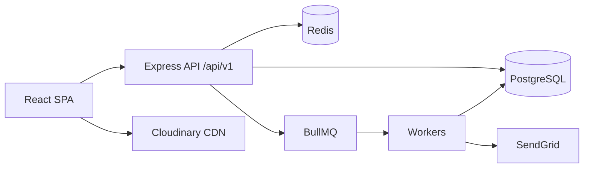

# Seat Reservation Platform for Study Cafés

Nền tảng đặt chỗ ngồi học tại quán cà phê — full-stack web app với REST API, xử lý booking đồng thời, background jobs và phân quyền theo vai trò.

---

## Giới thiệu

Hệ thống kết nối **khách hàng**, **chủ quán** và **admin** trên cùng một nền tảng:

| Vai trò | Chức năng chính |
| ------- | ---------------- |
| **Customer** | Duyệt quán, xem layout ghế, kiểm tra chỗ trống theo khung giờ, đặt chỗ, hủy, check-in, quản lý profile |
| **Owner** | Đăng ký hồ sơ, quản lý café, chỉnh layout ghế, xem booking, check-in khách |
| **Admin** | Duyệt owner/café mới, quản lý user, suspend tài khoản |

**Điểm nổi bật kỹ thuật**

- Kiến trúc **modular monolith** — một deployable unit, tách module theo domain
- Booking an toàn khi concurrent: transaction, row lock, idempotency key (Redis)
- Cache Redis, rate limit, JWT access/refresh token
- Background workers (BullMQ): reminder, auto-expire, auto-complete booking, gửi email
- Upload ảnh café qua Cloudinary signed upload (tuỳ chọn)



---

## Tech stack

| Layer | Công nghệ |
| ----- | --------- |
| **Frontend** | React 19, TypeScript, Vite, MUI, React Router, TanStack Query, Axios, React Hook Form, Zod |
| **Backend** | Node.js 20+, Express 4, TypeScript, Prisma 6, Zod |
| **Database** | PostgreSQL 16 |
| **Cache / Queue** | Redis 7, BullMQ |
| **Auth** | JWT (access + refresh), RBAC |
| **Tích hợp** | SendGrid (email), Cloudinary (upload) — tuỳ chọn |
| **Testing** | Vitest, Supertest, k6 |
| **DevOps** | Docker, Docker Compose |

---

## Cấu trúc repo

```
Cafe Reservation/
├── backend/          # REST API, Prisma, workers, tests
│   └── docs/         # Tài liệu backend chi tiết
├── frontend/         # React SPA
│   └── docs/         # Tài liệu frontend (architecture, UI/UX)
├── docker-compose.yml
└── .env.docker.example
```

---

## Yêu cầu

- [Node.js](https://nodejs.org/) ≥ 20
- [Docker Desktop](https://www.docker.com/products/docker-desktop/) (khuyến nghị — dùng cho Postgres, Redis và/hoặc full stack)
- npm

---

## Cài đặt & chạy project

Có **hai cách** phổ biến. Chọn một tùy mục đích.

### Cách 1 — Docker (full stack, nhanh nhất)

Chạy Postgres, Redis, Backend và Frontend trong một lệnh.

```bash
# Tuỳ chọn: tạo file env ở thư mục gốc
cp .env.docker.example .env
# Chỉnh JWT secret, Cloudinary, SendGrid trong .env nếu cần

docker compose up -d --build
```

| Service | URL |
| ------- | --- |
| **Frontend** | http://localhost:5173 |
| **Backend API** | http://localhost:3000/api/v1 |
| **Health check** | http://localhost:3000/health |
| Postgres (debug) | `localhost:5434` |
| Redis (debug) | `localhost:6381` |

Backend tự chạy `prisma migrate deploy` khi khởi động. Dữ liệu demo được seed khi `RUN_SEED=true` (mặc định).

**Lệnh hữu ích**

```bash
docker compose ps                  # trạng thái services
docker compose logs -f backend     # xem log backend
docker compose down                # dừng stack
docker compose down -v             # dừng + xóa database (reset)
```

---

### Cách 2 — Local development (hot reload)

Phù hợp khi đang phát triển/sửa code. Hạ tầng chạy bằng Docker; backend và frontend chạy trên máy với `npm run dev`.

#### Bước 1 — Khởi động Postgres & Redis

Từ thư mục gốc repo:

```bash
docker compose up -d postgres redis
```

| Service | Host port |
| ------- | --------- |
| Postgres | `5434` |
| Redis | `6381` |

#### Bước 2 — Backend

```bash
cd backend
cp .env.example .env
npm install
npx prisma migrate deploy
npx prisma db seed
npm run dev
```

- API: http://localhost:3000/api/v1
- Health: http://localhost:3000/health
- Workers (BullMQ) chạy **cùng process** với HTTP server

#### Bước 3 — Frontend

Mở terminal mới:

```bash
cd frontend
cp .env.example .env
npm install
npm run dev
```

- App: http://localhost:5173
- `VITE_API_BASE_URL` mặc định trỏ `http://localhost:3000/api/v1`

> **Lưu ý:** Dev backend (`localhost:5434`) và Docker backend (`postgres:5432`) dùng **cùng PostgreSQL container** khi `cafe-postgres` đang chạy — dữ liệu được chia sẻ.

---

## Tài khoản demo (sau seed)

| Role | Email | Password |
| ---- | ----- | -------- |
| Admin | `admin@example.com` | `Admin123!` |
| Owner | `owner@example.com` | `Owner123!` |
| Customer | `customer@example.com` | `Customer123!` |

Owner seed có hồ sơ **APPROVED** và café **Study Hub Hanoi** (ACTIVE).

---

## Biến môi trường

### Bắt buộc (backend)

| Biến | Mô tả |
| ---- | ----- |
| `DATABASE_URL` | PostgreSQL connection string |
| `REDIS_URL` | Redis connection string |
| `JWT_ACCESS_SECRET` | Secret ký access token |
| `JWT_REFRESH_SECRET` | Secret ký refresh token |

### Tuỳ chọn

| Biến | Mô tả |
| ---- | ----- |
| `SENDGRID_API_KEY` | Gửi email (để trống = bỏ qua) |
| `CLOUDINARY_*` | Upload ảnh café (để trống = tắt upload) |
| `FRONTEND_URL` | URL frontend cho deep link trong email |

File mẫu:

- Docker (root): [`.env.docker.example`](./.env.docker.example)
- Backend local: [`backend/.env.example`](./backend/.env.example)
- Frontend local: [`frontend/.env.example`](./frontend/.env.example)

**Không commit** file `.env` thật — đã được liệt kê trong `.gitignore`.

---

## Scripts thường dùng

### Backend (`cd backend`)

| Lệnh | Mô tả |
| ---- | ----- |
| `npm run dev` | API + workers (hot reload) |
| `npm run build` | Compile TypeScript |
| `npm run test` | Toàn bộ tests |
| `npm run test:unit` | Unit tests |
| `npm run test:integration` | Integration tests |
| `npm run load:smoke` | k6 smoke test |

### Frontend (`cd frontend`)

| Lệnh | Mô tả |
| ---- | ----- |
| `npm run dev` | Vite dev server |
| `npm run build` | Production build |
| `npm run lint` | Oxlint |

Integration test dùng `docker-compose.test.yml` (Postgres `5433`, Redis `6380`) và `backend/.env.test`.

---

## Tài liệu chi tiết

| Tài liệu | Nội dung |
| -------- | -------- |
| [frontend/docs/README.md](./frontend/docs/README.md) | Frontend overview |
| [backend/docs/README.md](./backend/docs/README.md) | Backend overview + quick start |
| [backend/docs/BACKEND-OVERVIEW.md](./backend/docs/BACKEND-OVERVIEW.md) | Kiến trúc, module map |
| [backend/docs/API-SPECIFICATION.md](./backend/docs/API-SPECIFICATION.md) | REST API đầy đủ |
| [frontend/docs/FRONTEND-ARCHITECTURE.md](./frontend/docs/FRONTEND-ARCHITECTURE.md) | Kiến trúc frontend chi tiết |
| [frontend/docs/FRONTEND-UI-UX-DESIGN.md](./frontend/docs/FRONTEND-UI-UX-DESIGN.md) | UI/UX design |

---

## License

Dự án portfolio / học tập. Chưa có license chính thức.
