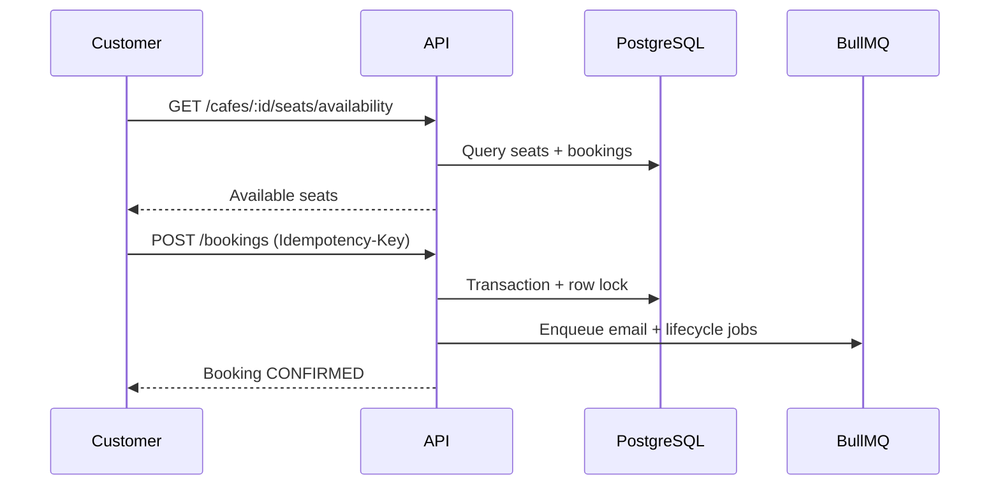

# Backend Features

**Base URL:** `/api/v1`  
**Auth header:** `Authorization: Bearer <access_token>`

Tài liệu mô tả **tính năng và API chính** theo từng role. Chi tiết request/response đầy đủ → [API-SPECIFICATION.md](./API-SPECIFICATION.md).

---

## 1. Auth

### Customer register

- `POST /auth/register`
- Tạo user `CUSTOMER` + `CustomerProfile`
- Trả về access token + refresh token ngay (status `ACTIVE`)

### Owner register

- `POST /auth/register-owner`
- Tạo user `OWNER` + `OwnerProfile` (status `PENDING`)
- **Không** trả token — owner chờ admin duyệt hồ sơ
- Gửi email verification (nếu SendGrid cấu hình)

### Login / session

| Method | Endpoint | Mô tả |
| ------ | -------- | ----- |
| POST | `/auth/login` | Login, trả tokens. Owner cần profile APPROVED |
| POST | `/auth/refresh` | Rotate refresh token |
| POST | `/auth/logout` | Revoke refresh token |
| GET | `/auth/me` | Thông tin user hiện tại |

**Bảo vệ:** rate limit register/login; khóa tài khoản sau 5 lần login sai; chặn `SUSPENDED`.

---

## 2. Customer

### Duyệt quán (public — không cần auth)

| Method | Endpoint | Mô tả |
| ------ | -------- | ----- |
| GET | `/cafes` | Danh sách café ACTIVE (cursor pagination) |
| GET | `/cafes/search` | Tìm theo tên/thành phố |
| GET | `/cafes/:cafeId` | Chi tiết café |
| GET | `/cafes/:cafeId/seats/layout` | Layout zone + ghế |
| GET | `/cafes/:cafeId/seats/availability` | Ghế trống theo ngày/giờ |

### Đặt chỗ

| Method | Endpoint | Mô tả |
| ------ | -------- | ----- |
| POST | `/bookings` | Tạo booking (**bắt buộc** header `Idempotency-Key`) |
| GET | `/bookings` | Lịch sử booking (filter status, upcoming, sort) |
| GET | `/bookings/:bookingId` | Chi tiết booking |
| DELETE | `/bookings/:bookingId` | Hủy booking |
| POST | `/bookings/:bookingId/check-in` | Customer tự check-in (QR/code) |

Sau khi tạo booking thành công:

- Email xác nhận (queue)
- In-app notification
- Job reminder (30 phút trước giờ bắt đầu)
- Job auto-expire (nếu không check-in)
- Job auto-complete (sau `endTime`)

### Profile

| Method | Endpoint | Mô tả |
| ------ | -------- | ----- |
| GET | `/customers/profile` | Xem profile + preferences |
| PATCH | `/customers/profile` | Cập nhật city, notification settings |

### Notifications

| Method | Endpoint | Mô tả |
| ------ | -------- | ----- |
| GET | `/notifications` | Danh sách in-app (cursor, filter unread) |
| PATCH | `/notifications/:notificationId/read` | Đánh dấu đã đọc |

---

## 3. Owner

> Tất cả route dưới `/owner/cafes` yêu cầu: auth + role OWNER + `OwnerProfile` APPROVED.

### Quản lý café

| Method | Endpoint | Mô tả |
| ------ | -------- | ----- |
| POST | `/owner/cafes` | Tạo café mới (status PENDING_VERIFICATION) |
| GET | `/owner/cafes` | Danh sách café của owner |
| GET | `/owner/cafes/:cafeId` | Chi tiết café |
| PUT | `/owner/cafes/:cafeId` | Cập nhật thông tin café |
| PATCH | `/owner/cafes/:cafeId/settings` | Cài đặt (grace period, v.v.) |

### Layout ghế

| Method | Endpoint | Mô tả |
| ------ | -------- | ----- |
| GET | `/owner/cafes/:cafeId/seats/layout` | Xem layout (kèm trạng thái ghế tuỳ query) |
| PUT | `/owner/cafes/:cafeId/seats/layout` | Cập nhật zones + seats |

### Bookings

| Method | Endpoint | Mô tả |
| ------ | -------- | ----- |
| GET | `/owner/cafes/:cafeId/bookings` | Xem booking theo café (filter ngày/status) |
| POST | `/owner/cafes/:cafeId/bookings/:bookingId/check-in` | Owner check-in thay khách |

### Upload (Cloudinary)

| Method | Endpoint | Mô tả |
| ------ | -------- | ----- |
| POST | `/uploads/cloudinary/signature/registration` | Public — ký upload giấy tờ khi đăng ký owner |
| POST | `/uploads/cloudinary/signature` | Auth owner/admin — ký upload ảnh café |

---

## 4. Admin

> Tất cả route `/admin/*` yêu cầu role ADMIN.

### Users

| Method | Endpoint | Mô tả |
| ------ | -------- | ----- |
| GET | `/admin/users` | Danh sách user |
| GET | `/admin/users/:userId` | Chi tiết user |
| PUT | `/admin/users/:userId/suspend` | Suspend + revoke tokens |
| PUT | `/admin/users/:userId/unsuspend` | Mở khóa tài khoản |

### Owner approval

| Method | Endpoint | Mô tả |
| ------ | -------- | ----- |
| GET | `/admin/owners/pending` | Owner chờ duyệt |
| GET | `/admin/owners/:userId` | Chi tiết hồ sơ owner |
| PUT | `/admin/owners/:userId/approve` | Duyệt owner |
| PUT | `/admin/owners/:userId/reject` | Từ chối owner |

### Café approval

| Method | Endpoint | Mô tả |
| ------ | -------- | ----- |
| GET | `/admin/cafes/pending` | Café chờ duyệt |
| GET | `/admin/cafes/:cafeId` | Chi tiết café |
| GET | `/admin/cafes/:cafeId/seats/layout` | Layout để review |
| PUT | `/admin/cafes/:cafeId/approve` | Duyệt café → ACTIVE |
| PUT | `/admin/cafes/:cafeId/reject` | Từ chối café |

---

## 5. Luồng nghiệp vụ chính

### Luồng đặt chỗ (Customer)



### Luồng owner onboarding

1. Owner đăng ký (`POST /auth/register-owner`) → `OwnerProfile` PENDING
2. Admin duyệt (`PUT /admin/owners/:id/approve`)
3. Owner login → truy cập `/owner/cafes`
4. Owner tạo café → admin duyệt café → café ACTIVE → customer có thể book

### Luồng vòng đời booking

| Sự kiện | Hành động hệ thống |
| ------- | ------------------ |
| Tạo booking | CONFIRMED, cache invalidate, queue jobs |
| Check-in | CHECKED_IN, hủy job expire |
| Hết giờ (checked in) | Worker → COMPLETED |
| Không check-in | Worker → EXPIRED |
| Hủy (customer) | CANCELLED, hủy jobs, email + in-app notify |

---

## 6. Response format

API trả JSON thống nhất:

**Success (single resource):**
```json
{
  "success": true,
  "data": { ... },
  "meta": { "requestId": "..." }
}
```

**Success (paginated — cursor):**
```json
{
  "success": true,
  "data": [ ... ],
  "pagination": {
    "nextCursor": "...",
    "hasMore": true
  },
  "meta": { "requestId": "..." }
}
```

**Error:**
```json
{
  "success": false,
  "error": {
    "code": "VALIDATION_ERROR",
    "message": "..."
  },
  "meta": { "requestId": "..." }
}
```

---

## 7. Luồng thử nhanh (dữ liệu seed)

Dùng tài khoản seed (xem [README.md](./README.md)):

1. Login **customer** → browse `/cafes` → xem availability → tạo booking
2. Login **owner** → xem bookings café → check-in
3. Login **admin** → xem pending (nếu có) → approve/reject

---

## 8. Đọc tiếp

- [BACKEND-OVERVIEW.md](./BACKEND-OVERVIEW.md) — kiến trúc tổng quan
- [BACKEND-DESIGN-NOTES.md](./BACKEND-DESIGN-NOTES.md) — chi tiết kỹ thuật (overview)
- [USE_CASES.md](./USE_CASES.md) — use cases đầy đủ
