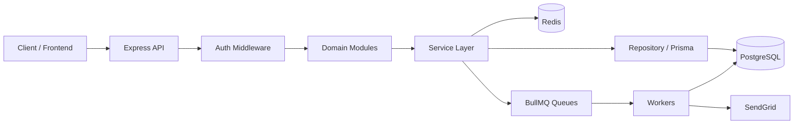

# Backend Overview

**Project:** Seat Reservation Platform for Study Cafés  
**Last Updated:** July 2026

---

## 1. Bài toán

Hệ thống cho phép:

- **Customer** duyệt quán, xem layout ghế, kiểm tra chỗ trống theo khung giờ, đặt chỗ, hủy, check-in.
- **Owner** đăng ký hồ sơ, quản lý café, chỉnh layout ghế, xem booking, check-in khách.
- **Admin** duyệt owner/café mới, quản lý user, suspend tài khoản.

Backend là **modular monolith** — một deployable unit, tách module theo domain, dễ mở rộng sau này.

---

## 2. Technology Stack

| Layer | Công nghệ |
| ----- | --------- |
| Runtime | Node.js 20+ |
| Framework | Express 4 |
| Language | TypeScript |
| ORM | Prisma 6 |
| Database | PostgreSQL 16 |
| Cache / session / rate limit | Redis 7 (ioredis) |
| Background jobs | BullMQ |
| Validation | Zod |
| Auth | JWT (access + refresh) |
| Email | SendGrid (optional) |
| File upload | Cloudinary signed upload (optional) |
| Testing | Vitest + Supertest + k6 |

---

## 3. Kiến trúc tổng quan



### Request pipeline

Mỗi request đi qua:

1. **Request ID** — gắn `x-request-id` để trace log
2. **CORS + JSON body**
3. **Route handler** — module tương ứng
4. **Middleware** (tuỳ route): authenticate → authorize → rate limit → validate (Zod)
5. **Controller** — parse request, gọi service
6. **Service** — business logic, transaction, enqueue job
7. **Repository** — truy vấn Prisma
8. **Error handler** — map `AppError` → HTTP response thống nhất

---

## 4. Module map

Base path: **`/api/v1`**

| Module | Route prefix | Trách nhiệm |
| ------ | ------------ | ----------- |
| **Auth** | `/auth` | Register, login, refresh, logout, `/me` |
| **Café (public)** | `/cafes` | Browse, search, detail, layout, availability |
| **Owner** | `/owner/cafes` | CRUD café, layout, bookings, owner check-in |
| **Booking** | `/bookings` | Create, list, detail, cancel, customer check-in |
| **Customer** | `/customers` | Profile GET/PATCH |
| **Notification** | `/notifications` | In-app list, mark read |
| **Admin** | `/admin` | Users, pending owners/cafés, approve/reject |
| **Upload** | `/uploads` | Cloudinary signature (registration + auth) |

### Pattern trong mỗi module

```
*.routes.ts    → định nghĩa HTTP endpoints + middleware
*.controller.ts → nhận request, trả response
*.service.ts   → business rules
*.repository.ts → Prisma queries
*.validator.ts → Zod schemas
*.dto.ts       → TypeScript types (tuỳ module)
```

---

## 5. Actors & phân quyền

| Role | Mô tả |
| ---- | ----- |
| `CUSTOMER` | Đặt chỗ, xem lịch sử, quản lý profile |
| `OWNER` | Quản lý café của mình (cần `OwnerProfile` **APPROVED**) |
| `ADMIN` | Duyệt hồ sơ, quản lý toàn hệ thống |

Middleware chính:

- `authenticate` — verify JWT access token
- `authorize(...roles)` — kiểm tra role
- `requireApprovedOwner` — chặn owner chưa được admin duyệt

---

## 6. Domain chính (database)

Các entity cốt lõi (Prisma):

| Entity | Vai trò |
| ------ | ------- |
| `User` | Tài khoản + role + status |
| `CustomerProfile` | Tuỳ chọn customer |
| `OwnerProfile` | Giấy tờ + trạng thái duyệt owner |
| `Cafe` | Thông tin quán, giờ mở cửa, trạng thái duyệt |
| `Zone` / `Seat` | Layout ghế theo khu vực |
| `Booking` | Đặt chỗ theo seat + time slot |
| `BookingHistory` | Audit trail thay đổi trạng thái booking |
| `NotificationLog` | Log email + in-app notification |
| `AuditLog` | Audit hành động quan trọng |

### Booking lifecycle

```
CONFIRMED → CHECKED_IN → COMPLETED
     ↓           ↓
 CANCELLED    EXPIRED (no check-in)
```

Worker tự động: reminder trước giờ bắt đầu, expire nếu không check-in, complete sau `endTime`.

---

## 7. Background workers

Chạy trong cùng process với API (`server.ts`):

| Queue | Jobs |
| ----- | ---- |
| `booking` | Reminder, auto-expire, auto-complete |
| `email` | Confirmation, cancellation, reminder, verification, admin alerts |

Graceful shutdown: đóng workers → disconnect Prisma/Redis khi nhận `SIGTERM` / `SIGINT`.

---

## 8. Phạm vi & giới hạn hiện tại

**Đã có:** booking concurrency, idempotency, cache availability, queue lifecycle, RBAC, admin approval flows, unit + integration tests.

**Chưa hoàn thiện / ngoài phạm vi hiện tại:**

- Email verification cho owner: gửi email nhưng chưa có endpoint verify token
- Customer đăng ký được active ngay (không bắt buộc verify email)
- Workers chưa tách process riêng (phù hợp development local; cần tách khi scale production)
- SendGrid / Cloudinary optional — thiếu key thì skip, không crash app

---

## 9. Đọc tiếp

- [BACKEND-FEATURES.md](./BACKEND-FEATURES.md) — tính năng + API theo role
- [BACKEND-DESIGN-NOTES.md](./BACKEND-DESIGN-NOTES.md) — quyết định thiết kế kỹ thuật
- [README.md](./README.md) — hướng dẫn chạy project
