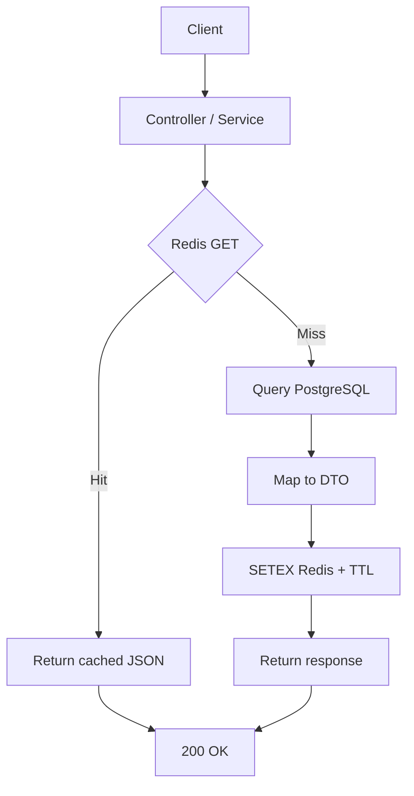
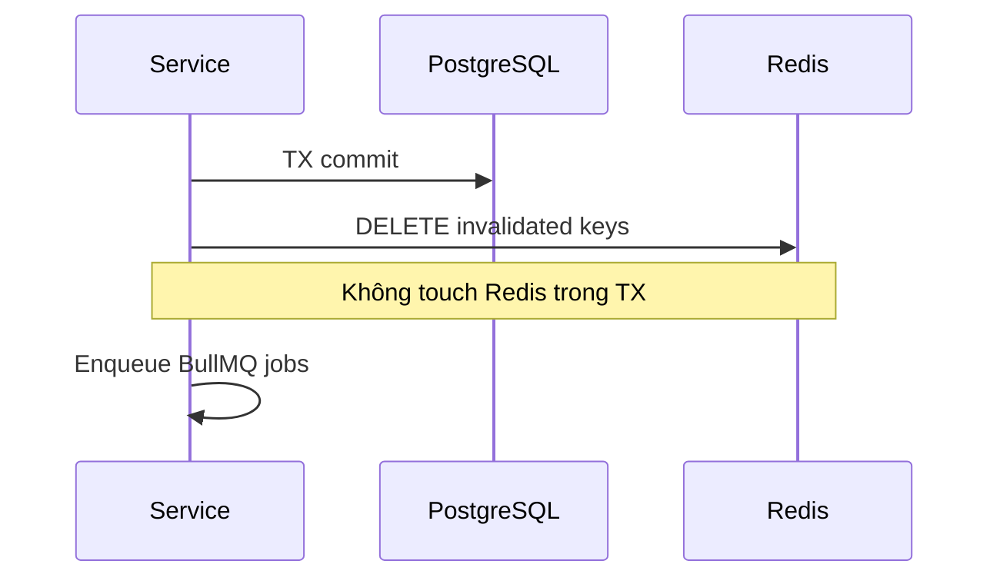

# Cache Design — Seat Reservation Platform for Study Cafés

**Project:** Seat Reservation Platform for Study Cafés  
**Stack:** Node.js, Express, PostgreSQL, Prisma, Redis, BullMQ  
**Document Version:** 2.0  
**Last Updated:** June 2026

**Related:** `QUEUE-DESIGN.md`, `REQUEST-FLOW.md`, `CONCURRENCY-DESIGN.md`

---

## Table of Contents

1. [Cache Overview](#1-cache-overview)
2. [Redis Usage Boundaries](#2-redis-usage-boundaries)
3. [Caching Strategy](#3-caching-strategy)
4. [Cache Key Registry](#4-cache-key-registry)
5. [Cache Read/Write Matrix](#5-cache-readwrite-matrix)
6. [Cache Flow](#6-cache-flow)
7. [Write Path & Invalidation](#7-write-path--invalidation)
8. [Consistency & Failure](#8-consistency--failure)
9. [Testing Strategy](#9-testing-strategy)
10. [Design Principles](#10-design-principles)

---

## 1. Cache Overview

- **Purpose:** Giảm tải PostgreSQL trên các endpoint đọc nhiều (browse café, availability).
- **Pattern:** Cache-aside — đọc Redis trước, miss thì query DB rồi `SETEX`.
- **Authority:** PostgreSQL là source of truth; cache không đảm bảo write correctness (booking dùng TX + row lock).
- **Scope:** Chỉ **Application Cache** — 4 loại dữ liệu (§3). Idempotency, JWT, rate limit, BullMQ dùng Redis riêng (§2).

---

## 2. Redis Usage Boundaries

| Redis Use | Category | Cache? | Notes |
| --------- | -------- | ------ | ----- |
| Café list / detail / availability | **Application cache** | Yes | This document |
| Idempotency keys | Deduplication store | No | Pre/post TX; TTL 1h |
| Refresh tokens / JWT blacklist | Session store | No | Auth module |
| Rate limit counters | Gateway counter | No | `INCR` + TTL |
| BullMQ queues | Job broker | No | See `QUEUE-DESIGN.md` |

---

## 3. Caching Strategy

### Cached (4 types)

| Data | Cache Key | Reason |
| ---- | --------- | ------ |
| **Café List** | `cafes:list:{paramsHash}` | Read-heavy; ít thay đổi |
| **Café Detail** | `cafe:detail:{cafeId}` | Truy cập thường xuyên khi guest xem quán |
| **Seat Layout** | `cafe:layout:{cafeId}` | Ít thay đổi; layout ổn định sau khi owner setup |
| **Seat Availability** | `availability:{cafeId}:{date}:{slotHash}` | Read-heavy nhất; TTL ngắn (30s) |

### Not cached

| Data | Reason |
| ---- | ------ |
| Customer active bookings | Truy cập thấp; validation đọc trực tiếp từ DB trong TX |
| Customer notification prefs | Truy cập thấp; query DB đủ nhanh |
| Admin pending cafés | Traffic thấp; không justify cache |
| User profile | Truy cập thấp; cần dữ liệu fresh sau update/suspend |
| Booking detail / history | User-specific; ít reuse; pagination đa dạng |
| Search (`GET /cafes/search`) | Dùng chung key pattern `cafes:list:{paramsHash}` — không cache riêng |

---

## 4. Cache Key Registry

| Key | Value | TTL | Invalidated By |
| --- | ----- | --- | -------------- |
| `cafes:list:{paramsHash}` | Paginated café list | 5 min | Café create / update / approve |
| `cafe:detail:{cafeId}` | Café profile + policies | 10 min | Café update; layout change |
| `cafe:layout:{cafeId}` | Zones + seats | 10 min | Layout update |
| `availability:{cafeId}:{date}:{slotHash}` | Seat availability snapshot | **30 sec** | Booking create / cancel / expire; layout update |

**Key notes:**

- `{paramsHash}` — hash của query params đã sort (city, cursor, sort, filters).
- `{slotHash}` — hash của `startTime` + `endTime` (ISO UTC).
- `{date}` — `YYYY-MM-DD` (café timezone), hỗ trợ debug.

**Invalidation pattern:** `availability:{cafeId}:*` — xóa tất cả slot keys của một café (dùng `SCAN` + `DEL` hoặc `UNLINK`).

---

## 5. Cache Read/Write Matrix

| Endpoint | Read Cache | Write Cache | Invalidate |
| -------- | ---------- | ----------- | ---------- |
| **Browse Cafés** `GET /cafes` | `cafes:list:{paramsHash}` | On miss → `SETEX` 5 min | — |
| **Get Café Detail** `GET /cafes/{id}` | `cafe:detail:{cafeId}` | On miss → `SETEX` 10 min | — |
| **Get Seat Layout** `GET /cafes/{id}/seats/layout` | `cafe:layout:{cafeId}` | On miss → `SETEX` 10 min | — |
| **Get Seat Availability** `GET /cafes/{id}/seats/availability` | `availability:{cafeId}:{date}:{slotHash}` | On miss → `SETEX` 30 sec | — |
| **Create Booking** `POST /bookings` | — | — | `availability:{cafeId}:*` |
| **Cancel Booking** `DELETE /bookings/{id}` | — | — | `availability:{cafeId}:*` |
| **Update Café** `PUT /owner/cafes/{id}` | — | — | `cafes:list:*`, `cafe:detail:{cafeId}` |
| **Update Seat Layout** `PUT /owner/cafes/{id}/seats/layout` | — | — | `cafe:layout:{cafeId}`, `cafe:detail:{cafeId}`, `availability:{cafeId}:*` |

**Legend:**

- **Read Cache** — `GET` từ Redis trước; miss thì query DB.
- **Write Cache** — populate cache sau DB read (cache-aside).
- **Invalidate** — `DEL` sau commit thành công; không ghi cache trong TX.

> Auto-expire booking (worker) cũng invalidate `availability:{cafeId}:*` — giống cancel.

---

## 6. Cache Flow

Luồng đọc tổng quát (cache-aside):

| Step | Action |
| ---- | ------ |
| 1 | Build cache key từ request params |
| 2 | `GET` Redis |
| 3 | Hit → deserialize → return |
| 4 | Miss → query DB → `SETEX` → return |

**Redis down:** Bỏ qua cache; query DB trực tiếp; vẫn trả `200 OK`.

---

## 7. Write Path & Invalidation

| Rule | Detail |
| ---- | ------ |
| Không Redis trong TX | Invalidation chỉ sau commit |
| Thứ tự post-commit | COMMIT → invalidate → idempotency → BullMQ |
| Invalidate fail | Log warning; TTL tự heal (availability max 30s) |
| Không warm cache sau write | Client miss → DB → SET mới |

### Invalidation summary

| Event | Keys |
| ----- | ---- |
| Booking create / cancel / expire | `availability:{cafeId}:*` |
| Café create / update / approve | `cafes:list:*`, `cafe:detail:{cafeId}` |
| Layout update | `cafe:layout:{cafeId}`, `cafe:detail:{cafeId}`, `availability:{cafeId}:*` |
| Check-in | **None** — seat đã reserved, availability không đổi |

---

## 8. Consistency & Failure

| Rule | Description |
| ---- | ----------- |
| Eventual consistency | Cache có thể lag DB tối đa 1 TTL |
| Write authority | Booking correctness = DB TX, không phải cache |
| Stale read OK | Availability có thể hiện `AVAILABLE` tạm thời — write path trả `409` |
| Zone filter | Cache full café snapshot; filter zone ở service layer |

| Failure | Behaviour |
| ------- | --------- |
| Redis down (read) | Fallback DB; không cache write |
| Redis down (invalidate) | Booking/commit vẫn OK; TTL heal |
| Invalidation partial fail | Log; rely on TTL |

---

## 9. Testing Strategy

| Test Case | Expected |
| --------- | -------- |
| 2× `GET /cafes` same params | Lần 2 cache hit; DB query 1 lần |
| Create booking → `GET availability` | Cache miss; data fresh từ DB |
| Redis down → `GET /cafes` | `200` từ DB |
| Layout update | Layout + detail + availability keys cleared |
| TTL expiry | Key gone; next request queries DB |

---

## 10. Design Principles

| Principle | Application |
| --------- | ----------- |
| **Đơn giản** | 4 cache keys; 1 pattern (cache-aside) |
| **Read-heavy only** | Chỉ cache endpoint guest browse nhiều |
| **Không cache low-traffic** | Profile, admin, active-bookings → DB |
| **TTL là safety net** | Invalidation + TTL; availability 30s |
| **Invalidate after commit** | Tránh stale sau rollback |
| **No stampede lock** | Không cần cho portfolio scale |
| **No distributed lock** | Modular monolith; single Redis |
| **Redis = app cache only** | Idempotency/tokens/queue tách biệt (§2) |

---

**End of Cache Design Document**

*See `QUEUE-DESIGN.md` for BullMQ (separate Redis usage).*
