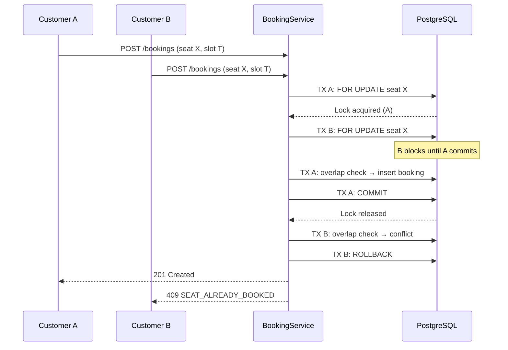
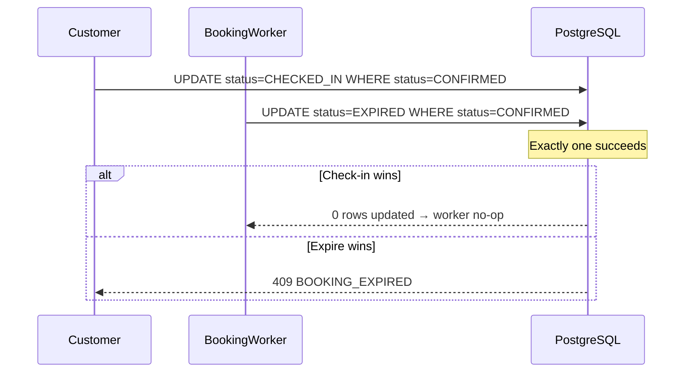
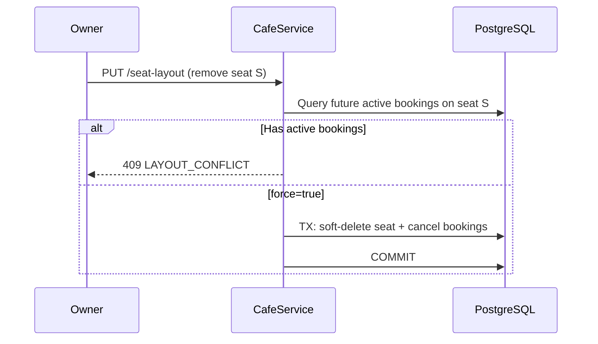

# Concurrency Design — Seat Reservation Platform for Study Cafés

**Project:** Seat Reservation Platform for Study Cafés  
**Stack:** Node.js, Express, PostgreSQL, Prisma, Redis, BullMQ  
**Document Version:** 1.0  
**Last Updated:** June 2026

**Related:** `DATABASE-DESIGN.md`, `REQUEST-FLOW.md`, `API-SPECIFICATION.md`

---

## Table of Contents

1. [Concurrency Overview](#1-concurrency-overview)
2. [Concurrency Matrix](#2-concurrency-matrix)
3. [Detailed Scenarios](#3-detailed-scenarios)
4. [Transaction Strategy](#4-transaction-strategy)
5. [Locking Strategy](#5-locking-strategy)
6. [Database Constraints](#6-database-constraints)
7. [Idempotency Strategy](#7-idempotency-strategy)
8. [Cache Consistency](#8-cache-consistency)
9. [Queue Consistency](#9-queue-consistency)
10. [Failure Recovery](#10-failure-recovery)
11. [Testing Strategy](#11-testing-strategy)
12. [Design Decisions](#12-design-decisions)

---

## 1. Concurrency Overview

- **Shared mutable state:** Seat availability for a time window is contested by many customers; overselling is unacceptable.
- **Multiple writers:** HTTP handlers, BullMQ workers, and client retries can mutate the same booking row concurrently.
- **Read/write split:** Availability reads are cached; writes must invalidate cache **after** DB commit.
- **Design principle:** PostgreSQL transaction + row lock is the source of truth; Redis handles idempotency and cache only.
- **Scope:** Modular monolith — no distributed locks; single PostgreSQL instance is sufficient.

---

## 2. Concurrency Matrix

| Scenario | Race Condition | Impact | Solution | Priority |
| -------- | -------------- | ------ | -------- | -------- |
| Double booking (same seat + slot) | Two customers book simultaneously | Overselling, data corruption | `FOR UPDATE` on seat + overlap check in TX + partial unique index | **Critical** |
| Double-click booking (same user) | Client retries POST after timeout | Duplicate booking rows | `Idempotency-Key` in Redis (pre-TX check) | **Critical** |
| Cancel vs auto-expire | Worker and cancel both update status | Wrong final status / double side effects | Conditional `UPDATE WHERE status = 'CONFIRMED'` | **High** |
| Check-in vs auto-expire | Worker and check-in at grace deadline | Seat freed while customer checked in | Conditional `UPDATE WHERE status = 'CONFIRMED'` | **High** |
| Cancel vs check-in | User cancels while checking in | Invalid state transition | Conditional update; 0 rows → `409` | **High** |
| Owner soft-delete seat vs active booking | Layout update removes booked seat | Orphan booking / layout conflict | Pre-TX conflict check; block or `force=true` cancel flow | **Medium** |
| Concurrent registration (same email) | Two register requests | Duplicate users | DB unique on `email` (partial) | **Medium** |
| Availability read vs booking write | Stale cache shows seat available | UX mismatch (not oversell) | Short TTL (30s) + post-commit invalidation; write path authoritative | **Low** |
| Duplicate BullMQ job delivery | Expire/reminder job runs twice | Duplicate emails / redundant updates | Status guard + BullMQ job idempotency key | **Low** |
| Admin suspend vs active booking | User mid-booking while suspended | Suspended user books | Pre-TX status check on `users.status` | **Medium** |

---

## 3. Detailed Scenarios

### Scenario: Double Booking (Concurrent Customers)

#### Flow



#### Table

| Item | Description |
| ---- | ----------- |
| Problem | Two requests reserve the same seat for overlapping time |
| Trigger | Peak traffic; same popular seat/slot |
| Components | BookingService, SeatRepository, PostgreSQL |
| Risk | Overselling — two active bookings on one seat |
| Solution | Serialize per seat via `FOR UPDATE`; overlap query; partial unique index as backup |
| Transaction | **Yes** (`READ COMMITTED`, 5s timeout) |
| Locking | **Row lock** on `seats` row |
| Idempotency | **Yes** (separate concern — per-client retry) |

---

### Scenario: Double-Click Booking (Client Retry)

#### Flow

```mermaid
sequenceDiagram
    participant C as Client
    participant API as BookingService
    participant R as Redis
    participant PG as PostgreSQL

    C->>API: POST /bookings + Idempotency-Key K
    API->>R: GET idempotency:booking:K
    R-->>API: miss
    API->>PG: TX → create booking → COMMIT
    API->>R: SET idempotency:booking:K (201 response)
    API-->>C: 201 (slow; client times out)
    C->>API: POST /bookings + Idempotency-Key K (retry)
    API->>R: GET idempotency:booking:K
    R-->>API: cached 201
    API-->>C: 201 (cached, no TX)
```

#### Table

| Item | Description |
| ---- | ----------- |
| Problem | Network timeout causes client to resubmit same booking |
| Trigger | Double tap, mobile retry, gateway timeout |
| Components | IdempotencyService, Redis, BookingService |
| Risk | Duplicate booking for same customer + slot |
| Solution | Check Redis **before** TX; cache response **after** commit |
| Transaction | **Yes** on first request only |
| Locking | Row lock on seat (same as double booking) |
| Idempotency | **Yes** — required header on `POST /bookings` |

---

### Scenario: Cancel vs Auto-Expire

#### Flow

```mermaid
sequenceDiagram
    participant U as Customer
    participant W as BookingWorker
    participant PG as PostgreSQL

    par Cancel path
        U->>PG: UPDATE status=CANCELLED WHERE status=CONFIRMED
    and Expire path
        W->>PG: UPDATE status=EXPIRED WHERE status=CONFIRMED
    end
    Note over PG: First writer wins; second gets 0 rows
```

#### Table

| Item | Description |
| ---- | ----------- |
| Problem | Cancel and expire worker race on same booking |
| Trigger | Customer cancels near no-show deadline |
| Components | CancellationService, BookingWorker |
| Risk | Wrong status; duplicate cache invalidation / emails |
| Solution | Conditional update on `status = 'CONFIRMED'`; loser exits gracefully |
| Transaction | **Yes** (each path independent TX) |
| Locking | **None** (optimistic conditional update) |
| Idempotency | **Yes** — cancel is idempotent; expire no-op if status changed |

---

### Scenario: Check-in vs Auto-Expire

#### Flow



#### Table

| Item | Description |
| ---- | ----------- |
| Problem | Check-in at grace boundary vs scheduled expire job |
| Trigger | Job fires at `startTime + graceMinutes` |
| Components | CheckinService, BookingWorker |
| Risk | Customer checked in but booking marked expired |
| Solution | Same conditional update pattern; expire worker no-op on 0 rows |
| Transaction | **Yes** |
| Locking | **None** (optimistic) |
| Idempotency | **Yes** — check-in idempotent if already `CHECKED_IN` |

---

### Scenario: Cancel vs Check-in

#### Table

| Item | Description |
| ---- | ----------- |
| Problem | Cancel and check-in submitted concurrently |
| Trigger | User action near slot start |
| Components | CancellationService, CheckinService |
| Risk | Booking ends in inconsistent state |
| Solution | Both use `UPDATE ... WHERE status = 'CONFIRMED'`; first wins |
| Transaction | **Yes** |
| Locking | **None** |
| Idempotency | **Yes** |

---

### Scenario: Owner Soft-Delete Seat vs Active Booking

#### Flow



#### Table

| Item | Description |
| ---- | ----------- |
| Problem | Layout change removes seat with future reservation |
| Trigger | Owner edits seat map |
| Components | CafeService, SeatRepository, BookingRepository |
| Risk | Booking references inactive seat; availability mismatch |
| Solution | Pre-TX conflict detection; block or `force=true` + cancel in TX |
| Transaction | **Yes** |
| Locking | **None** (validation query pre-TX) |
| Idempotency | **No** |

---

### Scenario: Concurrent Check-in

#### Table

| Item | Description |
| ---- | ----------- |
| Problem | User taps check-in twice quickly |
| Trigger | Double tap on mobile |
| Components | CheckinService |
| Risk | Duplicate audit entries (minor) |
| Solution | Conditional update; second request returns existing `CHECKED_IN` (idempotent 200) |
| Transaction | **Yes** |
| Locking | **None** |
| Idempotency | **Yes** |

---

### Scenario: Concurrent Registration (Same Email)

#### Table

| Item | Description |
| ---- | ----------- |
| Problem | Two register requests with same email |
| Trigger | Double submit on registration form |
| Components | AuthService, PostgreSQL |
| Risk | Duplicate user rows |
| Solution | DB partial unique on `email`; optional Redis Idempotency-Key |
| Transaction | **Yes** |
| Locking | **None** |
| Idempotency | **Optional** |

---

## 4. Transaction Strategy

| Use Case | Transaction | Rollback | Commit Point |
| -------- | ----------- | -------- | ------------ |
| **Create booking** | Yes — `READ COMMITTED`, 5s timeout | Overlap conflict, validation error, timeout, DB error | After booking insert + audit log |
| **Cancel booking** | Yes | Status not `CONFIRMED`, not owner, DB error | After status update + booking history + audit |
| **Check-in** | Yes | Status not `CONFIRMED`, time window invalid, DB error | After status update + `checkedInAt` + audit |

**Post-commit only (never inside TX):** Redis idempotency write, cache invalidation, BullMQ enqueue.

---

## 5. Locking Strategy

| Resource | Lock Type | Reason |
| -------- | --------- | ------ |
| `seats` row | **Pessimistic** (`SELECT FOR UPDATE`) | Serialize concurrent booking attempts on same seat |
| `bookings` row | **Optimistic** (conditional `UPDATE WHERE status = ?`) | Status transitions; no long-held lock needed |
| `users` row | **None** | Registration guarded by unique constraint; suspend is low frequency |
| Availability cache | **None** | TTL + invalidation; not authoritative |
| Seat layout | **Optional Redis lock** `cafe:layout:lock:{cafeId}` 30s | Prevent concurrent owner edits (nice-to-have) |

**Not used:** Distributed locks (Redlock), table-level locks, `SERIALIZABLE` isolation (default `READ COMMITTED` + explicit row lock is sufficient).

---

## 6. Database Constraints

| Constraint | Table | Purpose |
| ---------- | ----- | ------- |
| Primary Key (`id`) | All | Stable row identity |
| FK `bookings.seat_id → seats.id` | bookings | Referential integrity |
| FK `bookings.customer_id → users.id` | bookings | Owner of reservation |
| FK `bookings.cafe_id → cafes.id` | bookings | Owner dashboard queries |
| Unique `users.email` (partial: `deleted_at IS NULL`) | users | Prevent duplicate accounts |
| Unique `bookings.confirmation_number` | bookings | Human-readable reference |
| **Composite partial unique** `(seat_id, start_time, end_time) WHERE status IN ('CONFIRMED','CHECKED_IN')` | bookings | **Last defence** against identical-slot double booking |
| Composite partial unique `(zone_id, seat_number) WHERE deleted_at IS NULL` | seats | Unique labels per zone |
| Check `end_time > start_time` | bookings | Valid time window |
| Check status/timestamp consistency | bookings | `cancelled_at` only when `CANCELLED`, etc. |

**Phase 2 (optional):** GiST exclusion constraint for overlap prevention at DB level — not required for MVP.

---

## 7. Idempotency Strategy

| Endpoint | Need Idempotency | Reason |
| -------- | ---------------- | ------ |
| `POST /bookings` | **Required** | Client retry after timeout must not create duplicate booking |
| `DELETE /bookings/{id}` | **Recommended** | Safe retry returns same cancel response |
| `POST /bookings/{id}/check-in` | **Implicit** | Already `CHECKED_IN` → return same 200 |
| `POST /auth/register` | Optional | Prevent duplicate account on retry |
| `POST /auth/register-owner` | Optional | Same as register |
| `PUT /admin/users/{id}/suspend` | Implicit | Already suspended → same 200 |
| `GET` endpoints | **No** | Read-only |
| `POST /auth/login` | **No** | Each login issues new tokens (expected) |

**Storage:** Redis key `idempotency:{scope}:{key}`, TTL 1 hour. Check **before** TX; write **after** commit.

---

## 8. Cache Consistency

| Operation | Cache Action |
| --------- | ------------ |
| **Create booking** | Invalidate `availability:{cafeId}:*` **after commit** |
| **Cancel booking** | Same invalidation **after commit** |
| **Auto-expire booking** | Same invalidation **after commit** |
| **Check-in** | No availability invalidation (seat already reserved) |
| **Update seat layout** | Invalidate `availability:{cafeId}:*`, `cafe:detail:{cafeId}` |
| **Approve café** | Invalidate `cafes:list:*`, `cafe:detail:{cafeId}` |
| **Browse cafés (read)** | Cache-aside; 5 min TTL; stale reads acceptable |

**Rule:** Cache is eventually consistent. DB transaction is always authoritative. Redis failure on write path → booking still succeeds; cache heals via TTL.

---

## 9. Queue Consistency

| Worker | Possible Conflict | Solution |
| ------ | ----------------- | -------- |
| **BookingWorker** (expire) | vs cancel / check-in | `UPDATE WHERE status = 'CONFIRMED'`; 0 rows → no-op |
| **BookingWorker** (reminder) | Booking cancelled/checked-in before send | Read status; skip if not `CONFIRMED` |
| **EmailWorker** | Duplicate job delivery | Log in `notification_logs`; duplicate send acceptable for MVP |
| **Scheduled job cancel** | Check-in/cancel removes jobs on `booking` queue | Cancel by ID `{bookingId}:expire`, `{bookingId}:reminder` |

**Rule:** Workers never open booking TX before HTTP handler unless retrying failed worker TX. BullMQ single-consumer lock prevents parallel processing of same job.

---

## 10. Failure Recovery

| Failure | Recovery Strategy |
| ------- | ----------------- |
| **DB transaction failure** | Rollback; return 5xx/409 to client; client retries with same Idempotency-Key |
| **DB timeout (5s)** | Rollback; return `503 BOOKING_TIMEOUT`; client retry safe with idempotency |
| **Redis unavailable (idempotency read)** | Fail open: proceed to TX (risk duplicate on retry) OR fail closed: return 503 — **recommend fail closed for booking** |
| **Redis unavailable (cache)** | Degrade: read from DB directly; skip cache write |
| **Redis unavailable (post-commit invalidate)** | Log warning; TTL heals stale availability (30s max) |
| **BullMQ enqueue failure (post-commit)** | Log warning; reconciliation cron re-enqueues missing jobs |
| **Worker TX failure** | BullMQ retry 3× exponential; DLQ after max attempts |
| **Partial unique violation** | Catch PG error `23505`; map to `409 SEAT_ALREADY_BOOKED` |

---

## 11. Testing Strategy

| Test Case | Expected Result |
| --------- | --------------- |
| 100 concurrent requests, same seat + slot | Exactly 1 × `201`; rest `409 SEAT_ALREADY_BOOKED` |
| Double-click same `Idempotency-Key` | 1 booking row; both responses `201` (second cached) |
| Cancel + expire worker simultaneously | One status wins; no duplicate side effects; seat released once |
| Check-in + expire worker simultaneously | Check-in wins → worker no-op; OR expire wins → check-in `409` |
| Cancel + check-in simultaneously | One wins; other `409` |
| Owner removes seat with future booking (no force) | `409 LAYOUT_CONFLICT`; booking unchanged |
| Register same email concurrently | 1 × `201`; 1 × `409 EMAIL_ALREADY_REGISTERED` |
| Availability read during booking burst | Reads may show stale `AVAILABLE`; writes never oversell |
| Redis down during booking create | Policy-dependent: 503 (fail closed) or TX succeeds without cache |
| Worker retry after successful expire | Second run no-op (status ≠ `CONFIRMED`) |

**Tools:** Jest integration tests with parallel `Promise.all`; optional k6 load test on `POST /bookings`.

---

## 12. Design Decisions

| Decision | Reason |
| -------- | ------ |
| PostgreSQL as source of truth | ACID transactions; row-level locking; partial unique indexes |
| `READ COMMITTED` + `FOR UPDATE` | Simpler than `SERIALIZABLE`; sufficient with explicit seat lock |
| Row lock on `seats` only | Booking hot path contends on seat, not booking row |
| Optimistic update for status transitions | Short-lived operations; conditional `WHERE status` avoids deadlocks |
| Partial unique index (not full unique) | Terminal statuses (`CANCELLED`, `EXPIRED`) must not block rebooking same slot |
| Redis for idempotency, not locking | Modular monolith; single DB handles write serialization |
| No distributed lock | Single process + PostgreSQL row lock adequate for portfolio scale |
| Idempotency after commit | Prevents caching failed responses; matches Stripe-style pattern |
| Cache invalidation after commit | Prevents serving stale "available" after rolled-back booking |
| No GiST exclusion constraint (MVP) | Overlap handled in TX; add in Phase 2 if needed |
| BullMQ status guard over TX between worker/API | Looser coupling; first-writer-wins on booking row |

---

**End of Concurrency Design Document**
