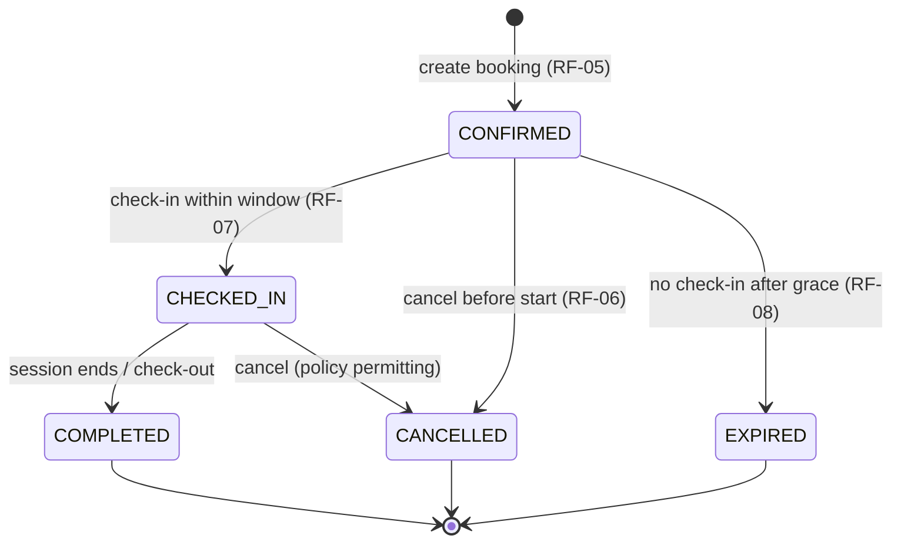

# Database Design — Seat Reservation Platform for Study Cafés

**Project:** Seat Reservation Platform for Study Cafés  
**Focus:** Relational schema design (PostgreSQL + Prisma)  
**Stack:** PostgreSQL, Prisma ORM, Node.js, Express, Redis, BullMQ  
**Document Version:** 1.0  
**Last Updated:** June 2026

---

## Document Purpose

This document defines the **PostgreSQL database design** for the seat reservation platform. It covers entities, relationships, constraints, indexes, and implementation notes for Prisma — without SQL migrations, Prisma schema, or application code.

**Related documents:** `REQUEST-FLOW.md` (transaction boundaries & flows), `USE_CASES.md` (business rules), `CONCURRENCY-DESIGN.md` *(planned)*.

**Explicitly out of scope for this schema:** payment, coupons, reviews, chat, loyalty, multi-branch chains, dynamic pricing.

**Not stored in PostgreSQL (by design):**

| Concern | Storage |
|---------|---------|
| Refresh tokens, JWT blacklist | Redis |
| Idempotency keys | Redis |
| Availability / café list cache | Redis |
| BullMQ job payloads & schedules | Redis |
| Rate-limit counters | Redis |

---

## Table of Contents

1. [Domain Model](#1-domain-model)
2. [ERD](#2-erd)
3. [Table Design](#3-table-design)
4. [Relationships](#4-relationships)
5. [Constraints](#5-constraints)
6. [Index Strategy](#6-index-strategy)
7. [Soft Delete Strategy](#7-soft-delete-strategy)
8. [Audit Fields](#8-audit-fields)
9. [Booking State Machine](#9-booking-state-machine)
10. [Database Concurrency Support](#10-database-concurrency-support)
11. [Prisma Considerations](#11-prisma-considerations)

---

## 1. Domain Model

Nine tables cover all in-scope features. Each maps to one bounded area of the domain.

| Entity | Table | Role |
|--------|-------|------|
| **User** | `users` | Central identity: credentials, role (`CUSTOMER`, `OWNER`, `ADMIN`), account lifecycle status. Single table for all actors. |
| **CustomerProfile** | `customer_profiles` | Customer-specific data (name, phone, city, notification preferences). One row per customer user. |
| **Cafe** | `cafes` | Study café profile, operating hours, booking policies, approval status. Owned by one `OWNER` user. |
| **Zone** | `zones` | Logical seating section inside a café (e.g. "Quiet Corner", "Window Row"). Groups seats for layout and availability UI. |
| **Seat** | `seats` | Bookable unit. Belongs to one zone. Tracks label, type, and active/inactive state. |
| **Booking** | `bookings` | Core reservation record: customer, seat, time window, status, check-in/cancel timestamps. |
| **BookingHistory** | `booking_history` | Append-only log of booking status transitions and reasons. Supports audit and owner/admin dashboards. |
| **NotificationLog** | `notification_logs` | Record of notifications sent (email/SMS/in-app). Supports reminder tracking and debugging failed jobs. |
| **AuditLog** | `audit_logs` | Platform-wide audit trail for security-sensitive actions (registration, admin suspend, booking create, etc.). |

### Design rationale

- **Single `users` table** instead of separate `customers` / `owners` / `admins` tables — simpler RBAC, one auth flow, aligns with `REQUEST-FLOW.md`.
- **`customer_profiles` split** — only customers need extended profile and notification prefs; owners/admins do not need a profile row.
- **No `payments`, `reviews`, `coupons` tables** — excluded per project scope.
- **No `refresh_tokens` table** — tokens live in Redis per RF-01/RF-02.
- **No `jobs` table** — BullMQ owns job state in Redis.

---

## 2. ERD

```mermaid
erDiagram
    users ||--o| customer_profiles : "has (CUSTOMER only)"
    users ||--o{ cafes : "owns (OWNER)"
    users ||--o{ bookings : "creates (customer)"
    users ||--o{ notification_logs : "receives"
    users ||--o{ audit_logs : "performs"

    cafes ||--o{ zones : "contains"
    cafes ||--o{ bookings : "hosts"

    zones ||--o{ seats : "contains"

    seats ||--o{ bookings : "reserved by"

    bookings ||--o{ booking_history : "tracks"

    users {
        uuid id PK
        string email UK
        string password_hash
        enum role
        enum status
        timestamptz created_at
    }

    customer_profiles {
        uuid id PK
        uuid user_id FK UK
        string full_name
        boolean email_notifications
        boolean sms_notifications
    }

    cafes {
        uuid id PK
        uuid owner_id FK
        string name
        enum status
        jsonb operating_hours
        int slot_duration_minutes
    }

    zones {
        uuid id PK
        uuid cafe_id FK
        string name
        int display_order
    }

    seats {
        uuid id PK
        uuid zone_id FK
        string seat_number
        boolean is_active
    }

    bookings {
        uuid id PK
        uuid customer_id FK
        uuid seat_id FK
        uuid cafe_id FK
        timestamptz start_time
        timestamptz end_time
        enum status
        string confirmation_number UK
    }

    booking_history {
        uuid id PK
        uuid booking_id FK
        enum from_status
        enum to_status
        string reason
    }

    notification_logs {
        uuid id PK
        uuid user_id FK
        enum channel
        enum type
        enum status
    }

    audit_logs {
        uuid id PK
        uuid actor_id FK
        string action
        string resource_type
        uuid resource_id
    }
```

---

## 3. Table Design

Conventions used below:

- **Primary keys:** `UUID` (`gen_random_uuid()` in PostgreSQL).
- **Timestamps:** `TIMESTAMPTZ` stored in UTC.
- **Enums:** PostgreSQL `ENUM` types (or Prisma enums mapped to PG enums).
- **Money:** Not applicable (no payment module).

---

### 3.1 `users`

**Purpose:** Authentication identity and account lifecycle for all platform actors.

| Column | Data Type | Nullable | Default | Constraints / Notes |
|--------|-----------|----------|---------|---------------------|
| `id` | UUID | NO | `gen_random_uuid()` | Primary Key |
| `email` | VARCHAR(255) | NO | — | Unique (among non-deleted rows — see §7) |
| `password_hash` | VARCHAR(255) | NO | — | bcrypt hash; never exposed via API |
| `role` | ENUM | NO | — | `CUSTOMER`, `OWNER`, `ADMIN` |
| `status` | ENUM | NO | `PENDING_EMAIL_VERIFICATION` | `PENDING_EMAIL_VERIFICATION`, `ACTIVE`, `SUSPENDED` |
| `full_name` | VARCHAR(150) | NO | — | Display name (all roles) |
| `phone` | VARCHAR(20) | YES | NULL | Optional; required for OWNER at registration |
| `email_verified_at` | TIMESTAMPTZ | YES | NULL | Set when email verification succeeds |
| `failed_login_attempts` | SMALLINT | NO | `0` | Reset on successful login |
| `locked_until` | TIMESTAMPTZ | YES | NULL | Account lockout expiry |
| `suspended_at` | TIMESTAMPTZ | YES | NULL | Set when admin suspends |
| `suspension_reason` | TEXT | YES | NULL | Required when `status = SUSPENDED` |
| `created_at` | TIMESTAMPTZ | NO | `now()` | — |
| `updated_at` | TIMESTAMPTZ | NO | `now()` | Auto-updated on change |
| `deleted_at` | TIMESTAMPTZ | YES | NULL | Soft delete (see §7) |

---

### 3.2 `customer_profiles`

**Purpose:** Extended profile and notification preferences for `CUSTOMER` role users.

| Column | Data Type | Nullable | Default | Constraints / Notes |
|--------|-----------|----------|---------|---------------------|
| `id` | UUID | NO | `gen_random_uuid()` | Primary Key |
| `user_id` | UUID | NO | — | FK → `users.id`; Unique (1:1) |
| `preferred_city` | VARCHAR(100) | YES | NULL | Used for café browse defaults |
| `email_notifications` | BOOLEAN | NO | `true` | RF-09 reminder preference |
| `sms_notifications` | BOOLEAN | NO | `false` | RF-09 reminder preference |
| `created_at` | TIMESTAMPTZ | NO | `now()` | — |
| `updated_at` | TIMESTAMPTZ | NO | `now()` | — |

---

### 3.3 `cafes`

**Purpose:** Café business profile, approval workflow, operating hours, and booking policies.

| Column | Data Type | Nullable | Default | Constraints / Notes |
|--------|-----------|----------|---------|---------------------|
| `id` | UUID | NO | `gen_random_uuid()` | Primary Key |
| `owner_id` | UUID | NO | — | FK → `users.id` (role must be `OWNER`) |
| `name` | VARCHAR(200) | NO | — | — |
| `slug` | VARCHAR(220) | NO | — | URL-safe identifier; Unique |
| `description` | TEXT | YES | NULL | — |
| `address` | VARCHAR(500) | NO | — | — |
| `city` | VARCHAR(100) | NO | — | Indexed for browse/filter |
| `phone` | VARCHAR(20) | YES | NULL | — |
| `email` | VARCHAR(255) | YES | NULL | Contact email (not login) |
| `status` | ENUM | NO | `PENDING_VERIFICATION` | `PENDING_VERIFICATION`, `ACTIVE`, `SUSPENDED`, `REJECTED` |
| `rejection_reason` | TEXT | YES | NULL | Set when admin rejects |
| `operating_hours` | JSONB | NO | — | Weekly schedule, e.g. `{ "monday": { "open": "08:00", "close": "22:00" }, ... }` |
| `amenities` | JSONB | NO | `[]` | e.g. `["wifi", "power_outlets", "parking"]` |
| `slot_duration_minutes` | INTEGER | NO | `120` | Booking slot length |
| `min_advance_booking_minutes` | INTEGER | NO | `15` | Earliest bookable time from now |
| `max_advance_booking_days` | INTEGER | NO | `30` | Latest bookable date |
| `cancellation_deadline_minutes` | INTEGER | NO | `60` | Cancel allowed until N minutes before start |
| `max_concurrent_bookings` | INTEGER | NO | `3` | Per customer, active bookings cap |
| `checkin_grace_minutes` | INTEGER | NO | `15` | No-show window after start (RF-08) |
| `timezone` | VARCHAR(50) | NO | `'Asia/Ho_Chi_Minh'` | IANA timezone for policy calculations |
| `approved_at` | TIMESTAMPTZ | YES | NULL | Set when admin approves |
| `created_at` | TIMESTAMPTZ | NO | `now()` | — |
| `updated_at` | TIMESTAMPTZ | NO | `now()` | — |

---

### 3.4 `zones`

**Purpose:** Group seats into named sections within a café layout.

| Column | Data Type | Nullable | Default | Constraints / Notes |
|--------|-----------|----------|---------|---------------------|
| `id` | UUID | NO | `gen_random_uuid()` | Primary Key |
| `cafe_id` | UUID | NO | — | FK → `cafes.id` |
| `name` | VARCHAR(100) | NO | — | e.g. "Study Area A" |
| `display_order` | INTEGER | NO | `0` | UI sort order |
| `is_active` | BOOLEAN | NO | `true` | Inactive zones hidden from availability |
| `created_at` | TIMESTAMPTZ | NO | `now()` | — |
| `updated_at` | TIMESTAMPTZ | NO | `now()` | — |
| `deleted_at` | TIMESTAMPTZ | YES | NULL | Soft delete when removed from layout |

**Composite Unique:** `(cafe_id, name)` where `deleted_at IS NULL` — no duplicate zone names per café.

---

### 3.5 `seats`

**Purpose:** Individual bookable seat within a zone.

| Column | Data Type | Nullable | Default | Constraints / Notes |
|--------|-----------|----------|---------|---------------------|
| `id` | UUID | NO | `gen_random_uuid()` | Primary Key |
| `zone_id` | UUID | NO | — | FK → `zones.id` |
| `seat_number` | VARCHAR(20) | NO | — | Human label, e.g. "A-12" |
| `seat_type` | ENUM | NO | `STANDARD` | `STANDARD`, `PREMIUM`, `GROUP` — display/filter only |
| `amenities` | JSONB | NO | `[]` | e.g. `["power_outlet", "window_view"]` |
| `is_active` | BOOLEAN | NO | `true` | Inactive seats excluded from booking |
| `created_at` | TIMESTAMPTZ | NO | `now()` | — |
| `updated_at` | TIMESTAMPTZ | NO | `now()` | — |
| `deleted_at` | TIMESTAMPTZ | YES | NULL | Soft delete when removed from layout (RF-11) |

**Composite Unique:** `(zone_id, seat_number)` where `deleted_at IS NULL` — no duplicate labels within a zone.

---

### 3.6 `bookings`

**Purpose:** Core reservation record linking customer, seat, and time window.

| Column | Data Type | Nullable | Default | Constraints / Notes |
|--------|-----------|----------|---------|---------------------|
| `id` | UUID | NO | `gen_random_uuid()` | Primary Key |
| `confirmation_number` | VARCHAR(20) | NO | — | Human-readable ref; Unique |
| `customer_id` | UUID | NO | — | FK → `users.id` |
| `seat_id` | UUID | NO | — | FK → `seats.id` |
| `cafe_id` | UUID | NO | — | FK → `cafes.id`; denormalized for owner queries |
| `start_time` | TIMESTAMPTZ | NO | — | Slot start (UTC) |
| `end_time` | TIMESTAMPTZ | NO | — | Slot end (UTC); must be > `start_time` |
| `status` | ENUM | NO | `CONFIRMED` | See §9 state machine |
| `notes` | TEXT | YES | NULL | Optional customer note |
| `checked_in_at` | TIMESTAMPTZ | YES | NULL | Set on check-in (RF-07) |
| `cancelled_at` | TIMESTAMPTZ | YES | NULL | Set on cancel |
| `cancellation_reason` | TEXT | YES | NULL | — |
| `expired_at` | TIMESTAMPTZ | YES | NULL | Set on auto-expire (RF-08) |
| `completed_at` | TIMESTAMPTZ | YES | NULL | Set when session ends |
| `created_at` | TIMESTAMPTZ | NO | `now()` | — |
| `updated_at` | TIMESTAMPTZ | NO | `now()` | — |

**Check constraints:**

- `end_time > start_time`
- Duration should match café `slot_duration_minutes` (enforced in application layer; optional DB check if slot sizes are fixed per café)

---

### 3.7 `booking_history`

**Purpose:** Append-only audit of booking status changes. Written on cancel, expire, check-in, and manual owner/admin updates.

| Column | Data Type | Nullable | Default | Constraints / Notes |
|--------|-----------|----------|---------|---------------------|
| `id` | UUID | NO | `gen_random_uuid()` | Primary Key |
| `booking_id` | UUID | NO | — | FK → `bookings.id` |
| `from_status` | ENUM | YES | NULL | NULL on initial create (optional first row) |
| `to_status` | ENUM | NO | — | Same enum as `bookings.status` |
| `reason` | VARCHAR(255) | YES | NULL | e.g. `CUSTOMER_REQUEST`, `NO_SHOW`, `ADMIN_ACTION` |
| `changed_by_id` | UUID | YES | NULL | FK → `users.id`; NULL for system/worker actions |
| `metadata` | JSONB | YES | NULL | Optional context (refund tier, policy applied) |
| `created_at` | TIMESTAMPTZ | NO | `now()` | Immutable; no `updated_at` |

---

### 3.8 `notification_logs`

**Purpose:** Track outbound notifications for debugging, deduplication awareness, and RF-09 reminder audit.

| Column | Data Type | Nullable | Default | Constraints / Notes |
|--------|-----------|----------|---------|---------------------|
| `id` | UUID | NO | `gen_random_uuid()` | Primary Key |
| `user_id` | UUID | NO | — | FK → `users.id` (recipient) |
| `booking_id` | UUID | YES | NULL | FK → `bookings.id`; NULL for non-booking notifications |
| `channel` | ENUM | NO | — | `EMAIL`, `SMS`, `IN_APP` |
| `type` | ENUM | NO | — | e.g. `BOOKING_CONFIRMATION`, `BOOKING_REMINDER`, `BOOKING_CANCELLATION`, `BOOKING_EXPIRED`, `EMAIL_VERIFICATION`, `ACCOUNT_SUSPENDED` |
| `status` | ENUM | NO | `PENDING` | `PENDING`, `SENT`, `FAILED`, `SKIPPED` |
| `recipient` | VARCHAR(255) | NO | — | Email address or phone at send time |
| `error_message` | TEXT | YES | NULL | Last failure reason |
| `sent_at` | TIMESTAMPTZ | YES | NULL | When delivery confirmed |
| `created_at` | TIMESTAMPTZ | NO | `now()` | — |

---

### 3.9 `audit_logs`

**Purpose:** Immutable audit trail for security and compliance-sensitive platform actions.

| Column | Data Type | Nullable | Default | Constraints / Notes |
|--------|-----------|----------|---------|---------------------|
| `id` | UUID | NO | `gen_random_uuid()` | Primary Key |
| `actor_id` | UUID | YES | NULL | FK → `users.id`; NULL for system/worker |
| `action` | VARCHAR(100) | NO | — | e.g. `USER_REGISTERED`, `BOOKING_CREATED`, `ADMIN_USER_SUSPENDED` |
| `resource_type` | VARCHAR(50) | NO | — | e.g. `USER`, `CAFE`, `BOOKING`, `SEAT` |
| `resource_id` | UUID | NO | — | ID of affected entity |
| `changes` | JSONB | YES | NULL | Before/after snapshot or diff |
| `ip_address` | VARCHAR(45) | YES | NULL | Request IP when available |
| `request_id` | VARCHAR(64) | YES | NULL | Correlation ID from gateway |
| `created_at` | TIMESTAMPTZ | NO | `now()` | Immutable; no `updated_at` |

---

## 4. Relationships

### One-to-One

| Parent | Child | Reason |
|--------|-------|--------|
| `users` (role = CUSTOMER) | `customer_profiles` | Profile and notification prefs are customer-specific; owners/admins do not need a profile row. Keeps `users` lean. |

### One-to-Many

| Parent | Child | Reason |
|--------|-------|--------|
| `users` (OWNER) | `cafes` | One owner may operate multiple cafés (RF-10 alternative flow). |
| `users` (CUSTOMER) | `bookings` | A customer creates many bookings over time. |
| `users` | `notification_logs` | One user receives many notifications. |
| `users` | `audit_logs` | One actor performs many audited actions. |
| `cafes` | `zones` | A café layout has multiple sections. |
| `cafes` | `bookings` | Denormalized FK speeds owner dashboard queries (`WHERE cafe_id = ?`). |
| `zones` | `seats` | Each zone contains multiple seats. |
| `seats` | `bookings` | A seat is reserved many times across different time windows (never concurrently for active statuses). |
| `bookings` | `booking_history` | Each booking accumulates status transition records. |

### Many-to-Many

**None.** The domain has no M:N relationships requiring a junction table.

- Customer ↔ Seat is mediated by `bookings` (reservation in a time window).
- Customer ↔ Cafe is mediated by `bookings`.
- Seat ↔ Time slot is stored as columns on `bookings`, not a separate `time_slots` table — keeps the model flat and avoids pre-generating slot rows.

### Cascade / delete behaviour (logical)

| FK | On Delete | Reason |
|----|-----------|--------|
| `customer_profiles.user_id` | CASCADE | Profile has no meaning without user. |
| `cafes.owner_id` | RESTRICT | Cannot delete owner while cafés exist. |
| `zones.cafe_id` | RESTRICT | Delete café only after removing/archiving zones. |
| `seats.zone_id` | RESTRICT | Use soft delete on seats instead of hard delete. |
| `bookings.customer_id` | RESTRICT | Preserve booking history; soft-delete users instead. |
| `bookings.seat_id` | RESTRICT | Seats with any booking history must not be hard-deleted. |
| `bookings.cafe_id` | RESTRICT | Same as above. |
| `booking_history.booking_id` | CASCADE | History is owned by booking. |
| `notification_logs.user_id` | SET NULL or RESTRICT | Prefer RESTRICT; anonymize on GDPR request via application. |
| `audit_logs.actor_id` | SET NULL | Preserve audit even if actor account is soft-deleted. |

---

## 5. Constraints

### Primary Keys

Every table uses `id UUID` as the sole primary key. UUIDs avoid sequential ID guessing in APIs and simplify distributed ID generation.

### Foreign Keys

All relationships in §4 are enforced with FK constraints. Referential integrity prevents orphan bookings, seats, or profiles.

### Unique Constraints

| Table | Constraint | Purpose |
|-------|------------|---------|
| `users` | `email` (partial: `WHERE deleted_at IS NULL`) | Prevent duplicate active accounts (RF-01) |
| `customer_profiles` | `user_id` | Enforce 1:1 with customer user |
| `cafes` | `slug` | Unique URL identifier |
| `zones` | `(cafe_id, name)` partial unique | No duplicate zone names per café |
| `seats` | `(zone_id, seat_number)` partial unique | No duplicate seat labels per zone (RF-11) |
| `bookings` | `confirmation_number` | Human-readable unique reference |
| `bookings` | `(seat_id, start_time, end_time)` **partial unique** | Prevent two active bookings for the exact same seat and time slot (RF-05 backup) |

**Partial unique index on bookings (critical):**

```
UNIQUE (seat_id, start_time, end_time)
WHERE status IN ('CONFIRMED', 'CHECKED_IN')
```

This is the **last line of defence** against double-booking when two requests submit the identical slot. It does **not** catch overlapping-but-different windows (e.g. 10:00–12:00 vs 11:00–13:00) — overlap is handled in the transaction (§10).

### Check Constraints

| Table | Constraint | Purpose |
|-------|------------|---------|
| `bookings` | `end_time > start_time` | Valid time window |
| `bookings` | `checked_in_at IS NULL OR status IN ('CHECKED_IN', 'COMPLETED')` | Timestamp consistency |
| `bookings` | `cancelled_at IS NULL OR status = 'CANCELLED'` | Timestamp consistency |
| `bookings` | `expired_at IS NULL OR status = 'EXPIRED'` | Timestamp consistency |
| `users` | `suspension_reason IS NOT NULL WHEN status = 'SUSPENDED'` | Admin suspend requires reason (RF-12) |
| `cafes` | `slot_duration_minutes > 0` | Valid policy |
| `cafes` | `max_concurrent_bookings > 0` | Valid policy |

### Composite Unique (summary)

| Columns | Condition | Prevents |
|---------|-----------|----------|
| `(cafe_id, name)` on `zones` | `deleted_at IS NULL` | Duplicate zone names |
| `(zone_id, seat_number)` on `seats` | `deleted_at IS NULL` | Duplicate seat numbers |
| `(seat_id, start_time, end_time)` on `bookings` | `status IN ('CONFIRMED', 'CHECKED_IN')` | **Double-booking same slot** |

### Optional advanced constraint (document only)

For stronger overlap protection at the database level, PostgreSQL supports a **GiST exclusion constraint**:

```
EXCLUDE USING gist (
  seat_id WITH =,
  tstzrange(start_time, end_time) WITH &&
) WHERE (status IN ('CONFIRMED', 'CHECKED_IN'))
```

This prevents any overlapping active bookings on the same seat. Recommended as a **Phase 2 hardening** step; Phase 1 relies on `SELECT FOR UPDATE` + overlap query + partial unique (sufficient for portfolio scope).

---

## 6. Index Strategy

Only indexes justified by actual query patterns from `REQUEST-FLOW.md`. No speculative indexing.

| Index | Table | Columns | Type | Reason |
|-------|-------|---------|------|--------|
| `idx_users_email_active` | `users` | `email` | B-tree, partial (`deleted_at IS NULL`) | Login and registration lookup (RF-01, RF-02) |
| `idx_users_role_status` | `users` | `(role, status)` | B-tree | Admin user list filter (RF-12) |
| `idx_cafes_city_status` | `cafes` | `(city, status)` | B-tree, partial (`status = 'ACTIVE'`) | Browse and filter cafés (RF-03) |
| `idx_cafes_owner_id` | `cafes` | `owner_id` | B-tree | Owner dashboard: list my cafés |
| `idx_zones_cafe_id` | `zones` | `cafe_id` | B-tree | Load layout by café (RF-04, RF-11) |
| `idx_seats_zone_id` | `seats` | `zone_id` | B-tree | Load seats per zone |
| `idx_seats_zone_active` | `seats` | `(zone_id, is_active)` | B-tree, partial (`deleted_at IS NULL`) | Availability query active seats only |
| `idx_bookings_seat_active_time` | `bookings` | `(seat_id, start_time, end_time)` | B-tree, partial (`status IN ('CONFIRMED', 'CHECKED_IN')`) | Overlap check during create (RF-05); backs partial unique |
| `idx_bookings_cafe_start` | `bookings` | `(cafe_id, start_time)` | B-tree | Owner booking dashboard date range (RF-16) |
| `idx_bookings_customer_status` | `bookings` | `(customer_id, status, start_time DESC)` | B-tree | Customer history and active booking count (RF-05, RF-11) |
| `idx_bookings_confirmation` | `bookings` | `confirmation_number` | B-tree | Lookup by confirmation number |
| `idx_booking_history_booking` | `booking_history` | `(booking_id, created_at)` | B-tree | Timeline per booking |
| `idx_notification_logs_user` | `notification_logs` | `(user_id, created_at DESC)` | B-tree | User notification history |
| `idx_notification_logs_booking_type` | `notification_logs` | `(booking_id, type)` | B-tree | Dedup check for reminders (RF-09) |
| `idx_audit_logs_resource` | `audit_logs` | `(resource_type, resource_id, created_at)` | B-tree | Audit lookup by entity |
| `idx_audit_logs_actor` | `audit_logs` | `(actor_id, created_at DESC)` | B-tree | Admin audit by user |

**Not indexed (and why):**

- Full-text search on café name — out of scope for v1; add later if search is implemented.
- `bookings.notes` — never queried.
- Covering indexes — premature for portfolio scale.

---

## 7. Soft Delete Strategy

| Table | Soft Delete? | Mechanism | Reason |
|-------|--------------|-----------|--------|
| `users` | **Yes** | `deleted_at` | RF-01: re-registration policy; RF-12: preserve booking/audit history |
| `zones` | **Yes** | `deleted_at` | RF-11: layout changes without breaking historical references |
| `seats` | **Yes** | `deleted_at` + `is_active` | RF-11: deactivate removed seats; retain FK integrity for past bookings |
| `bookings` | **No** | Status-based (`CANCELLED`, `EXPIRED`, `COMPLETED`) | Lifecycle tracked via status enum; never hard-delete |
| `cafes` | **No** | Status-based (`SUSPENDED`, `REJECTED`) | Approval workflow uses status, not deletion |
| `customer_profiles` | **No** | CASCADE with user soft delete | Profile hidden when parent user is soft-deleted |
| `booking_history` | **No** | Append-only | Immutable audit |
| `notification_logs` | **No** | Append-only | Delivery audit |
| `audit_logs` | **No** | Append-only | Compliance |

**Query convention:** All reads on soft-deletable tables include `WHERE deleted_at IS NULL` unless explicitly querying archived records (admin only).

**Partial unique indexes** (§5) use `deleted_at IS NULL` so a soft-deleted seat number can be reused in a new layout row if needed.

---

## 8. Audit Fields

### Standard timestamps

| Field | Tables | Purpose |
|-------|--------|---------|
| `created_at` | All tables | Record creation time; set once, never updated |
| `updated_at` | Mutable entities (`users`, `customer_profiles`, `cafes`, `zones`, `seats`, `bookings`) | Last modification time; Prisma `@updatedAt` |
| `deleted_at` | `users`, `zones`, `seats` | Soft delete marker (§7) |

### Domain-specific timestamps

| Field | Table | Set When |
|-------|-------|----------|
| `email_verified_at` | `users` | Email verification succeeds |
| `suspended_at` | `users` | Admin suspends account |
| `approved_at` | `cafes` | Admin approves café |
| `checked_in_at` | `bookings` | Customer checks in (RF-07) |
| `cancelled_at` | `bookings` | Booking cancelled (RF-06) |
| `expired_at` | `bookings` | Auto-expire worker fires (RF-08) |
| `completed_at` | `bookings` | Session ends / check-out |

### Dedicated audit tables

| Table | Scope |
|-------|-------|
| `audit_logs` | Cross-cutting security and admin actions |
| `booking_history` | Booking-specific status transitions |
| `notification_logs` | Notification delivery audit |

Append-only tables (`booking_history`, `notification_logs`, `audit_logs`) have only `created_at`, no `updated_at`.

---

## 9. Booking State Machine

### States

| Status | Meaning | Occupies Seat? |
|--------|---------|----------------|
| `CONFIRMED` | Booking created; awaiting check-in | **Yes** |
| `CHECKED_IN` | Customer arrived within grace window | **Yes** |
| `COMPLETED` | Session finished normally | No |
| `CANCELLED` | Cancelled by customer, owner, or system | No |
| `EXPIRED` | No check-in within grace period (no-show) | No |

There is no `PENDING` state — bookings are created directly as `CONFIRMED` (RF-05). Payment hold / pending confirmation is out of scope.

### State diagram



### Transitions

| From | To | Trigger | Guard | Side Effects |
|------|----|---------|-------|--------------|
| — | `CONFIRMED` | Customer creates booking | Seat available; customer active; policy valid | Insert booking; schedule reminder + expire jobs; invalidate availability cache |
| `CONFIRMED` | `CHECKED_IN` | Customer/owner check-in | Within ±`checkin_grace_minutes` of start | Set `checked_in_at`; cancel expire job; append history |
| `CONFIRMED` | `CANCELLED` | Customer/owner cancel | Before/at cancellation deadline; not checked in | Set `cancelled_at`; release seat; cancel scheduled jobs |
| `CONFIRMED` | `EXPIRED` | Auto-expire worker | Past start + grace; still `CONFIRMED` | Set `expired_at`; release seat; notify customer |
| `CHECKED_IN` | `COMPLETED` | Check-out or slot end | Session ended | Set `completed_at`; release seat |
| `CHECKED_IN` | `CANCELLED` | Cancel (rare) | Owner/admin policy | Set `cancelled_at`; append history |

### Concurrency guards on transitions

All status updates use **conditional writes**:

```
UPDATE bookings
SET status = :newStatus, ...
WHERE id = :id AND status = :expectedStatus
```

If `affected rows = 0`, the application returns the appropriate conflict error. This prevents races between check-in, cancel, and auto-expire (RF-06, RF-07, RF-08).

### Active booking definition

A booking **occupies a seat** when:

```
status IN ('CONFIRMED', 'CHECKED_IN')
```

Used for availability queries (RF-04), partial unique index (§5), and max concurrent booking checks (RF-05).

---

## 10. Database Concurrency Support

The booking path (RF-05) is the critical concurrency surface. The database must provide the following primitives — implemented in the service layer, not as DB triggers.

### Transaction

| Operation | Isolation | Scope |
|-----------|-----------|-------|
| Create booking (RF-05) | `READ COMMITTED` | Lock seat → overlap check → insert booking → audit log |
| Cancel booking (RF-06) | `READ COMMITTED` | Conditional status update → history → audit |
| Check-in (RF-07) | `READ COMMITTED` | Conditional status update → audit |
| Auto-expire (RF-08) | `READ COMMITTED` | Conditional status update → history → audit |
| Register user (RF-01) | `READ COMMITTED` | User + profile + audit |
| Update seat layout (RF-11) | `READ COMMITTED` | Zone/seat upsert + audit |

**Rule:** No external I/O (Redis, BullMQ, email) inside a database transaction.

### Row-level locking

| Scenario | Mechanism |
|----------|-----------|
| Create booking | `SELECT ... FROM seats WHERE id = ? FOR UPDATE` before overlap check and insert |
| Prevent double-booking | Pessimistic lock on seat row serializes concurrent booking attempts for the same seat |

Lock ordering: always lock by `seat.id` (single resource in v1). If multi-seat booking is added later, lock seat IDs in ascending order to prevent deadlocks.

### Unique constraint

| Constraint | Role |
|------------|------|
| Partial unique `(seat_id, start_time, end_time)` WHERE active | Catches duplicate identical slot if application check is bypassed; surfaces as `409 SEAT_ALREADY_BOOKED` |
| Unique `email` on users | Catches concurrent registration (RF-01) |

### Atomic update

| Scenario | Pattern |
|----------|---------|
| Check-in vs auto-expire race | `UPDATE ... WHERE status = 'CONFIRMED'` — only one writer succeeds |
| Cancel vs check-in race | Same conditional update pattern |
| Suspend user (RF-12) | Single `UPDATE users SET status = 'SUSPENDED' ...` inside TX |

### Overlap detection query (application layer)

Within the booking transaction, after locking the seat:

```
Find any booking WHERE
  seat_id = :seatId
  AND status IN ('CONFIRMED', 'CHECKED_IN')
  AND start_time < :requestedEnd
  AND end_time > :requestedStart
```

If any row exists → rollback → `409 SEAT_ALREADY_BOOKED`.

### What Redis handles (not DB)

| Concern | Mechanism |
|---------|-----------|
| Idempotency (RF-05) | Redis key `idempotency:booking:{key}` |
| Optimistic availability reads (RF-04) | Redis cache with TTL + event invalidation |
| Job scheduling (RF-08, RF-09) | BullMQ delayed jobs keyed by `bookingId` |

---

## 11. Prisma Considerations

### Enum mapping

Define Prisma enums matching PostgreSQL enums exactly:

- `UserRole`, `UserStatus`
- `CafeStatus`
- `SeatType`
- `BookingStatus`
- `NotificationChannel`, `NotificationType`, `NotificationStatus`

Use `@@map` to snake_case table/column names if the Prisma model uses camelCase.

### Composite unique & partial indexes

Prisma **does not natively support partial unique indexes** in the schema DSL. Options:

1. **Recommended:** Add partial indexes via raw SQL migration; document them in a comment block above the `Booking` model.
2. Use `prisma db execute` or a custom migration step after `prisma migrate`.

Example partial unique (added in migration SQL, not Prisma schema):

```
CREATE UNIQUE INDEX uq_bookings_seat_active_slot
ON bookings (seat_id, start_time, end_time)
WHERE status IN ('CONFIRMED', 'CHECKED_IN');
```

### Relations

| Relation | Prisma pattern |
|----------|----------------|
| User ↔ CustomerProfile | `@relation` with `@unique` on `userId`; optional `user CustomerProfile?` on User |
| User → Cafes | `ownerId` FK; filter owner cafés with `where: { ownerId }` |
| Zone → Seats → Bookings | Nested `include` for availability; avoid N+1 with selective `select` |
| Booking denormalized `cafeId` | Must be set from seat's zone's café at create time; validate in service layer |

### Cascade vs Restrict

Align Prisma `onDelete` with §4:

```text
CustomerProfile → User     : onDelete Cascade
Cafe → User (owner)        : onDelete Restrict
Booking → Seat             : onDelete Restrict
BookingHistory → Booking   : onDelete Cascade
AuditLog → User (actor)    : onDelete SetNull
```

Prisma defaults to `Restrict` for required relations — explicit `onDelete` on optional relations only.

### Row-level locking

Prisma has no `FOR UPDATE` in the query API. Use:

- `$queryRaw` / `$executeRaw` for `SELECT ... FOR UPDATE` inside `$transaction`, or
- `$transaction` callback with interactive transaction and raw lock query before `booking.create()`.

Document this pattern in the Booking repository; do not rely on Prisma's default read without locking.

### Soft delete

Prisma middleware or extension to auto-append `deletedAt: null` on reads for `User`, `Zone`, `Seat`. Alternatively, enforce in repository layer (simpler for intern scope).

For partial unique indexes involving `deleted_at`, soft delete must set `deleted_at = now()` — not hard delete.

### JSON fields

`operating_hours`, `amenities`, `audit_logs.changes` map to Prisma `Json` type. Validate structure with Zod at the service boundary before persist.

### Migrations workflow

1. Define models in `schema.prisma`.
2. `prisma migrate dev` for standard DDL.
3. Add partial indexes and optional exclusion constraint in a follow-up migration via `--create-only` + manual SQL edit.
4. Seed script: one admin user, sample café with zones/seats for local dev.

### Testing concurrency with Prisma

Integration tests should:

- Open two parallel `$transaction` blocks attempting the same seat+slot.
- Assert one succeeds (`201`) and one fails (`409`).
- Verify partial unique index violation is caught and mapped to domain error.

---

## Appendix: Entity Count Summary

| Category | Tables |
|----------|--------|
| Identity & auth | `users`, `customer_profiles` |
| Café & layout | `cafes`, `zones`, `seats` |
| Booking core | `bookings`, `booking_history` |
| Observability | `notification_logs`, `audit_logs` |
| **Total** | **9 tables** |

This schema supports all flows in `REQUEST-FLOW.md` (RF-01 through RF-12) without payment, reviews, or enterprise complexity — appropriate for a 4–6 week intern/junior backend portfolio project.

---

**End of Database Design Document**

*See `REQUEST-FLOW.md` for step-by-step implementation flows and `CONCURRENCY-DESIGN.md` for locking deep-dive.*
