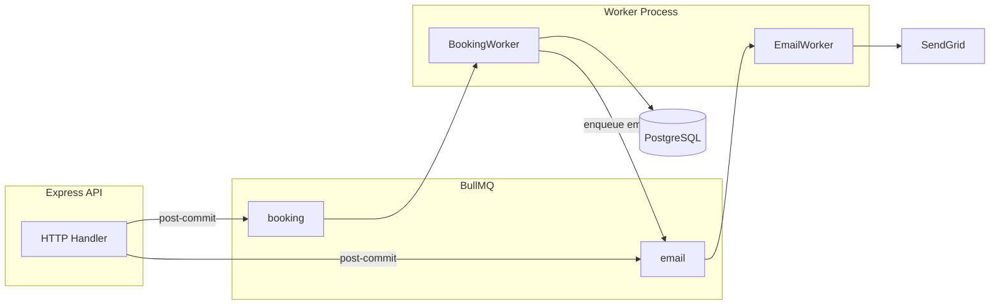
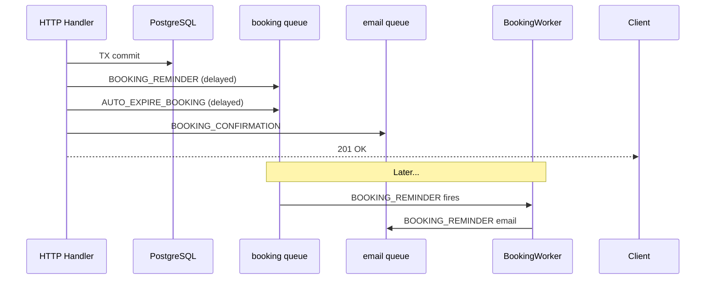

# Queue Design — Seat Reservation Platform for Study Cafés

**Project:** Seat Reservation Platform for Study Cafés  
**Stack:** Node.js, Express, PostgreSQL, Prisma, Redis, BullMQ  
**Document Version:** 2.0  
**Last Updated:** June 2026

**Related:** `REQUEST-FLOW.md`, `CONCURRENCY-DESIGN.md`, `CACHE-DESIGN.md`

---

## Table of Contents

1. [Queue Overview](#1-queue-overview)
2. [Why Only 2 Queues](#2-why-only-2-queues)
3. [Architecture](#3-architecture)
4. [Booking Queue](#4-booking-queue)
5. [Email Queue](#5-email-queue)
6. [Enqueue Rules](#6-enqueue-rules)
7. [Delayed Jobs per Booking](#7-delayed-jobs-per-booking)
8. [Job Cancellation](#8-job-cancellation)
9. [Job Idempotency](#9-job-idempotency)
10. [Testing Strategy](#10-testing-strategy)
11. [Design Decisions](#11-design-decisions)

---

## 1. Queue Overview

- **Purpose:** Async booking lifecycle + transactional emails.
- **Broker:** BullMQ on shared Redis (separate namespace from app cache).
- **Queues:** **2 only** — `booking`, `email`.
- **Workers:** **2 only** — `BookingWorker`, `EmailWorker`.
- **Trigger:** Enqueue **after** DB commit.
- **Out of scope:** SMS, push notifications, payment, analytics queues.

---

## 2. Why Only 2 Queues

| Removed | Reason |
| ------- | ------ |
| **Scheduled Queue** | BullMQ supports **delayed jobs** natively (`delay` option) — reminder and expire schedule on `booking` queue directly |
| **SMS Queue** | Out of MVP scope; email-only notifications |
| **Lifecycle Queue** | Merged into `booking` queue |
| **Separate Reminder Worker** | Reminder logic runs inside `BookingWorker`; email send delegated to `email` queue |

---

## 3. Architecture

```
BullMQ
├── booking          → BookingWorker  → PostgreSQL, Cache, Email Queue
└── email            → EmailWorker    → SendGrid, notification_logs
```



| Component | Role |
| --------- | ---- |
| **Producer** | `BookingQueueService`, `EmailQueueService` (service layer) |
| **Consumer** | Single worker process running both workers |
| **Redis** | Job storage, delays, retries — not in PostgreSQL |

---

## 4. Booking Queue

**Queue name:** `booking`  
**DLQ:** `booking:dlq`

| Item | Detail |
| ---- | ------ |
| **Purpose** | All booking-related background jobs: delayed reminder, auto-expire (release seat), optional reconciliation |
| **Producers** | `POST /bookings`, `DELETE /bookings/{id}`, `POST /bookings/{id}/check-in`, optional cron |
| **Consumer** | `BookingWorker` (concurrency: 3) |

### Job Types

| Job | Trigger | Delay | Payload | Worker Action |
| --- | ------- | ----- | ------- | ------------- |
| `BOOKING_REMINDER` | Create booking | `startTime − 30min` | `{ bookingId }` | Verify `CONFIRMED` → enqueue `BOOKING_REMINDER` to **email** queue |
| `AUTO_EXPIRE_BOOKING` | Create booking | `startTime + graceMinutes` | `{ bookingId }` | TX: set `EXPIRED` if still `CONFIRMED` → invalidate cache → enqueue cancellation email to **email** queue |
| `JOB_RECONCILIATION` | Cron (optional) | 0 | `{ scanWindowMinutes }` | Re-add missing delayed jobs for recent bookings |

**Delay formulas:**

- Reminder: `max(startTime − 30min − now, 1min)`
- Expire: `startTime + checkinGraceMinutes − now` (default grace 15 min)

### Retry Strategy

| Setting | Value |
| ------- | ----- |
| Attempts | 3 |
| Backoff | Exponential |
| Base delay | 30s |
| Formula | `30s × 2^(attempt − 1)` |

### Dead Letter Strategy

| Item | Detail |
| ---- | ------ |
| DLQ queue | `booking:dlq` |
| Move when | `attempts >= 3` |
| MVP action | Log error; inspect via Bull Board (dev); manual replay |

### Failure Handling

| Failure | Action |
| ------- | ------ |
| DB TX error | Retry |
| Status ≠ `CONFIRMED` (expire/reminder) | Complete job (no-op) |
| Booking not found | Complete job (discard) |
| Email enqueue fails post-expire | Log warning; booking still expired; cache invalidated |
| Clock drift (early expire) | Reschedule with corrected delay |
| Enqueue fails at booking create | Log; optional reconciliation job backfills |

---

## 5. Email Queue

**Queue name:** `email`  
**DLQ:** `email:dlq`

| Item | Detail |
| ---- | ------ |
| **Purpose** | Send all emails asynchronously via SendGrid |
| **Producers** | HTTP handlers (post-commit), `BookingWorker` (reminder / expire) |
| **Consumer** | `EmailWorker` (concurrency: 5) |

### Job Types

| Job | Trigger | Delay | Payload |
| --- | ------- | ----- | ------- |
| `BOOKING_CONFIRMATION` | Create booking | 1s | `{ bookingId, customerId }` |
| `BOOKING_REMINDER` | BookingWorker | 0 | `{ bookingId }` |
| `BOOKING_CANCELLATION` | Cancel booking / auto-expire | 0 | `{ bookingId, customerId, reason? }` |
| `SEND_VERIFICATION_EMAIL` | Register | 0 | `{ userId, email, token }` |
| `ADMIN_NEW_CAFE_PENDING` | Register-owner | 0 | `{ cafeId, ownerEmail }` |
| `ACCOUNT_SUSPENDED` | Admin suspend | 0 | `{ userId, reason }` |
| `ACCOUNT_UNSUSPENDED` | Admin unsuspend | 0 | `{ userId }` |

> MVP focus: **confirmation**, **reminder**, **cancellation**. Other jobs reuse the same queue and worker — no extra queue needed.

### Retry Strategy

| Setting | Value |
| ------- | ----- |
| Attempts | 3 |
| Backoff | Exponential |
| Base delay | 2s |
| Formula | `2s × 2^(attempt − 1)` |

### Dead Letter Strategy

| Item | Detail |
| ---- | ------ |
| DLQ queue | `email:dlq` |
| Move when | `attempts >= 3` or invalid recipient (4xx) |
| MVP action | Log + write `notification_logs` status `FAILED`; manual replay |

### Failure Handling

| Failure | Action |
| ------- | ------ |
| SendGrid 5xx / network | Retry |
| Invalid email (4xx) | Log; move to DLQ; no retry |
| Duplicate job | Send again (acceptable for MVP) or skip if `notification_logs` already `SENT` |

---

## 6. Enqueue Rules

| Rule | Detail |
| ---- | ------ |
| Post-commit only | Never enqueue inside PostgreSQL TX |
| Order | COMMIT → cache invalidate → idempotency write → enqueue |
| HTTP success | Booking saved even if enqueue fails (log + reconciliation) |
| Delayed jobs | BullMQ `delay` on `booking` queue — no separate scheduled queue |
| Cross-queue | `BookingWorker` enqueues to `email` queue; HTTP handler enqueues directly to `email` for immediate emails |



---

## 7. Delayed Jobs per Booking

Created on **booking create**:

| Job | Queue | Job ID | Fires At | Cancelled When |
| --- | ----- | ------ | -------- | -------------- |
| `BOOKING_REMINDER` | `booking` | `{bookingId}:reminder` | 30 min before start | Cancel booking |
| `AUTO_EXPIRE_BOOKING` | `booking` | `{bookingId}:expire` | Start + grace period | Cancel, check-in |

Immediate emails on create (email queue):

| Job | Cancelled When |
| --- | -------------- |
| `BOOKING_CONFIRMATION` | — (fire-and-forget) |

---

## 8. Job Cancellation

| Event | Jobs Removed (booking queue) |
| ----- | ---------------------------- |
| Cancel booking | `{bookingId}:reminder`, `{bookingId}:expire` |
| Check-in | `{bookingId}:expire` only |
| Force layout update | Per affected booking: reminder + expire |

**Mechanism:** `queue.remove(jobId)` by deterministic ID.

---

## 9. Job Idempotency

| Job | Deterministic ID | Queue |
| --- | ---------------- | ----- |
| `BOOKING_REMINDER` | `{bookingId}:reminder` | booking |
| `AUTO_EXPIRE_BOOKING` | `{bookingId}:expire` | booking |
| Others | UUID | email |

**Worker guard:** Expire/reminder no-op if booking status ≠ `CONFIRMED`.

---

## 10. Testing Strategy

| Test Case | Expected Result |
| --------- | --------------- |
| Create booking | 2 delayed jobs on `booking`; 1 email on `email` |
| Cancel booking | Reminder + expire removed from `booking` |
| Check-in | Expire removed; reminder may have fired |
| Reminder fires, booking active | Email job added to `email` queue |
| Expire fires, no check-in | Status `EXPIRED`; cache invalidated; email enqueued |
| Expire fires, already checked-in | No-op |
| Email SendGrid failure | 3 retries → `email:dlq` |
| Duplicate `{bookingId}:expire` | Single job in queue |

---

## 11. Design Decisions

| Decision | Reason |
| -------- | ------ |
| 2 queues only | Enough for modular monolith; easy for intern to implement |
| BullMQ delayed jobs | No separate Scheduled Queue — built-in `delay` |
| BookingWorker owns DB writes | Expire must be transactional |
| EmailWorker stateless | Template + SendGrid only |
| Reminder → email queue | BookingWorker orchestrates; EmailWorker sends |
| No SMS / push | Reduce scope for portfolio |
| 2 workers in one process | Single deployable worker container |
| Deterministic job IDs | Enable cancel on booking state change |
| Post-commit enqueue | DB is source of truth |
| DLQ manual replay | Simple ops; no auto-replay |

---

## Appendix: Jobs by Endpoint

| Endpoint | booking queue | email queue |
| -------- | ------------- | ----------- |
| `POST /bookings` | `BOOKING_REMINDER`, `AUTO_EXPIRE_BOOKING` | `BOOKING_CONFIRMATION` |
| `DELETE /bookings/{id}` | Remove reminder + expire | `BOOKING_CANCELLATION` |
| `POST /bookings/{id}/check-in` | Remove expire | — |
| `POST /auth/register` | — | `SEND_VERIFICATION_EMAIL` |
| `PUT /admin/users/{id}/suspend` | — | `ACCOUNT_SUSPENDED` |

---

**End of Queue Design Document**

*See `CACHE-DESIGN.md` for Redis cache (separate concern).*
