# Request Flows — Seat Reservation Platform

**Project:** Seat Reservation Platform for Study Cafés  
**Focus:** Backend request lifecycle (implementation guide)  
**Architecture:** Modular Monolith  
**Stack:** Node.js, Express, PostgreSQL, Prisma, Redis, BullMQ  
**Document Version:** 2.0  
**Last Updated:** June 2026

---

## Document Purpose

Describes **how the backend processes each business operation** across controllers, services, transactions, cache, queues, and workers.

Use during implementation. **Do not duplicate** schema, API contracts, cache keys, queue topology, or locking strategy — see linked design docs.

---

## Overview

### Request Flow Matrix

| Flow | Module | Transaction | Cache | Queue | Concurrency | Complexity |
| ---- | ------ | ----------- | ----- | ----- | ----------- | ---------- |
| Register | Auth | ✅ | ✅ | ✅ | ❌ | Medium |
| Login | Auth | ❌ | ✅ | ❌ | ❌ | Medium |
| Browse Cafés | Café | ❌ | ✅ | ❌ | ❌ | Low |
| Search Cafés | Café | ❌ | ✅ | ❌ | ❌ | Low |
| Get Café Detail | Café | ❌ | ✅ | ❌ | ❌ | Low |
| Get Seat Layout | Café | ❌ | ✅ | ❌ | ❌ | Low |
| View Seat Availability | Café, Booking | ❌ | ✅ | ❌ | ❌ | Low |
| Booking History | Booking | ❌ | ❌ | ❌ | ❌ | Low |
| Notifications | Notification | ❌ | ❌ | ❌ | ❌ | Low |
| Create Booking | Booking | ✅ | ✅ | ✅ | ✅ | High |
| Cancel Booking | Booking | ✅ | ✅ | ✅ | ✅ | High |
| Check-in | Booking | ✅ | ❌ | ✅ | ✅ | Medium |
| Auto Expire Booking | Worker | ✅ | ✅ | ✅ | ✅ | High |
| Booking Reminder | Worker | ❌ | ❌ | ✅ | ❌ | Low |
| Create Café | Café, Auth | ✅ | ✅ | ✅ | ❌ | Medium |
| Update Café | Café | ❌ | ✅ | ❌ | ❌ | Medium |
| Create Seat Layout | Café | ✅ | ✅ | ❌ | ✅ | Medium |
| Update Seat Layout | Café | ✅ | ✅ | ✅ | ✅ | Medium |
| Admin Manages Users | Admin | ✅ | ✅ | ✅ | ❌ | Medium |

### Flow Categories

#### Critical Flows

* Create Booking · Cancel Booking · Check-in · Auto Expire Booking

#### Medium Flows

* Register · Login · Create Café · Update Café · Create Seat Layout · Update Seat Layout · Admin Manages Users

#### Simple Flows

* Browse Cafés · Search Cafés · Get Café Detail · Get Seat Layout · View Seat Availability · Booking History · Notifications · Booking Reminder *(worker)*

### Cross Reference

| Topic | Related Document |
| ----- | ---------------- |
| Database | [DATABASE-DESIGN.md](./DATABASE-DESIGN.md) |
| API | [API-SPECIFICATION.md](./API-SPECIFICATION.md) |
| Cache | [CACHE-DESIGN.md](./CACHE-DESIGN.md) |
| Queue | [QUEUE-DESIGN.md](./QUEUE-DESIGN.md) |
| Concurrency | [CONCURRENCY-DESIGN.md](./CONCURRENCY-DESIGN.md) |
| Business Rules | [USE_CASES.md](./USE_CASES.md) |
| Architecture | [SYSTEM_ARCHITECTURE.md](./SYSTEM_ARCHITECTURE.md) |

---

## Conventions

| Abbreviation | Module |
|--------------|--------|
| **Auth** | Authentication & authorization |
| **Cafe** | Café and seat management |
| **Booking** | Reservations, check-in, cancellation |
| **Notification** | Email, SMS, in-app notifications |
| **Admin** | System administration |

**HTTP middleware chain:** Morgan → Request ID → Rate Limiter → Auth → RBAC → Validator → Error Handler

**Queues:** `booking` → `BookingWorker` (reminder, auto-expire) · `email` → `EmailWorker` (SendGrid). See [QUEUE-DESIGN.md](./QUEUE-DESIGN.md).

**Error envelope:** `{ error: { code, message, statusCode, requestId, details? } }`

---

## Table of Contents

| ID | Flow | Category | Trigger |
|----|------|----------|---------|
| [RF-01](#rf-01-register) | Register | Medium | HTTP POST |
| [RF-02](#rf-02-login) | Login | Medium | HTTP POST |
| [RF-03](#rf-03-browse-cafés) | Browse Cafés | Simple | HTTP GET |
| [RF-04](#rf-04-view-seat-availability) | View Seat Availability | Simple | HTTP GET |
| [RF-05](#rf-05-create-booking) | Create Booking | Critical | HTTP POST |
| [RF-06](#rf-06-cancel-booking) | Cancel Booking | Critical | HTTP DELETE |
| [RF-07](#rf-07-check-in) | Check-in | Critical | HTTP POST |
| [RF-08](#rf-08-auto-expire-booking) | Auto Expire Booking | Critical | BullMQ Worker |
| [RF-09](#rf-09-booking-reminder) | Booking Reminder | Simple | BullMQ Worker |
| [RF-10](#rf-10-create-café) | Create Café | Medium | HTTP POST |
| [RF-11](#rf-11-update-seat-layout) | Update Seat Layout | Medium | HTTP PUT |
| [RF-12](#rf-12-admin-manages-users) | Admin Manages Users | Medium | HTTP PUT |
| [RF-13](#rf-13-search-cafés) | Search Cafés | Simple | HTTP GET |
| [RF-14](#rf-14-get-café-detail) | Get Café Detail | Simple | HTTP GET |
| [RF-15](#rf-15-get-seat-layout) | Get Seat Layout | Simple | HTTP GET |
| [RF-16](#rf-16-booking-history) | Booking History | Simple | HTTP GET |
| [RF-17](#rf-17-notifications) | Notifications | Simple | HTTP GET/PATCH |
| [RF-18](#rf-18-update-café) | Update Café | Medium | HTTP PUT |
| [RF-19](#rf-19-create-seat-layout) | Create Seat Layout | Medium | HTTP PUT |

---

# Critical Flows

## RF-05: Create Booking

### Goal

Atomically reserve a seat, prevent double-booking, trigger post-commit side effects.

### Preconditions

- Customer `ACTIVE`; below `maxConcurrentBookings`.
- Café `ACTIVE`; seat belongs to café; slot valid and in the future.
- `Idempotency-Key` header present.

### Main Flow

| Step | Component | Action |
|------|-----------|--------|
| 1–3 | Client / Gateway / **BookingController** | Auth, validate body |
| 4 | **IdempotencyService** | Read Idempotency Cache → return cached `201` if hit |
| 5–8 | **BookingService** / **AuthService** / **CafeService** | Orchestrate; verify customer, café, slot rules |
| 9–14 | `[TX]` | Acquire row lock → overlap check → insert `CONFIRMED` → audit → COMMIT |
| 15–20 | Post-commit | Write Idempotency Cache · Invalidate Availability Cache · Enqueue Confirmation Email · Enqueue Booking Reminder · Enqueue Booking Expiration |
| 21 | **BookingController** | `201 Created` |

### Alternative Flows

| Scenario | Behavior |
|----------|----------|
| Idempotent retry | Cached `201` from step 4 |
| Customer time conflict (different seat) | `409 BOOKING_CONFLICT` before lock |
| Deposit required | Payment validation inside TX |

### Exception Flows

| Error | HTTP | Code |
|-------|------|------|
| Missing idempotency key | 400 | `IDEMPOTENCY_KEY_REQUIRED` |
| Unauthorized / suspended | 401 / 403 | `UNAUTHORIZED` / `ACCOUNT_SUSPENDED` |
| Seat not found / café inactive | 404 | `SEAT_NOT_FOUND` / `CAFE_NOT_AVAILABLE` |
| Seat booked / limit exceeded | 409 | `SEAT_ALREADY_BOOKED` / `BOOKING_LIMIT_EXCEEDED` |
| Invalid slot / TX timeout | 422 / 503 | `INVALID_TIME_SLOT` / `BOOKING_TIMEOUT` |
| Redis or queue failure (post-commit) | 201 | *(booking committed; log warning)* |

### Transaction Boundary

```
BEGIN → acquire row lock → overlap check → insert booking → audit → COMMIT
```

No Redis/BullMQ inside TX. See [CONCURRENCY-DESIGN.md](./CONCURRENCY-DESIGN.md).

### Concurrency Notes

- Acquire row lock + overlap check inside TX
- Idempotency key for client retries; unique index backup on seat+slot

See [CONCURRENCY-DESIGN.md](./CONCURRENCY-DESIGN.md).

### Cache Operations

- Read / Write Idempotency Cache · Invalidate Availability Cache

See [CACHE-DESIGN.md](./CACHE-DESIGN.md).

### Queue Operations

- Enqueue Confirmation Email · Enqueue Booking Reminder · Enqueue Booking Expiration

See [QUEUE-DESIGN.md](./QUEUE-DESIGN.md).

### Logging

`booking.created` · `booking.seat_conflict` · `booking.failed`

### Sequence Diagram

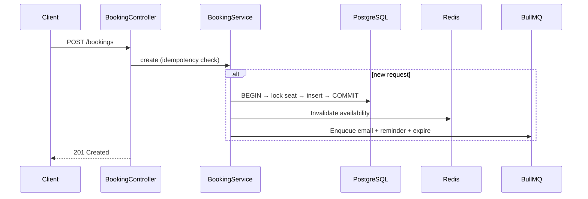

---

## RF-06: Cancel Booking

### Goal

Cancel active booking, release seat, apply refund policy, notify customer.

### Preconditions

- Customer owns booking; status `CONFIRMED` (not `CHECKED_IN` / `COMPLETED` / `CANCELLED`).

### Main Flow

| Step | Component | Action |
|------|-----------|--------|
| 1–7 | **BookingController** / **CancellationService** | Auth, load booking, validate policy, calculate refund |
| 8–12 | `[TX]` | Update `CANCELLED` + history + audit → COMMIT |
| 13–16 | Post-commit | Invalidate Availability Cache · Cancel reminder + expire jobs · Enqueue Cancellation Email |
| 17 | **BookingController** | `200 OK` |

### Alternative Flows

| Scenario | Behavior |
|----------|----------|
| Already cancelled | Idempotent `200` |
| Late cancel (< 1h) | `refundAmount = 0` |
| `force` owner cancel | May waive penalties |

### Exception Flows

| Error | HTTP | Code |
|-------|------|------|
| Not found / not owner | 404 / 403 | `BOOKING_NOT_FOUND` / `FORBIDDEN` |
| Cannot cancel (checked in) | 409 | `BOOKING_CANNOT_CANCEL` |

### Transaction Boundary

```
BEGIN → UPDATE status=CANCELLED + history + audit → COMMIT
```

See [CONCURRENCY-DESIGN.md](./CONCURRENCY-DESIGN.md).

### Concurrency Notes

- `UPDATE WHERE status='CONFIRMED'` — races with check-in / auto-expire

See [CONCURRENCY-DESIGN.md](./CONCURRENCY-DESIGN.md).

### Cache Operations

- Invalidate Availability Cache

See [CACHE-DESIGN.md](./CACHE-DESIGN.md).

### Queue Operations

- Cancel Booking Reminder · Cancel Booking Expiration · Enqueue Cancellation Email

See [QUEUE-DESIGN.md](./QUEUE-DESIGN.md).

### Logging

`booking.cancelled` · `booking.cancel.rejected`

### Sequence Diagram

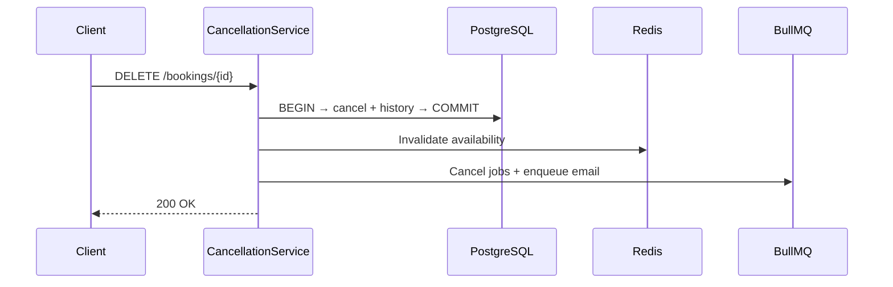

---

## RF-07: Check-in

### Goal

Mark booking `CHECKED_IN` within ±15 min of start; record `checkedInAt`.

### Preconditions

- Customer owns booking; status `CONFIRMED`; within check-in window.

### Main Flow

| Step | Component | Action |
|------|-----------|--------|
| 1–5 | **BookingController** / **CheckinService** | Auth, load booking, validate window |
| 6–10 | `[TX]` | `UPDATE CHECKED_IN WHERE CONFIRMED` + `checkedInAt` + audit → COMMIT |
| 11 | Post-commit | Cancel Booking Expiration job |
| 12 | **BookingController** | `200 OK` |

### Alternative Flows

| Scenario | Behavior |
|----------|----------|
| Already checked in | Idempotent `200` |
| Owner manual check-in | Skips customer ownership |
| Too early | `422 CHECKIN_TOO_EARLY` |

### Exception Flows

| Error | HTTP | Code |
|-------|------|------|
| Not found / not owner | 404 / 403 | — |
| Wrong status / expired | 409 | `BOOKING_INVALID_STATUS` / `BOOKING_EXPIRED` |
| Too late | 409 | `CHECKIN_WINDOW_EXPIRED` |

### Transaction Boundary

```
BEGIN → conditional UPDATE CHECKED_IN + audit → COMMIT
```

See [CONCURRENCY-DESIGN.md](./CONCURRENCY-DESIGN.md).

### Concurrency Notes

- Conditional update vs auto-expire worker — first writer wins

See [CONCURRENCY-DESIGN.md](./CONCURRENCY-DESIGN.md).

### Queue Operations

- Cancel Booking Expiration job

See [QUEUE-DESIGN.md](./QUEUE-DESIGN.md).

### Logging

`checkin.success` · `booking.checkin.rejected`

### Sequence Diagram

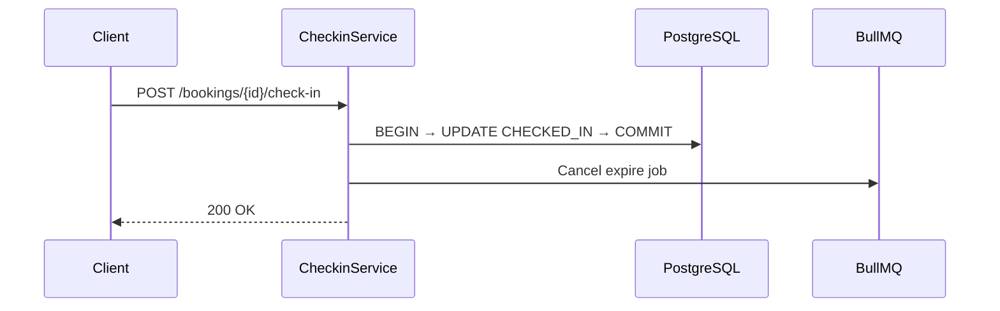

---

## RF-08: Auto Expire Booking

### Goal

Cancel no-show bookings after grace period (start + 15 min); free seat; notify customer.

**Trigger:** BullMQ delayed job from [RF-05](#rf-05-create-booking).

### Preconditions

- Status `CONFIRMED`; deadline passed; expire job not cancelled.

### Main Flow

| Step | Component | Action |
|------|-----------|--------|
| 1–5 | **BookingWorker** / **BookingService** | Load booking; verify `CONFIRMED` and past deadline |
| 6–10 | `[TX]` | `UPDATE EXPIRED WHERE CONFIRMED` + history (`NO_SHOW`) + audit → COMMIT |
| 11–14 | Post-commit | Invalidate Availability Cache · Enqueue Cancellation Email · complete job |

### Alternative Flows

| Scenario | Behavior |
|----------|----------|
| Already checked in / cancelled | 0 rows → no-op |
| Job fired early | Reschedule with corrected delay |

### Exception Flows

| Error | Job Action |
|-------|------------|
| Not found | Complete (discard) |
| DB error | Retry |
| Post-commit Redis/queue failure | Log warning; retry notification |

### Transaction Boundary

```
BEGIN → conditional UPDATE EXPIRED + history + audit → COMMIT
```

See [CONCURRENCY-DESIGN.md](./CONCURRENCY-DESIGN.md).

### Concurrency Notes

- Conditional update vs check-in; BullMQ job locking

See [CONCURRENCY-DESIGN.md](./CONCURRENCY-DESIGN.md).

### Cache Operations

- Invalidate Availability Cache

See [CACHE-DESIGN.md](./CACHE-DESIGN.md).

### Queue Operations

- Enqueue Booking Expiration *(scheduled at create)* · Enqueue Cancellation Email *(on expire)*

See [QUEUE-DESIGN.md](./QUEUE-DESIGN.md).

### Logging

`booking.expired` · `booking.expire.noop`

### Sequence Diagram

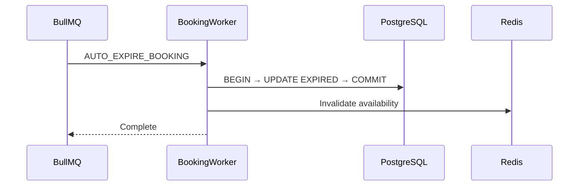

---

# Medium Flows

## RF-01: Register

### Goal

Create Customer account, issue JWT, enqueue verification email.

### Preconditions

- Email not registered; rate limit OK; role `CUSTOMER`.

### Main Flow

| Step | Action |
|------|--------|
| 1–6 | Validate → check uniqueness → hash password |
| 7–8 | `[TX]` Insert user (`PENDING_EMAIL_VERIFICATION`) + profile + audit → COMMIT |
| 9–12 | Issue JWT · store refresh token · Enqueue Verification Email → `201` |

### Exception Flows

| Error | HTTP | Code |
|-------|------|------|
| Validation | 422 | `VALIDATION_ERROR` |
| Email exists | 409 | `EMAIL_ALREADY_REGISTERED` |
| Rate limit | 429 | `RATE_LIMIT_EXCEEDED` |

### Transaction

```
BEGIN → user + profile + audit → COMMIT
```

### Cache

- Write Idempotency Cache · rate-limit counter

See [CACHE-DESIGN.md](./CACHE-DESIGN.md).

### Sequence Diagram

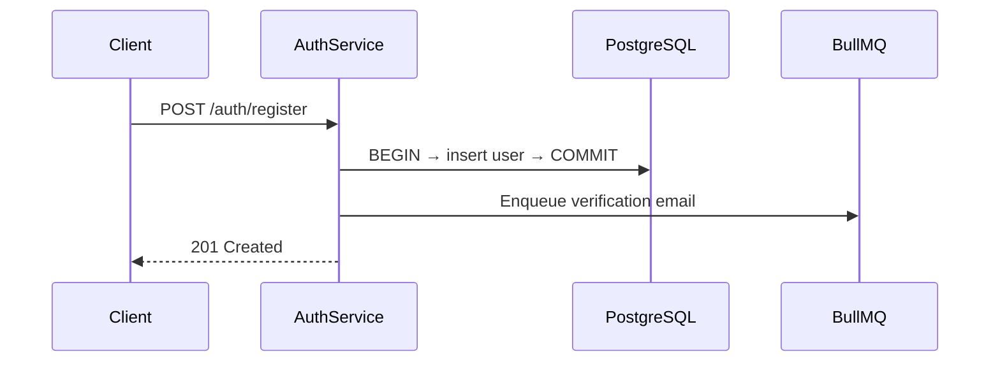

---

## RF-02: Login

### Goal

Authenticate; issue JWT; support session revocation.

### Preconditions

- User exists; not locked; status `ACTIVE` or `PENDING_EMAIL_VERIFICATION`.

### Main Flow

| Step | Action |
|------|--------|
| 1–6 | Rate limit → findByEmail → compare password |
| 7–11 | Reset fail counter · issue JWT · store refresh token · audit → `200` |

Failed password: increment counter; lock after 5 failures / 15 min.

### Exception Flows

| Error | HTTP | Code |
|-------|------|------|
| Bad credentials | 401 | `INVALID_CREDENTIALS` |
| Locked / suspended | 403 | `ACCOUNT_LOCKED` / `ACCOUNT_SUSPENDED` |

### Cache

- Login failure counter · refresh token

See [CACHE-DESIGN.md](./CACHE-DESIGN.md).

### Sequence Diagram

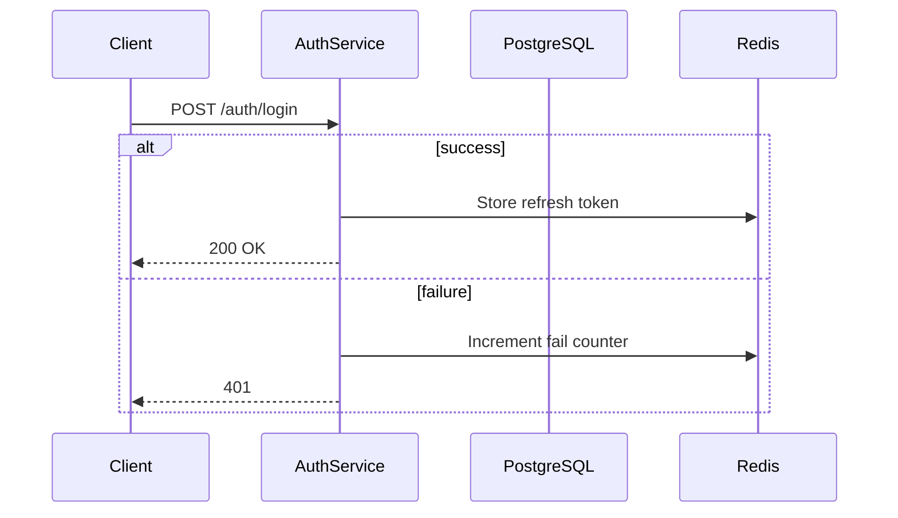

---

## RF-10: Create Café

### Goal

Create café `PENDING_VERIFICATION` — new owner registration or additional café for existing owner.

### Preconditions

- Required fields provided; rate limit OK.

### Main Flow

| Step | Action |
|------|--------|
| 1–4 | Validate; check email uniqueness *(new owner)* |
| 5–6 | `[TX]` Insert owner *(if new)* + café + audit → COMMIT |
| 7–10 | Issue JWT *(new owner)* · Enqueue Verification Email + Admin Notification → `201` |

### Exception Flows

| Error | HTTP | Code |
|-------|------|------|
| Email exists | 409 | `EMAIL_ALREADY_REGISTERED` |
| Invalid hours | 422 | `VALIDATION_ERROR` |

### Transaction

```
BEGIN → owner (if new) + café + audit → COMMIT
```

### Cache

No public list invalidation until admin approval.

See [CACHE-DESIGN.md](./CACHE-DESIGN.md).

### Sequence Diagram

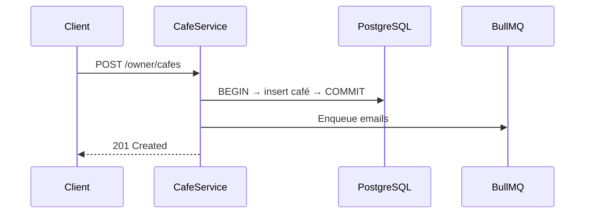

---

## RF-18: Update Café

### Goal

Update café profile (name, address, hours, amenities).

### Preconditions

- Owner authenticated; owns café; cannot change `status` here.

### Main Flow

| Step | Action |
|------|--------|
| 1–5 | Validate → verify ownership → update café + audit |
| 6–7 | Invalidate Café List Cache · Refresh Café Cache → `200` |

### Exception Flows

| Error | HTTP | Code |
|-------|------|------|
| Not found / not owner | 404 / 403 | — |
| Validation | 422 | `VALIDATION_ERROR` |

### Cache

- Invalidate Café List Cache · Refresh Café Cache

See [CACHE-DESIGN.md](./CACHE-DESIGN.md).

### Sequence Diagram

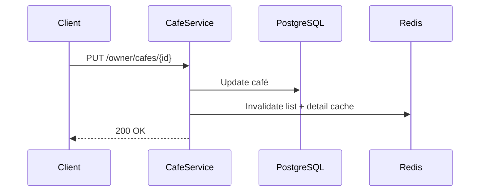

---

## RF-19: Create Seat Layout

### Goal

Create initial zones + seats for a café with no existing layout.

### Preconditions

- Owner owns café; no existing layout.

### Main Flow

| Step | Action |
|------|--------|
| 1–5 | Validate layout · verify ownership · uniqueness rules |
| 6–7 | `[TX]` Insert zones + seats + audit → COMMIT |
| 8–9 | Invalidate Café Layout Cache · Refresh Café Cache → `201` |

### Exception Flows

| Error | HTTP | Code |
|-------|------|------|
| Layout exists | 409 | `LAYOUT_ALREADY_EXISTS` |
| Duplicate seats | 422 | `DUPLICATE_SEAT_NUMBER` |

### Transaction

```
BEGIN → insert zones + seats + audit → COMMIT
```

### Cache

- Invalidate Café Layout Cache · Refresh Café Cache

See [CACHE-DESIGN.md](./CACHE-DESIGN.md).

### Sequence Diagram

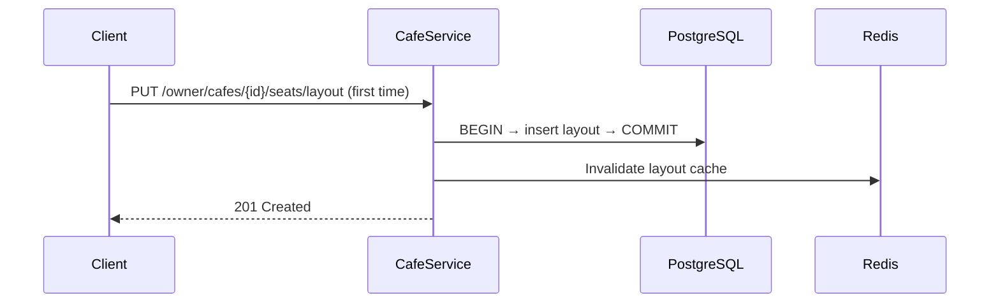

---

## RF-11: Update Seat Layout

### Goal

Update existing layout with conflict detection and cache invalidation.

### Preconditions

- Owner owns café; layout exists.

### Main Flow

| Step | Action |
|------|--------|
| 1–6 | Validate · verify ownership · check active booking conflicts |
| 7–8 | `[TX]` Upsert zones + seats (soft-delete removed) + audit → COMMIT |
| 9–10 | Invalidate Availability + Layout Cache · Refresh Café Cache |
| 11 | Enqueue Cancellation Email if `force=true` cancels bookings → `200` |

### Exception Flows

| Error | HTTP | Code |
|-------|------|------|
| Booking conflict | 409 | `LAYOUT_CONFLICT` |
| Duplicate seats | 422 | `DUPLICATE_SEAT_NUMBER` |

### Transaction

```
BEGIN → upsert zones + seats + audit → COMMIT
```

See [CONCURRENCY-DESIGN.md](./CONCURRENCY-DESIGN.md).

### Cache

- Invalidate Availability Cache · Invalidate Café Layout Cache · Refresh Café Cache

See [CACHE-DESIGN.md](./CACHE-DESIGN.md).

### Sequence Diagram

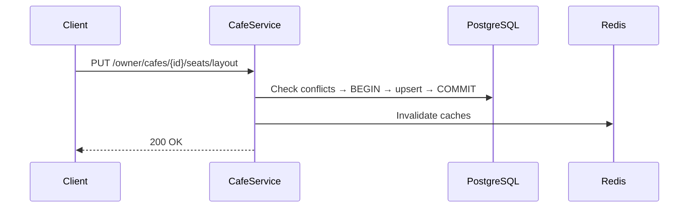

---

## RF-12: Admin Manages Users

### Goal

Suspend / unsuspend user; revoke sessions immediately.

### Preconditions

- Admin role; target not admin; reason provided *(suspend)*.

### Main Flow — Suspend

| Step | Action |
|------|--------|
| 1–6 | Validate · load user · policy checks |
| 7–8 | `[TX]` Update `SUSPENDED` + audit → COMMIT |
| 9–11 | Revoke refresh tokens · blocklist · Enqueue Account Suspended Email → `200` |

### Exception Flows

| Error | HTTP | Code |
|-------|------|------|
| Not found | 404 | `USER_NOT_FOUND` |
| Cannot suspend admin/self | 403 | `FORBIDDEN` |

### Transaction

```
BEGIN → update status + audit → COMMIT
```

### Cache

- Revoke refresh tokens · token blocklist

See [CACHE-DESIGN.md](./CACHE-DESIGN.md).

### Sequence Diagram

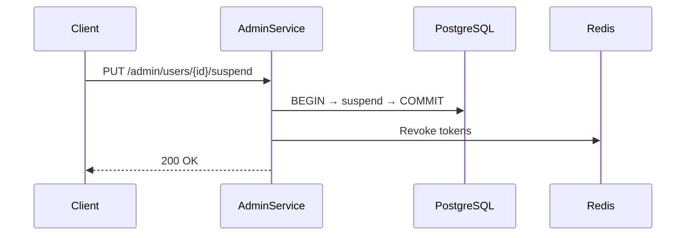

---

# Simple Flows

## RF-03: Browse Cafés

### Goal

Paginated list of active cafés.

### Preconditions

Public; only `ACTIVE` cafés.

### Main Flow

**CafeController** → **CafeListingService.list()** → Read Café List Cache → *(miss)* query DB → Write Café List Cache → `200`

### Response

`data.items[]` (`id`, `name`, `slug`, `city`, `amenities`, `totalSeats`) + pagination.

### Sequence Diagram

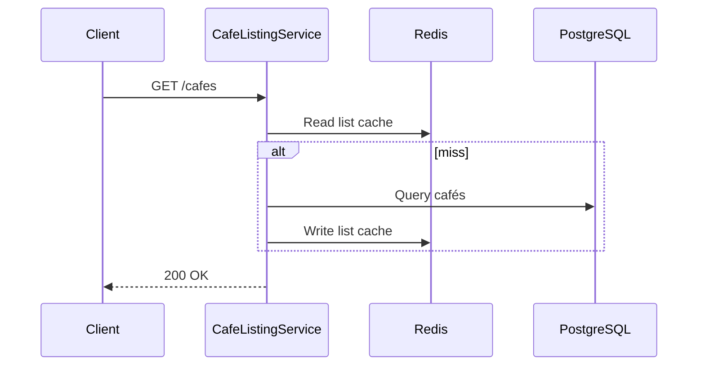

---

## RF-13: Search Cafés

### Goal

Filter by city, amenities, optional date/time; optional `availableSeatsCount`.

### Preconditions

Public; `city` required.

### Main Flow

**CafeListingService.search()** → Read Café List Cache → *(miss)* filtered query → *(time set)* compute availability counts → `200`

### Response

Same pagination as browse; optional `availableSeatsCount`.

### Sequence Diagram

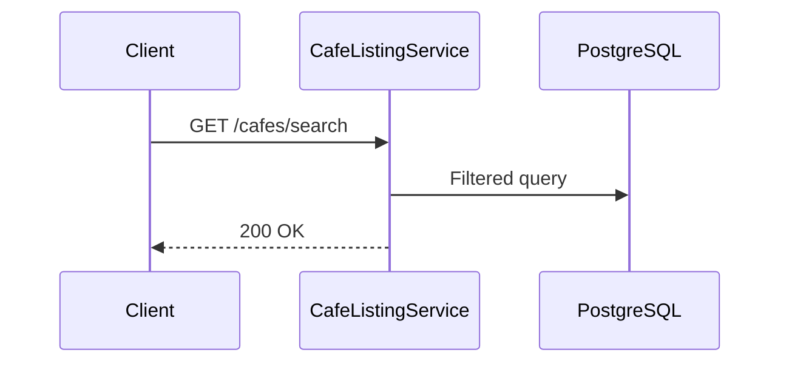

---

## RF-14: Get Café Detail

### Goal

Public café profile + booking policies.

### Main Flow

**CafeService.getPublicDetail()** → Read Café Detail Cache → *(miss)* load café + policies → `200`

### Response

`data.cafe`, `data.policies` · `404` if not found / not active.

### Sequence Diagram

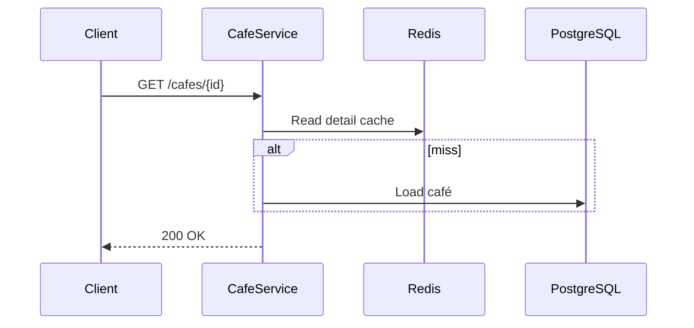

---

## RF-15: Get Seat Layout

### Goal

Zones + seats (no booking status).

### Main Flow

**CafeService.getSeatLayout()** → Read Café Layout Cache → *(miss)* load zones + seats → `200`

### Response

`data.zones[]` with `seats[]`.

### Sequence Diagram

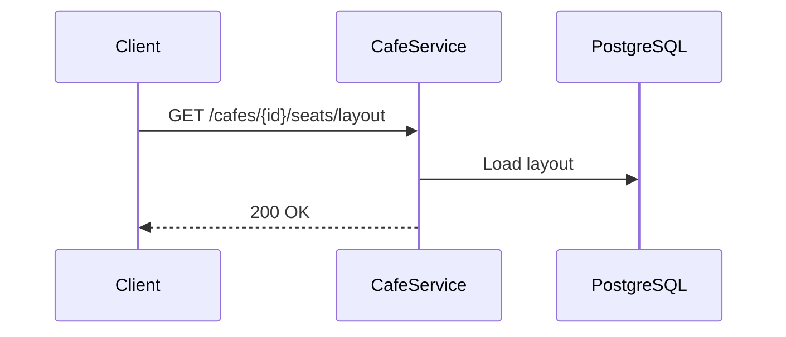

---

## RF-04: View Seat Availability

### Goal

Seat availability for a time slot (layout + occupancy).

### Preconditions

Café `ACTIVE`; slot valid and not in the past.

### Main Flow

**SeatAvailabilityService** → Read Availability Cache → *(miss)* load seats + overlapping bookings → merge `AVAILABLE`/`BOOKED` → `200`

### Response

`data.zones[]`, `data.summary` · `404` / `422` on invalid slot.

> Snapshot may be stale; [RF-05](#rf-05-create-booking) is authoritative at write time.

### Sequence Diagram

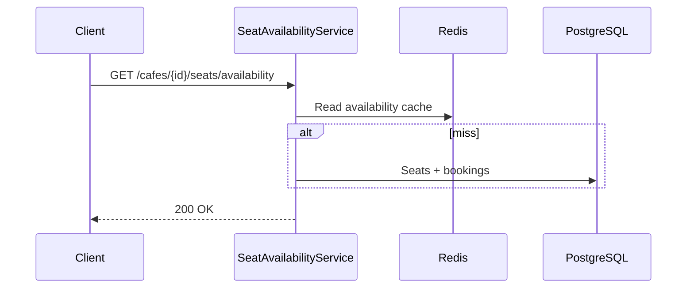

---

## RF-16: Booking History

### Goal

Paginated customer booking list.

### Preconditions

Customer authenticated; own bookings only.

### Main Flow

**BookingService.listByCustomer()** → filtered paginated query → `200`

### Response

`data.items[]` with café/seat summary. `upcoming=true` → future `CONFIRMED`/`CHECKED_IN`.

### Sequence Diagram

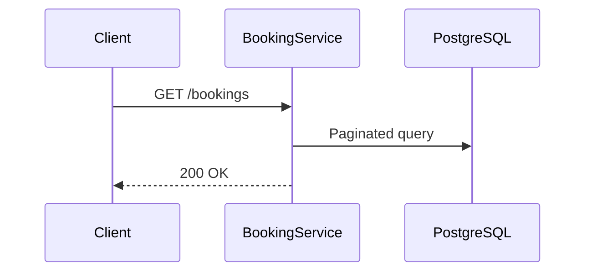

---

## RF-17: Notifications

### Goal

List in-app notifications; mark as read.

### Main Flow

| Operation | Flow |
|-----------|------|
| GET | **NotificationService.list()** → query `notification_logs` (`IN_APP`) → `200` + `unreadCount` |
| PATCH | **NotificationService.markRead()** → update `isRead` (idempotent) → `200` |

### Response

List: `data.items[]` + pagination · Mark read: `data.notification` · `404`/`403` on invalid.

### Sequence Diagram

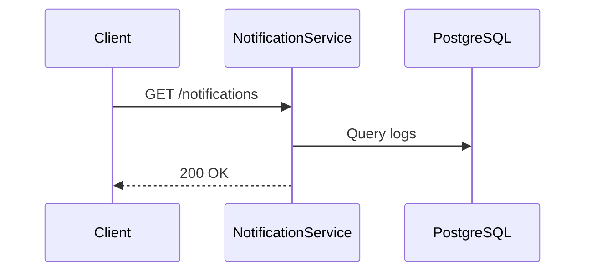

---

## RF-09: Booking Reminder

### Goal

Send reminder email 30 min before booking start.

**Trigger:** BullMQ delayed job from [RF-05](#rf-05-create-booking).

### Preconditions

Status `CONFIRMED`; reminder job not cancelled.

### Main Flow

**BookingWorker** → load booking → verify `CONFIRMED` → Enqueue Reminder Email → **EmailWorker** sends → complete job.

Cancelled/checked-in → no-op.

### Response

Job completes or no-ops.

### Sequence Diagram

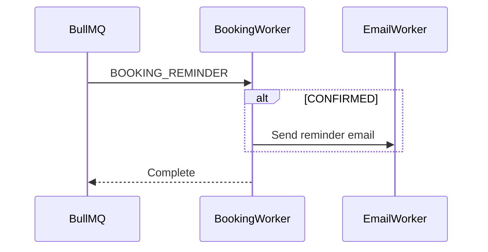

---

## Appendix

### Booking Status State Machine

```
CONFIRMED → CHECKED_IN → COMPLETED
     ↓           ↓
 CANCELLED    EXPIRED (no-show)
```

### Scheduled Jobs per Booking

| Job | Scheduled At | Cancelled By |
|-----|--------------|--------------|
| Booking Reminder | RF-05 create | RF-06 cancel |
| Booking Expiration | RF-05 create | RF-07 check-in, RF-06 cancel |

See [QUEUE-DESIGN.md](./QUEUE-DESIGN.md).

### Cache Invalidation Triggers

| Event | Action |
|-------|--------|
| Booking created / cancelled / expired | Invalidate Availability Cache |
| Café updated / approved | Invalidate Café List Cache · Refresh Café Cache |
| Layout changed | Invalidate Availability + Layout Cache |

See [CACHE-DESIGN.md](./CACHE-DESIGN.md).
