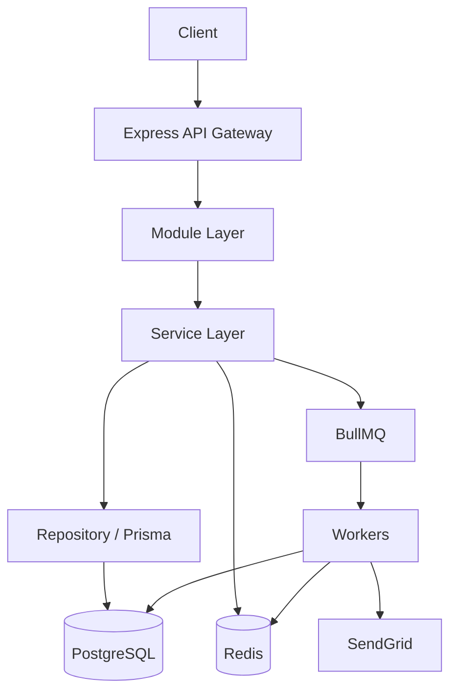
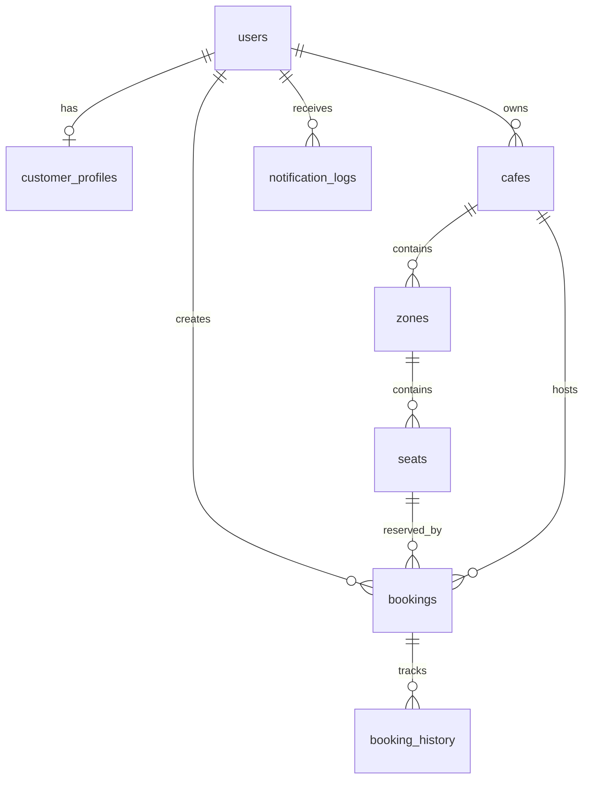

# System Overview — Seat Reservation Platform

**Project:** Seat Reservation Platform for Study Cafés  
**Role:** Technical Index / Project Blueprint — read this first  
**Audience:** Backend Intern / new developer  
**Document Version:** 1.0  
**Last Updated:** June 2026

> Summary only. For details, follow links in [§14 Documentation Index](#14-documentation-index).

---

## 1. Project Snapshot

| Item | Value |
| ---- | ----- |
| **Project Name** | Seat Reservation Platform for Study Cafés |
| **Architecture** | Modular Monolith (single deployable, bounded modules) |
| **Backend** | Node.js 20 · Express 4 |
| **Database** | PostgreSQL 16 · Prisma ORM |
| **Cache** | Redis 7 (application cache, sessions, idempotency, rate limits) |
| **Queue** | BullMQ on Redis (`booking`, `email` queues) |
| **Authentication** | JWT (access + refresh tokens); RBAC: `CUSTOMER`, `OWNER`, `ADMIN` |
| **Deployment** | Docker → Render (app + managed Postgres + Redis) |

---

## 2. High-Level Architecture



| Layer | Responsibility |
|-------|----------------|
| Gateway | Routing, JWT, RBAC, validation, rate limit, error handling |
| Modules | Auth · Café · Booking · Customer · Notification · Admin |
| Infrastructure | PostgreSQL (source of truth) · Redis · BullMQ · SendGrid |

→ Details: [SYSTEM_ARCHITECTURE.md](./SYSTEM_ARCHITECTURE.md)

---

## 3. Module Overview

| Module | Responsibility | Main Components |
| ------ | -------------- | --------------- |
| **Auth** | Registration, login, JWT, password, RBAC | AuthController, AuthService, JWTService, PasswordService |
| **Café** | Café CRUD, layout, availability reads | CafeController, CafeService, SeatAvailabilityService |
| **Booking** | Reserve, cancel, check-in, idempotency | BookingController, BookingService, CancellationService, CheckinService |
| **Customer** | Profile, preferences | CustomerService, CustomerRepository |
| **Notification** | Email orchestration, in-app notification logs | NotificationService, EmailQueueService |
| **Admin** | User suspend, café approval | AdminController, AdminService |

→ Details: [SYSTEM_ARCHITECTURE.md](./SYSTEM_ARCHITECTURE.md) · [USE_CASES.md](./USE_CASES.md)

---

## 4. API Summary

Base path: `/api/v1`. Full contracts → [API-SPECIFICATION.md](./API-SPECIFICATION.md).

| Module | Main APIs |
| ------ | --------- |
| **Auth** | `POST /auth/register` · `POST /auth/login` · `POST /auth/refresh` · `POST /auth/logout` · `GET /auth/me` |
| **Café (public)** | `GET /cafes` · `GET /cafes/search` · `GET /cafes/{id}` · `GET /cafes/{id}/seats/layout` · `GET /cafes/{id}/seats/availability` |
| **Booking** | `POST /bookings` · `GET /bookings` · `GET /bookings/{id}` · `DELETE /bookings/{id}` · `POST /bookings/{id}/check-in` |
| **Notification** | `GET /notifications` · `PATCH /notifications/{id}/read` |
| **Owner** | `POST /owner/cafes` · `PUT /owner/cafes/{id}` · `PUT /owner/cafes/{id}/seats/layout` · `GET /owner/cafes/{id}/bookings` |
| **Admin** | `GET /admin/users` · `PUT /admin/users/{id}/suspend` · `GET /admin/cafes/pending` · `PUT /admin/cafes/{id}/approve` |

**Level A** (critical): register, login, refresh, create/cancel booking, check-in, create café, update seat layout.

---

## 5. Request Flow Summary

| Flow | Transaction | Cache | Queue | Concurrency |
| ---- | ----------- | ----- | ----- | ----------- |
| Register | ✅ | ✅ | ✅ | ❌ |
| Login | ❌ | ✅ | ❌ | ❌ |
| Browse / Search / Detail / Layout Cafés | ❌ | ✅ | ❌ | ❌ |
| View Seat Availability | ❌ | ✅ | ❌ | ❌ |
| **Create Booking** | ✅ | ✅ | ✅ | ✅ |
| **Cancel Booking** | ✅ | ✅ | ✅ | ✅ |
| **Check-in** | ✅ | ❌ | ✅ | ✅ |
| **Auto Expire Booking** | ✅ | ✅ | ✅ | ✅ |
| Booking Reminder | ❌ | ❌ | ✅ | ❌ |
| Create Café | ✅ | ✅ | ✅ | ❌ |
| Update Café / Seat Layout | ✅ / ❌ | ✅ | ✅* | ✅ |
| Admin Suspend User | ✅ | ✅ | ✅ | ❌ |
| Booking History / Notifications | ❌ | ❌ | ❌ | ❌ |

*\*Queue on layout `force=true` cancels affected bookings.*

→ Step-by-step flows: [REQUEST-FLOW.md](./REQUEST-FLOW.md)

---

## 6. Database Summary

9 PostgreSQL tables. No `refresh_tokens` or `booking_slots` — those live in Redis / booking row.

| Table | Purpose |
| ----- | ------- |
| `users` | Identity, credentials, role, account status |
| `customer_profiles` | Customer name, phone, notification preferences |
| `cafes` | Café profile, hours, policies, approval status |
| `zones` | Seating sections within a café |
| `seats` | Bookable units per zone |
| `bookings` | Reservations: seat, time window, status, timestamps |
| `booking_history` | Append-only status transition log |
| `notification_logs` | Sent notification audit (email / in-app) |
| `audit_logs` | Platform security & business audit trail |

→ Schema, indexes, constraints: [DATABASE-DESIGN.md](./DATABASE-DESIGN.md)

---

## 7. Entity Relationships



---

## 8. Cache Summary

Application cache only (4 types). Strategy details → [CACHE-DESIGN.md](./CACHE-DESIGN.md).

| Cached Data | TTL |
| ----------- | --- |
| Café List | 5 min |
| Café Detail | 10 min |
| Seat Layout | 10 min |
| Seat Availability | 30 sec |

**Also in Redis (not application cache):** refresh tokens, idempotency keys, rate limits, BullMQ.

---

## 9. Queue Summary

2 queues. Details → [QUEUE-DESIGN.md](./QUEUE-DESIGN.md).

| Queue | Main Jobs |
| ----- | --------- |
| **booking** | `BOOKING_REMINDER` · `AUTO_EXPIRE_BOOKING` · `JOB_RECONCILIATION` *(optional)* |
| **email** | `BOOKING_CONFIRMATION` · `BOOKING_REMINDER` · `BOOKING_CANCELLATION` · `SEND_VERIFICATION_EMAIL` · `ADMIN_NEW_CAFE_PENDING` · `ACCOUNT_SUSPENDED` |

---

## 10. Concurrency Summary

| Scenario | Solution |
| -------- | -------- |
| Double booking (same seat + slot) | Row-level lock on seat + overlap check in TX |
| Duplicate client request | Idempotency Key (Redis) |
| Cancel vs auto-expire vs check-in | Conditional `UPDATE WHERE status = 'CONFIRMED'` |
| Concurrent registration (same email) | DB unique constraint on email |
| Layout change vs active bookings | Pre-TX conflict check; `force=true` optional |
| Stale availability read | Short TTL + post-commit cache invalidation |

→ Deep dive: [CONCURRENCY-DESIGN.md](./CONCURRENCY-DESIGN.md)

---

## 11. Background Workers

| Worker | Responsibility |
| ------ | -------------- |
| **BookingWorker** | Process `booking` queue: reminder orchestration, auto-expire (TX + cache invalidate + enqueue email) |
| **EmailWorker** | Process `email` queue: SendGrid delivery, write `notification_logs` |

Runs in same Node process or separate worker container. Enqueue **after** DB commit only.

---

## 12. Project Structure

Planned backend layout (modular monolith):

```
src/
├── app.ts                 # Express bootstrap
├── routes/                # Route registration
├── modules/
│   ├── auth/
│   ├── cafe/
│   ├── booking/
│   ├── customer/
│   ├── notification/
│   └── admin/
├── common/                # Shared types, errors, utils
├── middleware/            # Auth, RBAC, validator, error handler
├── workers/               # BookingWorker, EmailWorker
└── config/                # Env, Redis, Prisma clients
prisma/
├── schema.prisma
└── migrations/
tests/
├── unit/
├── integration/
└── load/k6/
```

---

## 13. Technology Stack

| Category | Technology |
| -------- | ---------- |
| Runtime | Node.js 20 LTS |
| Framework | Express 4 |
| ORM | Prisma |
| Database | PostgreSQL 16 |
| Cache / Session | Redis 7 |
| Queue | BullMQ |
| Auth | JWT (jsonwebtoken) · bcrypt |
| Email | SendGrid |
| Testing | Vitest · Supertest · k6 |
| CI/CD | GitHub Actions |
| Deployment | Docker · Render |

---

## 14. Documentation Index

| Document | Purpose |
| -------- | ------- |
| [SYSTEM-OVERVIEW.md](./SYSTEM-OVERVIEW.md) | **This file** — technical index & blueprint |
| [SYSTEM_ARCHITECTURE.md](./SYSTEM_ARCHITECTURE.md) | Components, layers, module dependencies, infrastructure |
| [USE_CASES.md](./USE_CASES.md) | Business rules, actors, use cases |
| [DATABASE-DESIGN.md](./DATABASE-DESIGN.md) | Tables, ERD, constraints, indexes, booking state machine |
| [API-SPECIFICATION.md](./API-SPECIFICATION.md) | REST endpoints, request/response, error codes |
| [REQUEST-FLOW.md](./REQUEST-FLOW.md) | Per-flow processing steps (controller → worker) |
| [CONCURRENCY-DESIGN.md](./CONCURRENCY-DESIGN.md) | Transactions, locking, idempotency, race scenarios |
| [CACHE-DESIGN.md](./CACHE-DESIGN.md) | Cache keys, TTL, invalidation, failure behaviour |
| [QUEUE-DESIGN.md](./QUEUE-DESIGN.md) | BullMQ topology, jobs, delays, cancellation |
| [TESTING.md](./TESTING.md) | Unit, integration, load test strategy |
| [DEPLOYMENT.md](../../docs/DEPLOYMENT.md) | Deploy runbook *(planned)* — repo root `docs/` |

---

## Reading Order (5–10 min)

1. **This document** — whole-system map
2. [USE_CASES.md](./USE_CASES.md) — what the system does
3. [SYSTEM_ARCHITECTURE.md](./SYSTEM_ARCHITECTURE.md) — how components connect
4. [API-SPECIFICATION.md](./API-SPECIFICATION.md) + [REQUEST-FLOW.md](./REQUEST-FLOW.md) — implement HTTP features
5. [DATABASE-DESIGN.md](./DATABASE-DESIGN.md) + [CONCURRENCY-DESIGN.md](./CONCURRENCY-DESIGN.md) — data & safety for booking path
6. [CACHE-DESIGN.md](./CACHE-DESIGN.md) + [QUEUE-DESIGN.md](./QUEUE-DESIGN.md) — Redis & async side effects
7. [TESTING.md](./TESTING.md) — verify before shipping
