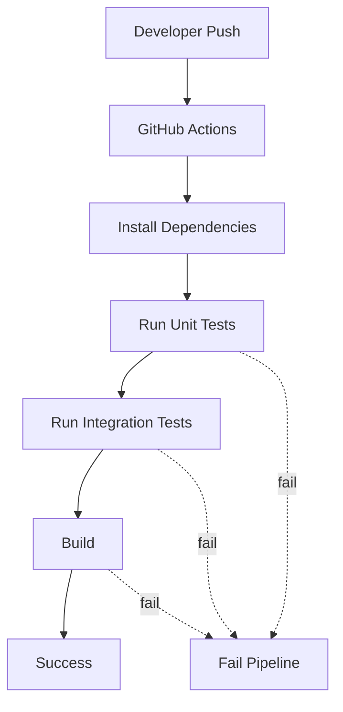

# Testing Strategy — Seat Reservation Platform

**Project:** Seat Reservation Platform for Study Cafés  
**Audience:** Backend Intern / Fresher (implementation guide)  
**Stack:** Node.js, Express, PostgreSQL, Prisma, Redis, BullMQ  
**Test Tools:** Vitest, Supertest, k6, GitHub Actions  
**Document Version:** 1.0  
**Last Updated:** June 2026

**Related:** [API-SPECIFICATION.md](./API-SPECIFICATION.md) · [REQUEST-FLOW.md](./REQUEST-FLOW.md) · [CONCURRENCY-DESIGN.md](./CONCURRENCY-DESIGN.md)

---

## 1. Testing Overview

### Goals

| Goal | Description |
|------|-------------|
| **Protect critical paths** | Booking, auth, and concurrency-sensitive logic must behave correctly under normal and failure conditions |
| **Catch regressions early** | Automated tests run on every push via GitHub Actions |
| **Validate realistic usage** | Integration and load tests exercise real HTTP + database paths |
| **Demonstrate engineering judgment** | Test what matters — not every endpoint, not 100% coverage |

### Philosophy

* **Value over volume** — a small suite of meaningful tests beats hundreds of trivial assertions.
* **Test behaviour, not implementation** — focus on inputs, outputs, and side effects (DB state, HTTP status).
* **Isolate layers appropriately** — unit tests mock dependencies; integration tests use real PostgreSQL + Redis.
* **Match project scope** — this is a portfolio backend project, not a production QA programme.

### Test Types in Scope

| Type | When to Use |
|------|-------------|
| **Unit** | Pure business logic in services and utilities |
| **Integration** | Critical HTTP APIs end-to-end through Express → service → DB |
| **Load** | Smoke and moderate load on read-heavy and booking paths |

### Out of Scope

The following are **not** part of this project. They require dedicated QA infrastructure, larger teams, or extended timelines — beyond a Backend Intern portfolio:

| Excluded Type | Reason |
|---------------|--------|
| End-to-End (E2E) | Requires full frontend + browser automation |
| Contract Testing | Overhead for a single-service monolith with one consumer |
| Mutation / Property-based Testing | Advanced techniques; low ROI at this scale |
| Chaos Testing | Needs production-like distributed environment |
| Stress / Spike / Soak Testing | Beyond load-test scope for intern project |
| Visual / Snapshot Testing | Frontend concern |

---

## 2. Testing Strategy

| Test Level | Tool | Purpose | Scope |
| ---------- | ---- | ------- | ----- |
| **Unit** | Vitest | Verify business rules in isolation with mocked repositories and Redis | Service layer, validators, pure utilities |
| **Integration** | Vitest + Supertest | Verify HTTP contracts, auth, DB persistence, and error mapping | Selected Level A APIs against test DB + Redis |
| **Load** | k6 | Verify system stability under light and moderate traffic | Smoke (sanity) + load (booking / availability) |

### Test Directory Layout

```
tests/
├── unit/                  # Vitest — *.test.ts per service/utility
├── integration/           # Vitest + Supertest — *.integration.test.ts per API group
├── helpers/               # Factories, test DB setup, auth helpers
└── load/
    ├── k6/                # k6 scripts (*.js)
    └── reports/           # k6 JSON/HTML output (gitignored)
```

---

## 3. Test Scope Matrix

Not every module needs all three levels. Priority follows [REQUEST-FLOW.md](./REQUEST-FLOW.md) critical flows.

| Module | Unit | Integration | Load | Rationale |
| ------ | ---- | ----------- | ---- | --------- |
| **Authentication** | ✅ | ✅ | ❌ | JWT + password logic; register/login/refresh are entry points |
| **Booking** | ✅ | ✅ | ✅ | Highest business risk; concurrency and idempotency |
| **Café** | ⚠️ Partial | ❌ | ✅ | Availability read path is load-sensitive; simple CRUD skipped |
| **Seat / Layout** | ⚠️ Partial | ❌ | ❌ | Layout validation only (unit); reads covered via availability |
| **Notification** | ❌ | ❌ | ❌ | Async side effect; verified manually / via integration side effects |
| **Admin** | ❌ | ❌ | ❌ | Out of scope for intern test suite |
| **Worker (BullMQ)** | ⚠️ Partial | ❌ | ❌ | Expire logic unit-tested; job delivery verified manually |

**Legend:** ✅ planned · ⚠️ limited · ❌ not in scope

---

## 4. Test Environment

| Component | Environment |
| --------- | ----------- |
| **PostgreSQL** | Docker container (`postgres:16-alpine`); separate `cafe_reservation_test` database |
| **Redis** | Docker container (`redis:7-alpine`); DB index `1` for tests |
| **Node.js** | v20 LTS (matches CI) |
| **Docker Compose** | `docker-compose.test.yml` — starts Postgres + Redis for local integration tests |
| **Environment variables** | `.env.test` — test DB URL, Redis URL, JWT secrets (non-production) |
| **Prisma** | `prisma migrate deploy` against test DB before integration suite |
| **GitHub Actions** | `ubuntu-latest` runner; service containers for Postgres + Redis |
| **k6** | Run locally or in CI `load` job (manual trigger / scheduled — not on every push) |

### Local Commands (reference)

| Command | Description |
|---------|-------------|
| `npm run test:unit` | Vitest unit tests |
| `npm run test:integration` | Vitest integration tests (requires Docker) |
| `npm run test` | Unit + integration |
| `k6 run tests/load/k6/smoke.js` | Smoke test |
| `k6 run tests/load/k6/booking-load.js` | Booking load test |

---

## 5. Unit Testing

Focus on **business logic** in the service layer. Do not unit-test controllers, Prisma queries, or simple CRUD wrappers.

### Modules & Test Cases

| Module | Test Cases |
| ------ | ---------- |
| **BookingService** | Reject overlapping slot · enforce `maxConcurrentBookings` · reject past / out-of-hours slot · happy-path create DTO mapping |
| **CancellationService** | Refund tier: full (>1h) vs none (<1h) · reject cancel when `CHECKED_IN` · idempotent cancel when already `CANCELLED` |
| **CheckinService** | Accept within ±15 min window · reject too early · reject too late · reject wrong status |
| **SeatAvailabilityService** | Merge seats as `AVAILABLE` / `BOOKED` given booking list · handle empty café · zone filter |
| **AuthService** | Reject weak password · reject duplicate email (mock repo) · lock after N failed attempts (mock Redis) |
| **PasswordService** | Hash + compare round-trip |
| **JWTService** | Issue token · verify expiry · reject invalid signature |
| **SeatLayoutValidator** | Reject duplicate seat numbers · require ≥1 seat per zone |
| **BookingService.expireIfNoCheckin** | Expire when `CONFIRMED` + past grace · no-op when `CHECKED_IN` |

### Conventions

* File naming: `tests/unit/<module>/<service>.test.ts`
* Mock `Repository` and `Redis` interfaces — never hit real DB in unit tests
* Use Vitest `describe` / `it` blocks grouped by behaviour
* No snapshot tests

### Example Structure

```
tests/unit/
├── booking/
│   ├── booking.service.test.ts
│   ├── cancellation.service.test.ts
│   └── checkin.service.test.ts
├── cafe/
│   └── seat-availability.service.test.ts
├── auth/
│   ├── auth.service.test.ts
│   └── jwt.service.test.ts
└── shared/
    └── password.service.test.ts
```

---

## 6. Integration Testing

Test **selected Level A APIs** through the full Express stack. Use Supertest; seed minimal fixtures via Prisma.

### API Test Matrix

| API | Scenario | Expected Result |
| --- | -------- | --------------- |
| `POST /api/v1/auth/register` | Valid customer payload | `201` · user created · tokens returned |
| `POST /api/v1/auth/register` | Duplicate email | `409 EMAIL_ALREADY_REGISTERED` |
| `POST /api/v1/auth/login` | Valid credentials | `200` · access + refresh tokens |
| `POST /api/v1/auth/login` | Wrong password | `401 INVALID_CREDENTIALS` |
| `POST /api/v1/auth/refresh` | Valid refresh token | `200` · new access token |
| `POST /api/v1/auth/refresh` | Revoked / expired token | `401` |
| `POST /api/v1/bookings` | Valid booking + `Idempotency-Key` | `201` · `status=CONFIRMED` in DB |
| `POST /api/v1/bookings` | Same seat + slot (concurrent) | One `201`, one `409 SEAT_ALREADY_BOOKED` |
| `POST /api/v1/bookings` | Missing `Idempotency-Key` | `400 IDEMPOTENCY_KEY_REQUIRED` |
| `POST /api/v1/bookings` | Duplicate idempotency key | `201` cached response (no double insert) |
| `DELETE /api/v1/bookings/{id}` | Owner cancels `CONFIRMED` booking | `200` · `status=CANCELLED` in DB |
| `DELETE /api/v1/bookings/{id}` | Cancel already checked-in booking | `409 BOOKING_CANNOT_CANCEL` |
| `POST /api/v1/bookings/{id}/check-in` | Within grace window | `200` · `status=CHECKED_IN` |
| `POST /api/v1/bookings/{id}/check-in` | Too early | `422 CHECKIN_TOO_EARLY` |
| `GET /api/v1/cafes/{id}/seats/availability` | Active café + valid slot | `200` · seats with `AVAILABLE` / `BOOKED` |

### Conventions

* File naming: `tests/integration/<group>.integration.test.ts`
* `beforeAll` — migrate test DB, seed café + seats + test user
* `afterEach` — truncate booking tables (keep seed data)
* Obtain auth token via login helper; attach `Authorization: Bearer` header
* Do **not** integration-test every Level B read endpoint

### Not Tested (Integration)

| Endpoint Group | Reason |
|----------------|--------|
| Browse / Search / Detail cafés | Read-only; low risk; covered by manual verification |
| Owner / Admin APIs | Out of intern scope |
| Notification list | Depends on async worker; manual check |
| Email delivery | Mock SendGrid in test env |

---

## 7. Load Testing

Use **k6** for two scenarios only. No stress, spike, or soak tests.

| Test | Script | Purpose |
| ---- | ------ | ------- |
| **Smoke** | `tests/load/k6/smoke.js` | Verify app responds under minimal load (1–5 VUs, ~30s): health check, login, browse cafés |
| **Load** | `tests/load/k6/booking-load.js` | Simulate concurrent users: read availability → attempt create booking; observe `201` vs `409` ratio and p95 latency |

### Smoke Test Thresholds (targets)

| Metric | Threshold |
|--------|-----------|
| `http_req_failed` | < 1% |
| `http_req_duration` p95 | < 500 ms |

### Load Test Profile (targets)

| Parameter | Value |
|-----------|-------|
| Virtual users | 20–50 |
| Duration | 2–5 min |
| Ramp-up | 30s |

### Scripts & Reports

| Path | Description |
|------|-------------|
| `tests/load/k6/smoke.js` | Smoke test script |
| `tests/load/k6/booking-load.js` | Booking + availability load script |
| `tests/load/k6/helpers.js` | Shared auth + data helpers |
| `tests/load/reports/` | k6 output (`--out json=...`); add to `.gitignore` |

Run locally:

```bash
k6 run tests/load/k6/smoke.js
k6 run tests/load/k6/booking-load.js --out json=tests/load/reports/booking-load.json
```

Load tests run **manually** or on a scheduled CI workflow — not on every push (slower, needs running app).

---

## 8. Test Automation

### CI Pipeline

Triggered on: `push` and `pull_request` to `main`.



### Workflow Jobs

| Job | Steps | Trigger |
|-----|-------|---------|
| `test` | Checkout → setup Node → `npm ci` → start Postgres/Redis services → `npm run test` → `npm run build` | Every push / PR |
| `load` *(optional)* | Deploy to staging or start app → `k6 run` smoke → upload report artifact | Manual `workflow_dispatch` |

### Integration Test in CI

```yaml
# Simplified — see .github/workflows/test.yml
services:
  postgres:
    image: postgres:16-alpine
    env:
      POSTGRES_DB: cafe_reservation_test
  redis:
    image: redis:7-alpine
```

No deploy step in the test pipeline.

---

## 9. Test Results Summary

> Update this table after running the test suite. **Do not fabricate coverage percentages or pass rates.**

| Test Type | Status | Notes |
| --------- | ------ | ----- |
| Unit | Pending | Suite defined; run `npm run test:unit` |
| Integration | Pending | Requires Docker; run `npm run test:integration` |
| Smoke (k6) | Pending | Manual verification after deployment |
| Load (k6) | Pending | Manual verification; results in `tests/load/reports/` |

### What Passing Tests Prove

| Test Type | Proves |
|-----------|--------|
| **Unit** | Business rules (booking overlap, cancel policy, check-in window, auth validation) are correctly implemented in isolation |
| **Integration** | Critical APIs return correct HTTP status, persist expected DB state, and handle auth + idempotency |
| **Smoke** | Application is reachable and core paths respond under minimal traffic |
| **Load** | Booking and availability endpoints remain stable under moderate concurrent users without excessive errors |

---

## 10. Known Limitations

| Limitation | Impact |
|------------|--------|
| No E2E testing | Frontend ↔ backend flows not automated |
| No test coverage reporting | Coverage % not tracked (no Istanbul/c8 threshold in CI) |
| No performance benchmark baseline | k6 results are point-in-time; no historical comparison |
| No security testing | No OWASP scan, penetration test, or dependency audit automation |
| BullMQ workers not in integration CI | Auto-expire and reminder jobs verified manually or via unit tests |
| Email / SendGrid mocked | Real email delivery not tested |
| No contract tests | API changes not validated against external consumers |
| Single-node load tests | k6 from one machine ≠ production traffic patterns |

These gaps are **acceptable** for a Backend Intern portfolio. They document honest scope boundaries and areas for future improvement.

---

## Quick Reference

| Question | Answer |
|----------|--------|
| **What do we test?** | Booking business logic, auth, critical APIs, light load on availability/booking |
| **What tools?** | Vitest (unit + integration), Supertest (HTTP), k6 (load), GitHub Actions (CI) |
| **How are critical features tested?** | Unit tests for rules; integration tests for create/cancel/check-in + auth; k6 for concurrency smoke |
| **What do results demonstrate?** | Core reservation flow is correct, regressions are caught on push, system handles moderate load |

*See [REQUEST-FLOW.md](./REQUEST-FLOW.md) for flows under test and [API-SPECIFICATION.md](./API-SPECIFICATION.md) for endpoint contracts.*
