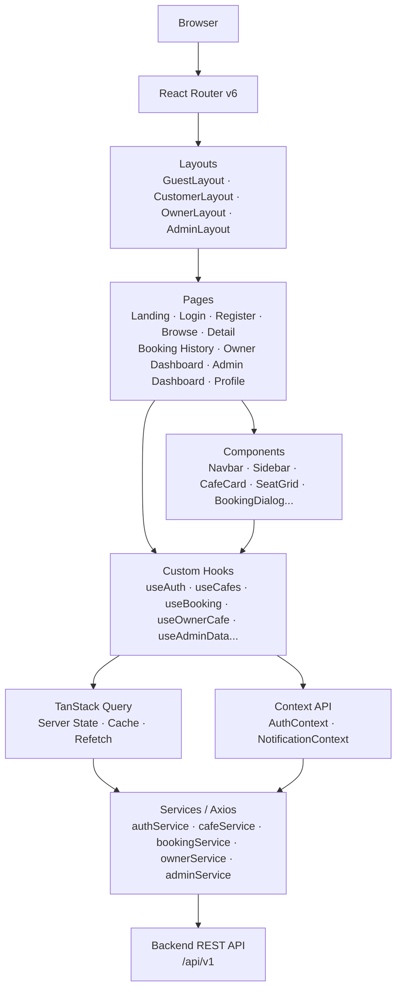
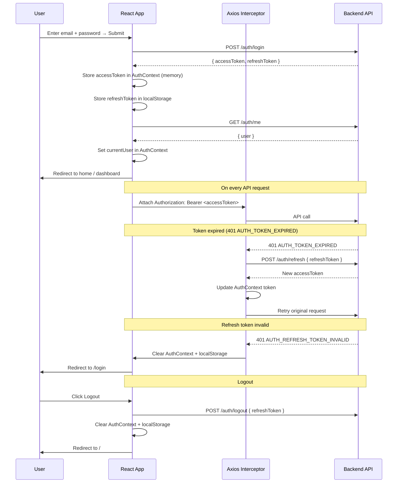

# Frontend Architecture — Seat Reservation Platform for Study Cafés

**Role:** Frontend Architecture Reference  
**Scope:** Project structure, routing, data fetching, state, error handling — no business logic, no DB details  
**Stack:** React 19 · Vite · TypeScript · MUI · React Router · Axios · React Hook Form · Zod · TanStack Query · Context API  
**Last Updated:** June 2026

---

## 1. Frontend Architecture Overview



---

## 2. Folder Structure

```
src/
├── main.tsx                    # Vite entry point
├── App.tsx                     # Router setup, QueryClientProvider, theme
│
├── assets/                     # Static images, icons
│
├── layouts/
│   ├── GuestLayout.tsx         # Navbar only — public pages
│   ├── CustomerLayout.tsx      # Navbar (with notification dropdown)
│   ├── OwnerLayout.tsx         # Left sidebar + top navbar
│   └── AdminLayout.tsx         # Left sidebar + top navbar
│
├── pages/
│   ├── LandingPage.tsx
│   ├── auth/
│   │   ├── LoginPage.tsx
│   │   └── RegisterPage.tsx
│   ├── cafe/
│   │   ├── BrowseCafesPage.tsx
│   │   └── CafeDetailPage.tsx  # Booking Dialog opens here
│   ├── booking/
│   │   └── BookingHistoryPage.tsx
│   ├── owner/
│   │   └── OwnerDashboardPage.tsx  # Tabs: Overview · My Cafés & Layout · Bookings
│   ├── admin/
│   │   └── AdminDashboardPage.tsx  # Tabs: Overview · Users · Café Approvals
│   └── profile/
│       └── ProfilePage.tsx
│
├── components/
│   ├── common/
│   │   ├── Navbar.tsx
│   │   ├── Sidebar.tsx
│   │   ├── NotificationDropdown.tsx  # Bell icon dropdown in Navbar
│   │   ├── StatusChip.tsx
│   │   ├── SearchBar.tsx
│   │   ├── LoadingSpinner.tsx
│   │   ├── EmptyState.tsx
│   │   ├── ConfirmDialog.tsx
│   │   └── ProtectedRoute.tsx
│   ├── cafe/
│   │   ├── CafeCard.tsx
│   │   └── SeatGrid.tsx
│   ├── booking/
│   │   └── BookingDialog.tsx
│   └── owner/
│       └── SeatLayoutEditor.tsx    # Tab panel component inside OwnerDashboardPage
│
├── hooks/
│   ├── useAuth.ts
│   ├── useCafes.ts
│   ├── useCafeDetail.ts
│   ├── useBooking.ts
│   ├── useNotifications.ts
│   ├── useOwnerDashboard.ts
│   └── useAdminDashboard.ts
│
├── contexts/
│   ├── AuthContext.tsx              # User identity, tokens, login/logout
│   └── NotificationContext.tsx     # Unread count, refetch trigger
│
├── services/
│   ├── axiosInstance.ts            # Base Axios config, interceptors
│   ├── authService.ts
│   ├── cafeService.ts
│   ├── bookingService.ts
│   ├── notificationService.ts
│   ├── ownerService.ts
│   └── adminService.ts
│
├── types/
│   ├── auth.types.ts
│   ├── cafe.types.ts
│   ├── booking.types.ts
│   ├── notification.types.ts
│   └── admin.types.ts
│
├── utils/
│   ├── formatDate.ts               # ISO 8601 → display string
│   ├── idempotencyKey.ts           # UUID v4 generator for POST /bookings
│   └── errorMessage.ts             # Map API error codes → user-facing strings
│
└── schemas/                        # Zod validation schemas
    ├── auth.schema.ts
    ├── booking.schema.ts
    ├── cafe.schema.ts
    └── profile.schema.ts
```

---

## 3. Route Summary

| Route | Page | Layout | Auth Required | Role |
|-------|------|--------|---------------|------|
| `/` | Landing | Guest | No | — |
| `/login` | Login | Guest | No | — |
| `/register` | Register | Guest | No | — |
| `/cafes` | Browse Cafés | Guest | No | — |
| `/cafes/:cafeId` | Café Detail + Booking Dialog | Guest | No (dialog requires auth) | — |
| `/bookings` | Booking History | Customer | Yes | CUSTOMER |
| `/profile` | Profile | Customer | Yes | CUSTOMER |
| `/owner/dashboard` | Owner Dashboard | Owner | Yes | OWNER |
| `/admin/dashboard` | Admin Dashboard | Admin | Yes | ADMIN |

**Route guards:**
- Unauthenticated access to protected routes → redirect to `/login`.
- Wrong role (e.g. CUSTOMER hitting `/owner/*`) → redirect to `/`.
- Booking Dialog on Café Detail: if user clicks "Book This Seat" without auth → redirect to `/login?next=...`.
- Implemented via `ProtectedRoute` wrapper reading `AuthContext`.

---

## 4. Page → API Mapping

| Page | Method + Endpoint | Backend Module |
|------|-------------------|----------------|
| **Browse Cafés** | `GET /cafes` · `GET /cafes/search` | Café |
| **Café Detail** | `GET /cafes/{id}` · `GET /cafes/{id}/seats/layout` · `GET /cafes/{id}/seats/availability` | Café · Seat |
| **Booking Dialog** | `POST /bookings` | Booking |
| **Booking History** | `GET /bookings` · `DELETE /bookings/{id}` · `POST /bookings/{id}/check-in` | Booking |
| **Profile** | `GET /auth/me` · `PATCH /customer/profile` | Auth · Customer |
| **Login** | `POST /auth/login` | Auth |
| **Register** | `POST /auth/register` · `POST /auth/register-owner` | Auth |
| **Owner Dashboard — Overview tab** | `GET /owner/cafes` | Owner |
| **Owner Dashboard — My Cafés & Layout tab** | `POST /owner/cafes` · `PUT /owner/cafes/{id}` · `PATCH /owner/cafes/{id}/settings` · `GET /owner/cafes/{id}/seats/layout` · `PUT /owner/cafes/{id}/seats/layout` | Owner · Seat |
| **Owner Dashboard — Bookings tab** | `GET /owner/cafes/{id}/bookings` · `POST /owner/cafes/{id}/bookings/{id}/check-in` | Owner · Booking |
| **Admin Dashboard — Overview tab** | `GET /admin/users` · `GET /admin/cafes/pending` | Admin |
| **Admin Dashboard — Users tab** | `GET /admin/users` · `GET /admin/users/{id}` · `PUT /admin/users/{id}/suspend` · `PUT /admin/users/{id}/unsuspend` | Admin |
| **Admin Dashboard — Café Approvals tab** | `GET /admin/cafes/pending` · `PUT /admin/cafes/{id}/approve` · `PUT /admin/cafes/{id}/reject` | Admin |
| **Notification Dropdown (Navbar)** | `GET /notifications` · `PATCH /notifications/{id}/read` | Notification |

---

## 5. Business Flow Mapping

| UI Flow | User Action | Backend Flow |
|---------|------------|--------------|
| **Register** | Fill form → Submit | `POST /auth/register` or `/register-owner` → issue JWT + enqueue email |
| **Login** | Fill form → Submit | `POST /auth/login` → receive `accessToken` + `refreshToken` |
| **Token Refresh** | Automatic (interceptor) | `POST /auth/refresh` → new `accessToken` |
| **Logout** | Click logout | `POST /auth/logout` → revoke refresh token → clear local state |
| **Browse Cafés** | Load page / search | `GET /cafes` or `GET /cafes/search` → cached list (5 min) |
| **View Seat Availability** | Open Café Detail / select zone | `GET /cafes/{id}/seats/availability` → 30s TTL cache |
| **Create Booking** | Select seat → Confirm in dialog | `POST /bookings` (with `Idempotency-Key`) → row lock → enqueue confirmation email |
| **Cancel Booking** | Click Cancel → Confirm Dialog | `DELETE /bookings/{id}` → status update → enqueue email |
| **Check-in (Customer)** | Click Check-in on active booking | `POST /bookings/{id}/check-in` → status update → enqueue email |
| **Check-in (Owner)** | Owner checks in guest from Bookings tab | `POST /owner/cafes/{id}/bookings/{id}/check-in` |
| **Create Café** | Owner fills form → Submit in Layout tab | `POST /owner/cafes` → PENDING status |
| **Update Seat Layout** | Owner edits zones/seats → Save Layout | `PUT /owner/cafes/{id}/seats/layout` → conflict check → cache invalidated |
| **Approve Café** | Admin clicks Approve in Café Approvals tab | `PUT /admin/cafes/{id}/approve` → status APPROVED |
| **Suspend User** | Admin clicks Suspend → Confirm Dialog | `PUT /admin/users/{id}/suspend` → enqueue email |
| **Read Notification** | Click item in bell dropdown | `PATCH /notifications/{id}/read` → mark read |

---

## 6. State Management

| Data | Storage | Tool | Notes |
|------|---------|------|-------|
| `accessToken` | Memory (Context) | `AuthContext` | Never in `localStorage`. Lost on page refresh → triggers refresh flow. |
| `refreshToken` | `localStorage` | Native | Persists across sessions. Cleared on logout. |
| `currentUser` | Memory (Context) | `AuthContext` | Populated from `GET /auth/me` on app init. |
| Café list | Server cache | TanStack Query | `staleTime: 5min`. Refetch on search param change. |
| Café detail | Server cache | TanStack Query | `staleTime: 10min`. Keyed by `cafeId`. |
| Seat availability | Server cache | TanStack Query | `staleTime: 30s`. Matches backend Redis TTL. |
| Booking list | Server cache | TanStack Query | `staleTime: 0`. Invalidated after create / cancel. |
| Notification list | Server cache | TanStack Query | `staleTime: 0`. Invalidated on `PATCH /read`. |
| Unread notification count | Memory (Context) | `NotificationContext` | Derived from notification list query. |
| Owner café list | Server cache | TanStack Query | `staleTime: 2min`. Invalidated after create / update. |
| Active dashboard tab | Component local | `useState` | Not lifted; Owner and Admin pages manage own tab index. |
| Form state | Component local | React Hook Form | Not lifted to global state. |
| Dialog open/close | Component local | `useState` | Not lifted. |

---

## 7. Component Responsibility

| Component | Responsibility |
|-----------|---------------|
| **Navbar** | Logo, primary nav links, user menu (login/logout/profile), notification bell badge. Renders in all layouts. |
| **Sidebar** | Role-specific nav links (Owner, Admin). Collapsible on tablet. Controlled by layout parent. |
| **NotificationDropdown** | MUI Popover from Navbar bell icon. Lists recent notifications. Marks read on click. No separate page. |
| **CafeCard** | Display café name, address, hours, status chip. Click navigates to Café Detail. Receives data via props. |
| **SeatGrid** | Render seats in a zone as a grid. Color-code by availability. Emit selected seat id on click. Used in Café Detail and Owner Dashboard layout tab. |
| **BookingDialog** | MUI Dialog over Café Detail. Date/time form via React Hook Form + Zod. Calls `POST /bookings` on submit. Emits close/success to parent. |
| **SeatLayoutEditor** | Tab panel inside Owner Dashboard. Zone selector, seat grid, add/remove controls, Save Layout button. |
| **StatusChip** | Render booking or account status as MUI Chip with color. Maps enum → label + color. |
| **SearchBar** | Controlled, debounced input. Emits search string to parent page via callback prop. |
| **ConfirmDialog** | Reusable "Are you sure?" modal. Accepts `title`, `message`, `onConfirm`. Used for cancel booking, suspend user, approve/reject café. |
| **EmptyState** | Zero-items placeholder. Accepts icon + message props. Used in any empty list or tab. |
| **LoadingSpinner** | Centered MUI `CircularProgress`. Shown during `isLoading` state. |
| **ProtectedRoute** | Reads `AuthContext`. Redirects to `/login` if unauthenticated; to `/` if wrong role. |

---

## 8. Form Mapping

| Form | Location | Validation (Zod) | Submits To |
|------|----------|------------------|------------|
| **Login** | `LoginPage` | `email` format · `password` required | `POST /auth/login` |
| **Register (Customer)** | `RegisterPage` | `email` · `password` min 8 alphanumeric · `fullName` 2–150 chars | `POST /auth/register` |
| **Register (Owner)** | `RegisterPage` (role toggle) | Same as customer | `POST /auth/register-owner` |
| **Booking** | `BookingDialog` (in Café Detail) | `date` required · `startTime` < `endTime` · slot not in past | `POST /bookings` |
| **Profile** | `ProfilePage` | `fullName` required · `phone` optional E.164 | `PATCH /customer/profile` |
| **Café Form** | Owner Dashboard — My Cafés & Layout tab | `name` · `address` · `city` · `openTime` / `closeTime` · `minBookingMinutes` | `POST /owner/cafes` or `PUT /owner/cafes/{id}` |
| **Café Settings** | Owner Dashboard — My Cafés & Layout tab | `maxConcurrentBookingsPerSeat` · cancellation policy flags | `PATCH /owner/cafes/{id}/settings` |
| **Seat Layout** | `SeatLayoutEditor` component (Owner Dashboard) | Zone name required · seat numbers unique per zone | `PUT /owner/cafes/{id}/seats/layout` |

---

## 9. Error Handling

| HTTP / State | Error Code | UI Behaviour |
|-------------|-----------|--------------|
| `401` | `AUTH_TOKEN_EXPIRED` | Axios interceptor silently calls `POST /auth/refresh` → retry original request. |
| `401` | `AUTH_INVALID_CREDENTIALS` | Inline form error: "Invalid email or password." |
| `401` | `AUTH_REFRESH_TOKEN_INVALID` | Clear AuthContext + localStorage → redirect `/login`. |
| `403` | `FORBIDDEN` | Toast: "You do not have permission." Redirect to `/`. |
| `403` | `ACCOUNT_SUSPENDED` | Toast: "Your account has been suspended." Force logout. |
| `404` | `CAFE_NOT_FOUND` / `BOOKING_NOT_FOUND` | Page-level EmptyState or redirect to `/cafes`. |
| `409` | `SEAT_ALREADY_BOOKED` / `BOOKING_CONFLICT` | Inline BookingDialog error: "This seat is no longer available." Trigger availability refetch. |
| `409` | `BOOKING_CANNOT_CANCEL` | Toast: "This booking cannot be cancelled." |
| `409` | `EMAIL_ALREADY_REGISTERED` | Inline Register form error: "Email is already in use." |
| `422` | `VALIDATION_ERROR` | Map `meta.details` fields → React Hook Form `setError()` per field. |
| `429` | `RATE_LIMIT_EXCEEDED` | Toast: "Too many requests. Please wait." |
| `500` / `503` | `INTERNAL_SERVER_ERROR` | Toast: "Something went wrong. Please try again." |
| Loading | — | `LoadingSpinner` replaces content area during `isLoading`. |
| Empty list | — | `EmptyState` with contextual message per page/tab. |
| Network offline | — | Axios network error → Toast: "No internet connection." |

**Error utility:** `utils/errorMessage.ts` maps API `error` code → display string. All toasts use MUI `Snackbar` + `Alert`.

---

## 10. Authentication Flow



**App init:** On mount, if `refreshToken` in `localStorage` → `POST /auth/refresh` → `GET /auth/me` → populate `AuthContext`.

---

## 11. Data Fetching Strategy

| Resource | Hook | staleTime | Notes |
|----------|------|-----------|-------|
| **Café List** | `useCafes` | 5 min | Refetch on search/filter param change. |
| **Café Detail** | `useCafeDetail(cafeId)` | 10 min | Keyed by `cafeId`. |
| **Seat Layout** | `useSeatLayout(cafeId)` | 10 min | Fetched on Café Detail mount. |
| **Seat Availability** | `useSeatAvailability(cafeId, date)` | 30 sec | Matches backend Redis TTL. Refetch on date change. |
| **Booking List** | `useBookings` | 0 | Always fresh. Invalidated after create / cancel. |
| **Owner Café List** | `useOwnerDashboard` | 2 min | Invalidated after create / update. |
| **Owner Bookings** | `useOwnerDashboard` (same hook, separate query key) | 0 | Always fresh. |
| **Notifications** | `useNotifications` | 0 | Invalidated on `PATCH /read`. |
| **Admin Users** | `useAdminDashboard` | 0 | No caching. Sensitive data. |
| **Admin Pending Cafés** | `useAdminDashboard` (separate query key) | 0 | Invalidated after approve / reject. |
| **Profile / currentUser** | `useAuth` (AuthContext) | — | Not TanStack Query. Stored in Context; refreshed on login. |

**Mutations:** All writes use TanStack Query `useMutation`. On `onSuccess` → `queryClient.invalidateQueries()` for affected query keys.

**Idempotency:** `POST /bookings` attaches `Idempotency-Key: <uuidv4>`. Generated once per BookingDialog open (not per retry). Source: `utils/idempotencyKey.ts`.

---

## 12. Frontend ↔ Backend Mapping Summary

| Frontend Module | Service File | Backend Module | Endpoints |
|-----------------|-------------|----------------|-----------|
| **Authentication** | `authService.ts` | Auth | `POST /auth/register` · `/register-owner` · `/login` · `/refresh` · `/logout` · `GET /auth/me` |
| **Café Browse** | `cafeService.ts` | Café | `GET /cafes` · `GET /cafes/search` · `GET /cafes/{id}` |
| **Seat** | `cafeService.ts` | Café · Seat | `GET /cafes/{id}/seats/layout` · `GET /cafes/{id}/seats/availability` |
| **Booking** | `bookingService.ts` | Booking | `POST /bookings` · `GET /bookings` · `DELETE /bookings/{id}` · `POST /bookings/{id}/check-in` |
| **Notification** | `notificationService.ts` | Notification | `GET /notifications` · `PATCH /notifications/{id}/read` |
| **Owner** | `ownerService.ts` | Owner · Café · Seat | `GET/POST /owner/cafes` · `GET/PUT /owner/cafes/{id}` · `PATCH settings` · `GET/PUT layout` · `GET/POST owner bookings + check-in` |
| **Admin** | `adminService.ts` | Admin | `GET /admin/users` · `PUT suspend/unsuspend` · `GET /admin/cafes/pending` · `PUT approve/reject` |
