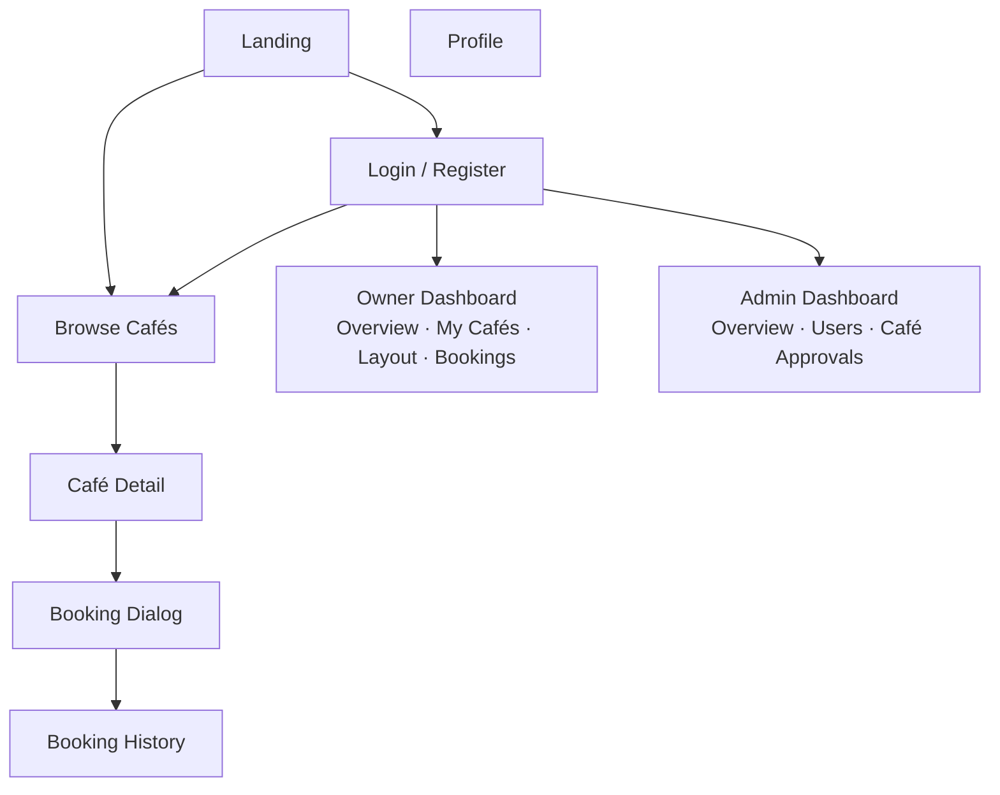

# Frontend UI Design — Seat Reservation Platform for Study Cafés

**Role:** UI Reference for Demo Frontend  
**Scope:** Layout, navigation, wireframes, components — no business logic, no API details  
**Last Updated:** June 2026

---

## 1. UI Design Principles

| Principle | Description |
|-----------|-------------|
| **Simple** | Minimal visual noise. No decorative elements. Every element earns its place. |
| **Functional** | Frontend exists to demo backend flows. UI clarity > visual polish. |
| **Material Design** | MUI component library. Default theme with minor customizations only. |
| **Backend-first** | No complex client-side state. Forms call APIs; results display immediately. |
| **Desktop-first** | Primary layout targets 1280px+. Tablet and mobile are supported, not optimized. |
| **Responsive** | Sidebar collapses on tablet. Single-column stacked layout on mobile. |

---

## 2. User Roles

| Role | Main Screens |
|------|-------------|
| **Guest** | Landing, Login, Register, Browse Cafés, Café Detail |
| **Customer** | Browse Cafés, Café Detail, Booking (dialog), Booking History, Profile |
| **Café Owner** | Owner Dashboard (tabs: Overview · My Cafés & Layout · Bookings) |
| **Admin** | Admin Dashboard (tabs: Overview · Users · Café Approvals) |

---

## 3. Sitemap



---

## 4. Navigation Structure

| Layout | Pages | Nav Elements |
|--------|-------|--------------|
| **Guest Layout** | Landing, Login, Register, Browse Cafés, Café Detail | Top Navbar only |
| **Customer Layout** | Browse Cafés, Café Detail, Booking History, Profile | Top Navbar (Bookings · Profile · 🔔 Notifications dropdown) |
| **Owner Layout** | Owner Dashboard | Left Sidebar + Top Navbar (user menu) |
| **Admin Layout** | Admin Dashboard | Left Sidebar + Top Navbar (user menu) |

**Notes:**
- Booking Dialog opens as a MUI Dialog overlay on top of Café Detail — no separate layout.
- Notifications appear as a dropdown from the bell icon in Navbar — no separate page.
- Owner Dashboard uses MUI Tabs: **Overview** · **My Cafés & Layout** · **Bookings**.
- Admin Dashboard uses MUI Tabs: **Overview** · **Users** · **Café Approvals**.

---

## 5. Page Inventory

| Page | Purpose | Main Components |
|------|---------|-----------------|
| **Landing** | Entry point, CTA to browse or login | Hero text, CTA buttons |
| **Login** | Email + password auth | Form card, text fields, submit button |
| **Register** | New account — Customer or Owner | Form card, role radio, text fields |
| **Browse Cafés** | Search and list all approved cafés | Search bar, Café Cards, pagination |
| **Café Detail** | View café info, seats, availability; trigger booking | Café info, zone tabs, Seat Grid, Booking Dialog |
| **Booking** | Date/time selection → confirm reservation (dialog) | Booking Dialog (date picker, time inputs, confirm button) |
| **Booking History** | List customer's active and past bookings | Table, Status Chips, cancel button, Confirm Dialog |
| **Owner Dashboard** | Manage cafés, seat layout, view bookings — tabbed | Tab: stats cards · Tab: café form + seat grid + add/remove · Tab: bookings table |
| **Admin Dashboard** | Platform overview, user management, café approval — tabbed | Tab: stats cards · Tab: user table + suspend · Tab: pending cafés + approve/reject |
| **Profile** | View and edit customer profile | Profile form, save button |

---

## 6. Wireframes

### 6.1 Landing
```
+--------------------------------------------------+
| Navbar: Logo                    [Login] [Register]|
+--------------------------------------------------+
|                                                  |
|   Seat Reservation for Study Cafés               |
|   Find and book your seat in minutes.            |
|                                                  |
|   [Browse Cafés]   [Sign Up]                     |
|                                                  |
+--------------------------------------------------+
```

### 6.2 Login
```
+--------------------------------------------------+
| Navbar: Logo                                     |
+--------------------------------------------------+
|                                                  |
|        +--------------------------------+        |
|        | Login                          |        |
|        |                                |        |
|        | Email     [________________]   |        |
|        | Password  [________________]   |        |
|        |                                |        |
|        |           [    Login    ]      |        |
|        |                                |        |
|        | Don't have an account? Register|        |
|        +--------------------------------+        |
|                                                  |
+--------------------------------------------------+
```

### 6.3 Register
```
+--------------------------------------------------+
| Navbar: Logo                                     |
+--------------------------------------------------+
|                                                  |
|        +--------------------------------+        |
|        | Create Account                 |        |
|        |                                |        |
|        | Role    (•) Customer           |        |
|        |         ( ) Café Owner         |        |
|        |                                |        |
|        | Email     [________________]   |        |
|        | Password  [________________]   |        |
|        | Name      [________________]   |        |
|        |                                |        |
|        |           [   Register   ]     |        |
|        +--------------------------------+        |
|                                                  |
+--------------------------------------------------+
```

### 6.4 Browse Cafés
```
+--------------------------------------------------+
| Navbar: Logo   [Browse]    [Bookings] [Account ▼]|
+--------------------------------------------------+
| [Search by name or location...      ]            |
|                                                  |
| +------------+  +------------+  +------------+  |
| | Café Card  |  | Café Card  |  | Café Card  |  |
| | Name       |  | Name       |  | Name       |  |
| | Location   |  | Location   |  | Location   |  |
| | Hours      |  | Hours      |  | Hours      |  |
| | [View]     |  | [View]     |  | [View]     |  |
| +------------+  +------------+  +------------+  |
|                                                  |
| +------------+  +------------+  +------------+  |
| | Café Card  |  | Café Card  |  | Café Card  |  |
| +------------+  +------------+  +------------+  |
|                                                  |
|               [Load More]                        |
+--------------------------------------------------+
```

### 6.5 Café Detail
```
+--------------------------------------------------+
| Navbar                                           |
+--------------------------------------------------+
| ← Back to Browse                                 |
|                                                  |
| Café Name                    Address             |
| Hours: 08:00 – 22:00         Min booking: 1h     |
|                                                  |
| [Zone A] [Zone B] [Zone C]                       |
|                                                  |
| +-------+ +-------+ +-------+ +-------+         |
| | A-01  | | A-02  | | A-03  | | A-04  |          |
| |[AVAIL]| |[TAKEN]| |[AVAIL]| |[AVAIL]|          |
| +-------+ +-------+ +-------+ +-------+         |
|                                                  |
| Selected: A-01              [Book This Seat]     |
+--------------------------------------------------+
```

### 6.6 Booking Dialog
```
+--------------------------------------------------+
| (Café Detail underneath — dimmed overlay)        |
|                                                  |
|   +------------------------------------------+  |
|   | Book Seat A-01 — Café Name          [x]  |  |
|   |                                          |  |
|   | Date        [__________________]         |  |
|   | Start Time  [__________________]         |  |
|   | End Time    [__________________]         |  |
|   |                                          |  |
|   | Duration: 2h                             |  |
|   |                                          |  |
|   |          [Cancel]  [Confirm Booking]     |  |
|   +------------------------------------------+  |
|                                                  |
+--------------------------------------------------+
```

### 6.7 Booking History
```
+--------------------------------------------------+
| Navbar                              [Account ▼]  |
+--------------------------------------------------+
| Booking History                                  |
|                                                  |
| +------+----------+-------+--------+-----------+|
| | ID   | Café     | Seat  | Date   | Status    ||
| +------+----------+-------+--------+-----------+|
| | #001 | Bean Hub | A-01  | Jul 1  |CONFIRMED  ||
| | #002 | Bean Hub | B-03  | Jun 28 |COMPLETED  ||
| | #003 | Roast Co | A-02  | Jun 20 |CANCELLED  ||
| +------+----------+-------+--------+-----------+|
|                                                  |
|               [Load More]                        |
+--------------------------------------------------+
```

### 6.8 Owner Dashboard
```
+---------------+--------------------------------------------------+
| SIDEBAR       | Owner Dashboard                                  |
| • Dashboard   |                                                  |
|               | [Overview] [My Cafés & Layout] [Bookings]  ←tabs |
+---------------+--------------------------------------------------+
                |                                                  |
                | TAB: Overview                                    |
                | +----------+  +----------+  +----------+        |
                | | Cafés: 2 |  |Bookings:14|  |Pending: 3|        |
                | +----------+  +----------+  +----------+        |
                |                                                  |
                | TAB: My Cafés & Layout                           |
                | [+ Add Café]                                     |
                | Bean Hub   APPROVED  [Edit]  [Manage Layout ▼]   |
                | Roast Co   PENDING   [Edit]                      |
                |                                                  |
                | --- Layout: Bean Hub ---                         |
                | Zone [Zone A ▼]   [+ Add Zone]                   |
                | +-----+ +-----+ +-----+                         |
                | | A-01| | A-02| | A-03|  [+ Add Seat]           |
                | +-----+ +-----+ +-----+                         |
                | [Save Layout]                                    |
                |                                                  |
                | TAB: Bookings                                    |
                | +------+--------+-------+--------+----------+   |
                | | ID   | Seat   | Guest | Date   | Status   |   |
                | | #010 | A-01   | john  | Jul 1  |CONFIRMED |   |
                | +------+--------+-------+--------+----------+   |
                |                                                  |
                +--------------------------------------------------+
```

### 6.9 Admin Dashboard
```
+---------------+--------------------------------------------------+
| SIDEBAR       | Admin Dashboard                                  |
| • Dashboard   |                                                  |
|               | [Overview] [Users] [Café Approvals]       ←tabs  |
+---------------+--------------------------------------------------+
                |                                                  |
                | TAB: Overview                                    |
                | +----------+  +----------+  +----------+        |
                | | Users:120|  | Cafés: 18|  |Pending: 4|        |
                | +----------+  +----------+  +----------+        |
                |                                                  |
                | TAB: Users                                       |
                | [Search users...        ]                        |
                | +------+----------+---------+----------+-------+|
                | | ID   | Email    | Role    | Status   |Action ||
                | | #01  | a@b.com  |CUSTOMER | Active   |[Susp] ||
                | | #02  | c@d.com  |OWNER    | Active   |[Susp] ||
                | | #03  | e@f.com  |CUSTOMER | Suspended|[Unsusp]||
                | +------+----------+---------+----------+-------+|
                |                                                  |
                | TAB: Café Approvals                              |
                | +----------------------------+------------------+|
                | | Roast Co   Owner: j@ex.com | [Approve][Reject]||
                | | Hill Brew  Owner: k@ex.com | [Approve][Reject]||
                | +----------------------------+------------------+|
                |                                                  |
                +--------------------------------------------------+
```

### 6.10 Profile
```
+--------------------------------------------------+
| Navbar                              [Account ▼]  |
+--------------------------------------------------+
| Profile                                          |
|                                                  |
|        +--------------------------------+        |
|        | Full Name  [________________]  |        |
|        | Email      [________________]  |        |
|        |            (read-only)         |        |
|        | Phone      [________________]  |        |
|        |                                |        |
|        |           [Save Changes]       |        |
|        +--------------------------------+        |
|                                                  |
+--------------------------------------------------+
```

---

## 7. Reusable Components

| Component | Used In |
|-----------|---------|
| **Navbar** | All pages (all layouts) |
| **Sidebar** | Owner Dashboard, Admin Dashboard |
| **Café Card** | Browse Cafés |
| **Seat Grid** | Café Detail, Owner Dashboard (My Cafés & Layout tab) |
| **Booking Dialog** | Café Detail |
| **Search Bar** | Browse Cafés, Admin Dashboard (Users tab) |
| **Status Chip** | Booking History, Owner Dashboard (Bookings tab), Admin Dashboard (Users tab) |
| **Loading Spinner** | All data-fetching pages |
| **Empty State** | Booking History (empty), any empty list or tab |
| **Confirmation Dialog** | Cancel Booking, Suspend User, Approve/Reject Café |
| **Notification Dropdown** | Navbar (bell icon) — all authenticated pages |

---

## 8. Responsive Rules

| Breakpoint | Behavior |
|------------|----------|
| **Desktop** (≥ 1280px) | Full layout. Sidebar visible. 3-column card grid. Tables with all columns. Tabs fully labeled. |
| **Tablet** (768px – 1279px) | Sidebar collapses to icon rail. 2-column card grid. Tables scroll horizontally. |
| **Mobile** (< 768px) | Sidebar hidden (drawer on demand). Single-column layout. Cards stacked. Dashboard tabs scroll horizontally. |

---

## 9. Theme

| Token | Value |
|-------|-------|
| **Typography** | Roboto (MUI default) — Body: 14px, Heading: 20–24px |
| **Primary Color** | MUI default blue — `#1976D2` |
| **Secondary Color** | MUI default grey — `#9E9E9E` |
| **Border Radius** | MUI default — `4px` (cards, buttons); `8px` (dialogs) |
| **Spacing** | MUI default 8px base unit |
| **Icon Library** | MUI Icons (`@mui/icons-material`) |

> No custom theme. Use MUI's default `createTheme()` with no overrides except Status Chip colors.

**Status Chip Colors (only custom):**

| Status | Color |
|--------|-------|
| CONFIRMED | `success` (green) |
| PENDING | `warning` (amber) |
| COMPLETED | `default` (grey) |
| CANCELLED | `error` (red) |
| SUSPENDED | `error` (red) |
| APPROVED | `success` (green) |

---

## 10. Screen Summary

| Screen | Role | Complexity | Notes |
|--------|------|------------|-------|
| Landing | Guest | Low | Static, CTAs only |
| Login | Guest | Low | Single form |
| Register | Guest | Low | Role toggle changes fields |
| Browse Cafés | Guest / Customer | Low | Search + card list |
| Café Detail | Guest / Customer | Medium | Seat Grid + availability + dialog trigger |
| Booking (Dialog) | Customer | Medium | Date/time form, idempotency key |
| Booking History | Customer | Low | Table + cancel action |
| Owner Dashboard | Owner | Medium | 3 tabs; seat grid editor in tab |
| Admin Dashboard | Admin | Medium | 3 tabs; user + café actions in tabs |
| Profile | Customer | Low | Single form |

**Complexity guide:**
- **Low** — Static layout or single-purpose form/list. One or two API calls.
- **Medium** — Multiple API calls, tabbed layout, or interactive selection (seat picker, date/time).
