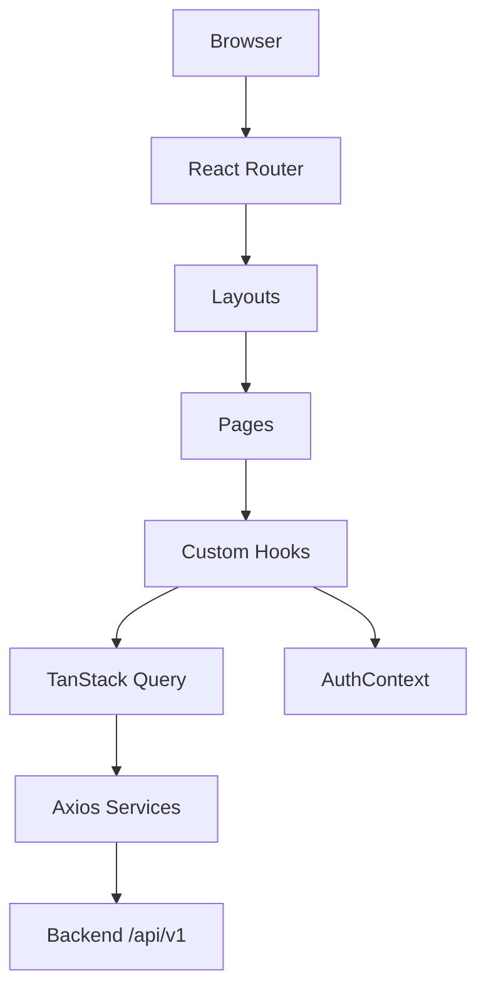

# Frontend Overview — Seat Reservation Platform for Study Cafés

Tài liệu tổng quan **React SPA** — nền tảng đặt chỗ ngồi học tại quán cà phê. Chi tiết kiến trúc và UI/UX nằm trong các file liên kết bên dưới.

> Backend API: [`backend/docs/README.md`](../../backend/docs/README.md)

---

## 1. Vai trò & phạm vi

Frontend phục vụ **4 nhóm người dùng** qua các layout riêng:

| Layout | Đối tượng | Trang chính |
| ------ | --------- | ----------- |
| **GuestLayout** | Khách chưa đăng nhập | Landing, Browse, Café Detail, Login, Register |
| **CustomerLayout** | Khách hàng | Booking History, Profile (+ browse/detail như guest) |
| **OwnerLayout** | Chủ quán | Owner Dashboard (Overview · Cafés & Layout · Bookings) |
| **AdminLayout** | Quản trị | Admin Dashboard (Overview · Users · Café/Owner Approvals) |

**Nguyên tắc:** UI map 1:1 với REST API (`/api/v1`). Không có trạng thái hay nút bấm không tương ứng endpoint backend.

---

## 2. Tech stack

| Layer | Công nghệ |
| ----- | --------- |
| Framework | React 19, TypeScript |
| Build | Vite 8 |
| UI | MUI 9, Emotion |
| Routing | React Router 7 |
| Server state | TanStack Query 5 |
| HTTP | Axios (interceptors: JWT refresh) |
| Forms | React Hook Form + Zod |
| Auth state | Context API (`AuthContext`, `NotificationContext`, `ToastContext`) |

---

## 3. Kiến trúc tổng quan



**Luồng dữ liệu chính**

1. Page/Component gọi custom hook (`useCafes`, `useBooking`, …)
2. Hook dùng TanStack Query → service layer (`cafeService`, `bookingService`, …)
3. `axiosInstance` gắn access token, tự refresh khi `401 AUTH_TOKEN_EXPIRED`
4. Response map sang TypeScript types trong `src/types/`

---

## 4. Routing

| Route | Trang | Auth | Role |
| ----- | ----- | ---- | ---- |
| `/` | Landing | — | — |
| `/login`, `/register` | Auth | — | — |
| `/cafes`, `/cafes/:cafeId` | Browse & Detail | — | — |
| `/bookings` | Booking History | ✅ | CUSTOMER |
| `/profile` | Profile | ✅ | CUSTOMER |
| `/owner/dashboard` | Owner Dashboard | ✅ | OWNER |
| `/admin/dashboard` | Admin Dashboard | ✅ | ADMIN |

`ProtectedRoute` chặn route theo role; chưa login → redirect `/login`.

---

## 5. Cấu trúc source (`src/`)

```
src/
├── App.tsx              # Routes + layout wrappers
├── layouts/             # Guest, Customer, Owner, Admin
├── pages/               # Landing, auth, cafe, booking, owner, admin, profile
├── components/          # common, cafe, booking, owner, admin, landing
├── hooks/               # useAuth, useCafes, useBooking, useOwnerDashboard, …
├── contexts/            # Auth, Notification, Toast
├── services/            # Axios API clients
├── types/               # DTO / response types
├── schemas/             # Zod form validation
└── utils/               # datetime, errorMessage, cloudinary, idempotencyKey
```

---

## 6. Tính năng theo luồng UI

| Luồng | Hành động người dùng | API chính |
| ----- | -------------------- | --------- |
| Đặt chỗ | Chọn ghế → Booking Dialog → Xác nhận | `POST /bookings` (+ `Idempotency-Key`) |
| Hủy / Check-in | Booking History | `DELETE /bookings/:id`, `POST .../check-in` |
| Owner quản lý quán | Tạo/sửa café, layout ghế | `POST/PUT /owner/cafes`, `PUT .../seats/layout` |
| Owner check-in khách | Tab Bookings | `POST .../bookings/:id/check-in` |
| Admin duyệt | Users, pending cafés/owners | `PUT /admin/.../approve`, `suspend`, … |
| Upload ảnh | Cover/gallery café, giấy tờ owner | Cloudinary signed upload qua `/uploads/cloudinary/signature` |

---

## 7. Cài đặt & chạy (local)

### Yêu cầu

- Node.js ≥ 20
- Backend API đang chạy (xem [backend/docs/README.md](../../backend/docs/README.md))

### Bước 1 — Cấu hình

```bash
cd frontend
cp .env.example .env
```

```env
VITE_API_BASE_URL=http://localhost:3000/api/v1
```

Khi chạy **full Docker**, frontend production build dùng `/api/v1` (nginx proxy sang backend) — không cần đổi khi build image.

### Bước 2 — Cài dependency & chạy

```bash
npm install
npm run dev
```

| URL | Mô tả |
| --- | ----- |
| http://localhost:5173 | Vite dev server |

### Scripts

| Lệnh | Mô tả |
| ---- | ----- |
| `npm run dev` | Development + HMR |
| `npm run build` | `tsc` + Vite production build |
| `npm run preview` | Preview build local |
| `npm run lint` | Oxlint |

### Docker (production build)

Từ thư mục gốc repo:

```bash
docker compose up -d --build frontend
```

Frontend container: http://localhost:5173 (nginx serve `dist/`, proxy `/api/` → backend).

---

## 8. State & cache (TanStack Query)

| Dữ liệu | `staleTime` gợi ý |
| ------- | ----------------- |
| Café list | 5 phút |
| Café detail / layout | 10 phút |
| Seat availability | 30 giây |
| Bookings, notifications, admin lists | 0 (luôn refetch) |

Access token giữ **trong memory** (`AuthContext`); refresh token trong `localStorage`.

---

## 9. Tài liệu chi tiết

| Tài liệu | Nội dung |
| -------- | -------- |
| [FRONTEND-ARCHITECTURE.md](./FRONTEND-ARCHITECTURE.md) | Kiến trúc chi tiết: folder, routes, API mapping, state, error handling |
| [FRONTEND-UI-UX-DESIGN.md](./FRONTEND-UI-UX-DESIGN.md) | UI/UX: sitemap, user flows, component spec, màu sắc |
| [FRONTEND-UI-DESIGN.md](./FRONTEND-UI-DESIGN.md) | UI design bổ sung |
| [backend/docs/API-SPECIFICATION.md](../../backend/docs/API-SPECIFICATION.md) | REST API contracts |
| [backend/docs/BACKEND-FEATURES.md](../../backend/docs/BACKEND-FEATURES.md) | Tính năng backend theo role |

---

## 10. Đọc theo thứ tự đề xuất

1. **File này** — tổng quan frontend
2. [FRONTEND-ARCHITECTURE.md](./FRONTEND-ARCHITECTURE.md) — implement / navigate codebase
3. [FRONTEND-UI-UX-DESIGN.md](./FRONTEND-UI-UX-DESIGN.md) — wireframe logic & UX rules
4. [backend/docs/API-SPECIFICATION.md](../../backend/docs/API-SPECIFICATION.md) — khi tích hợp API mới
